

# aladdin and the magic lamp

<h3>Characters</h3>

  

    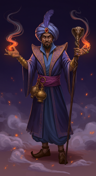
    
000_magicianprompt_0

  

  

    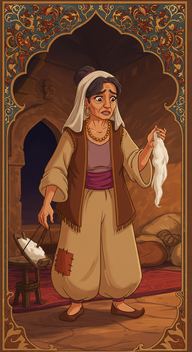
    
001_motherprompt_0

  

  

    
    
002_sultanprompt_0

  

  

    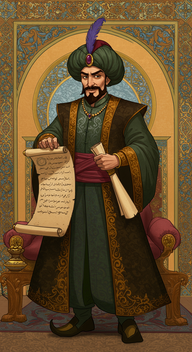
    
003_vizierprompt_0

  

<h3>Chapters</h3>

  

    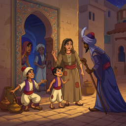
    
000_chapter1_0

  

  

    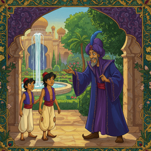
    
001_chapter2_0

  

  

    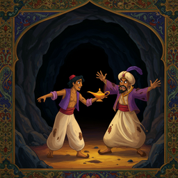
    
002_chapter3_0

  

  

    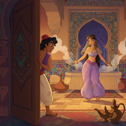
    
004_chapter5_0

  

  

    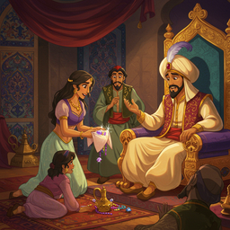
    
005_chapter6_0

  

  

    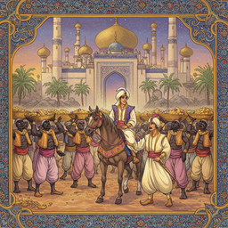
    
007_chapter8_0

  

  

    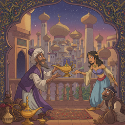
    
008_chapter9_0

  

  

    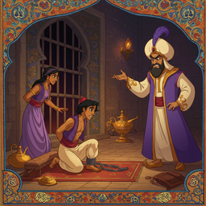
    
009_chapter10_0

  

  

    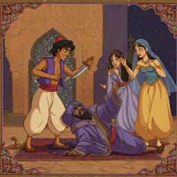
    
010_chapter11_0

  

  

    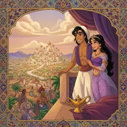
    
011_chapter12_0

  

