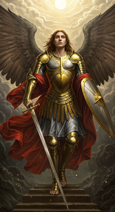
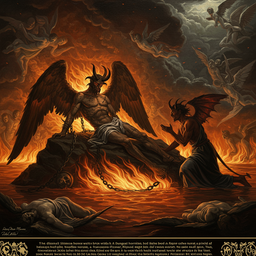
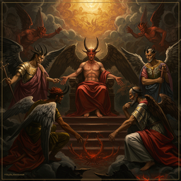

# paradise lost

<h3>Characters</h3>

  

    
    
001_eve_0

  

  

    
    
002_satan_0

  

  

    
    
003_god_0

  

  

    
    
004_michael_0

  

<h3>Chapters</h3>

  

    
    
000_book_i_0

  

  

    
    
001_book_ii_0

  

  

    
    
002_book_iii_0

  

  

    
    
004_book_v_0

  

  

    
    
005_book_vi_0

  

  

    
    
006_book_vii_0

  

  

    
    
007_book_viii_0

  

  

    
    
008_book_ix_0

  

  

    
    
009_book_x_0

  

