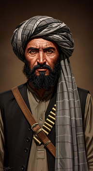
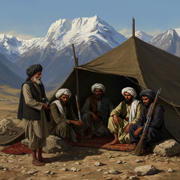
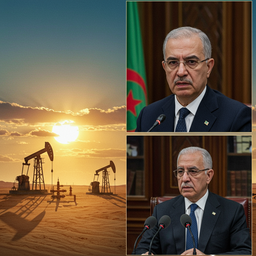
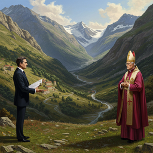
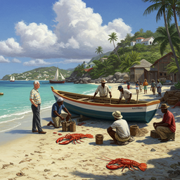
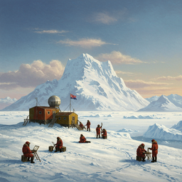

# the 1992 cia world factbook

<h3>Characters</h3>

  

    
    
000_afghanistan_adults_0

  

  

    
    
001_albania_adults_0

  

<h3>Chapters</h3>

  

    
    
000_afghanistan_a_land_in_turmoil_0

  

  

    
    
002_algeria_s_oil_fueled_ambitions_0

  

  

    
    
004_andorra_s_delicate_balance_0

  

  

    
    
006_anguilla_dependency_and_determination_0

  

  

    
    
007_antarctica_the_frozen_continent_0

  

  

    
    
008_antigua_and_barbuda_service_oriented_economy_0

  

<h2>Book Video</h2>

  <video controls width="100%">
    <source src="../../assets/pg_books_ai_generated_videos/the_1992_cia_world_factbook.mp4" type="video/mp4">
    Your browser does not support the video tag.
  </video>

