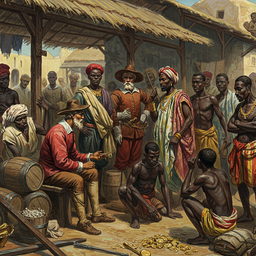
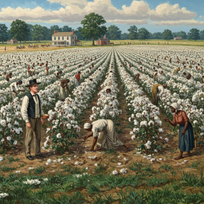
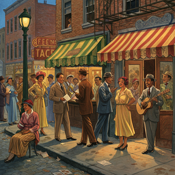

# the black experience in america

<h3>Characters</h3>

  

    
    
000_norman_coombs_0

  

  

    
    
001_lord_dunmore_0

  

  

    
    
004_lord_washington_0

  

<h3>Chapters</h3>

  

    
    
000_chapter_1_african_origins_0

  

  

    
    
001_chapter_2_the_human_market_0

  

  

    
    
002_chapter_3_slavery_as_capitalism_0

  

  

    
    
004_chapter_5_a_nation_divided_0

  

  

    
    
008_chapter_9_the_new_negro_0

  

  

    
    
009_chapter_10_fighting_racism_at_home_and_abroad_0

  

