

# the marvelous land of oz

<h3>Characters</h3>

  

    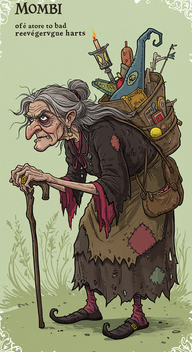
    
000_mombi_0

  

  

    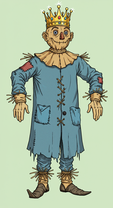
    
001_the_scarecrow_0

  

  

    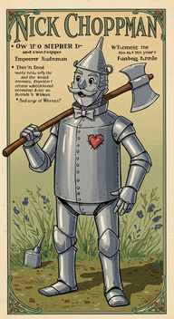
    
002_the_tin_woodman_0

  

  

    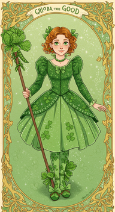
    
003_glinda_0

  

<h3>Chapters</h3>

  

    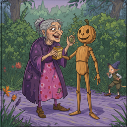
    
001_chapter_2_the_marvelous_powder_of_life_0

  

  

    
    
004_chapter_5_the_awakening_of_the_saw_horse_0

  

  

    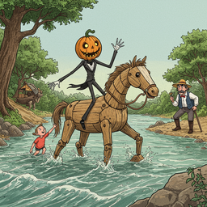
    
005_chapter_6_jack_pumpkinhead_s_ride_to_the_emerald_city_0

  

  

    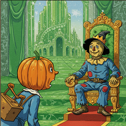
    
006_chapter_7_his_majesty_the_scarecrow_0

  

  

    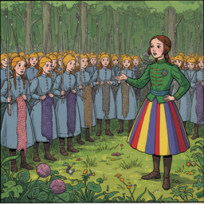
    
007_chapter_8_gen_0

  

  

    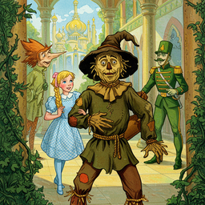
    
008_chapter_9_the_scarecrow_plans_an_escape_0

  

  

    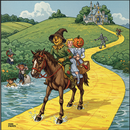
    
009_chapter_10_the_journey_to_the_tin_woodman_0

  

  

    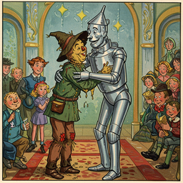
    
010_chapter_11_a_nickel_plated_emperor_0

  

  

    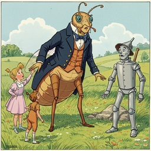
    
011_chapter_12_mr_h_m_woggle_bug_t_e_0

  

  

    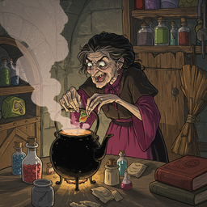
    
013_chapter_14_old_mombi_indulges_in_witchcraft_0

  

  

    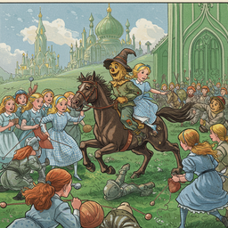
    
015_chapter_16_the_scarecrow_takes_time_to_think_0

  

  

    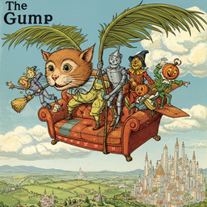
    
016_chapter_17_the_astonishing_flight_of_the_gump_0

  

  

    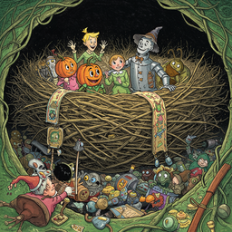
    
017_chapter_18_in_the_jackdaw_s_nest_0

  

  

    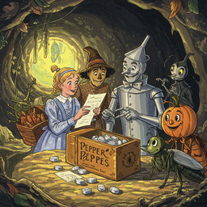
    
018_chapter_19_dr_0

  

  

    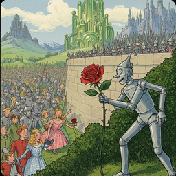
    
020_chapter_21_the_tin_woodman_plucks_a_rose_0

  

  

    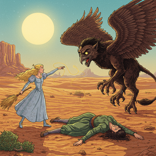
    
021_chapter_22_the_transformation_of_old_mombi_0

  

  

    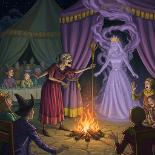
    
022_chapter_23_princess_ozma_of_oz_0

  

  

    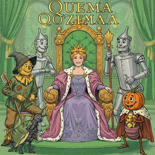
    
023_chapter_24_the_riches_of_content_0

  

<h2>Book Video</h2>

  <video controls width="100%">
    <source src="../../assets/pg_books_ai_generated_videos/the_marvelous_land_of_oz.mp4" type="video/mp4">
    Your browser does not support the video tag.
  </video>

