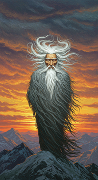
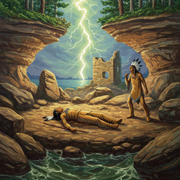
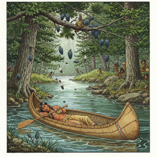

# the song of hiawatha

<h3>Characters</h3>

  

    
    
000_nokomis_0

  

  

    
    
001_mudjekeewis_0

  

  

    
    
002_iagoo_0

  

<h3>Chapters</h3>

  

    
    
000_i_0

  

  

    
    
001_ii_0

  

  

    
    
003_iv_0

  

  

    
    
004_v_0

  

  

    
    
005_vi_0

  

  

    
    
006_vii_0

  

  

    
    
007_viii_0

  

  

    
    
008_ix_0

  

  

    
    
009_x_0

  

  

    
    
010_xi_0

  

  

    
    
011_xii_0

  

  

    
    
013_xiv_0

  

  

    
    
014_xv_0

  

  

    
    
015_xvi_0

  

  

    
    
016_xvii_0

  

  

    
    
017_xviii_0

  

  

    
    
018_xix_0

  

  

    
    
019_xx_0

  

  

    
    
020_xxi_0

  

  

    
    
021_xxii_0

  

