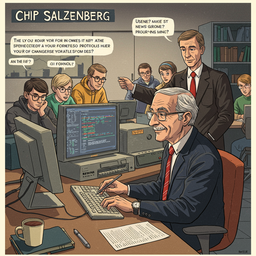
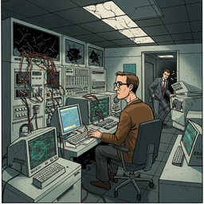
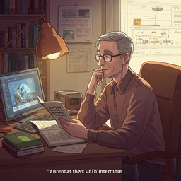
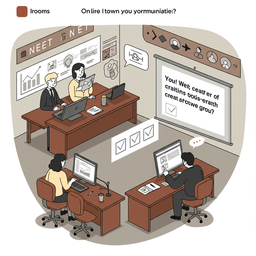

# zen and the art of the internet

<h3>Characters</h3>

  

    
    
000_brendan_kehoe_prompt_0

  

  

    
    
001_chip_salzenberg_prompt_0

  

  

    
    
002_gene_spafford_prompt_0

  

  

    
    
003_jon_postel_prompt_0

  

<h3>Chapters</h3>

  

    
    
000_part_a_introduction_prompt_0

  

  

    
    
001_network_basics_chapter_prompt_0

  

  

    
    
002_domains_chapter_prompt_0

  

  

    
    
003_electronic_mail_chapter_prompt_0

  

  

    
    
004_anonymous_ftp_chapter_prompt_0

  

  

    
    
005_usenet_news_chapter_prompt_0

  

  

    
    
006_telnet_chapter_prompt_0

  

  

    
    
007_various_tools_chapter_prompt_0

  

  

    
    
008_commercial_services_chapter_prompt_0

  

  

    
    
009_things_you_ll_hear_about_chapter_prompt_0

  

  

    
    
010_finding_out_more_chapter_prompt_0

  

  

    
    
011_getting_to_other_networks_chapter_prompt_0

  

  

    
    
012_newsgroup_creation_chapter_prompt_0

  

  

    
    
013_glossary_chapter_prompt_0

  

  

    
    
014_bibliography_chapter_prompt_0

  

<h2>Book Video</h2>

  <video controls width="100%">
    <source src="../../assets/pg_books_ai_generated_videos/zen_and_the_art_of_the_internet.mp4" type="video/mp4">
    Your browser does not support the video tag.
  </video>

