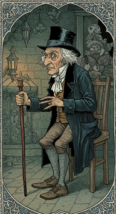
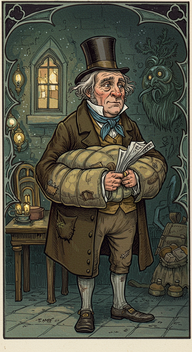
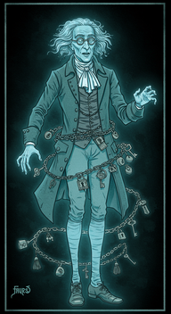
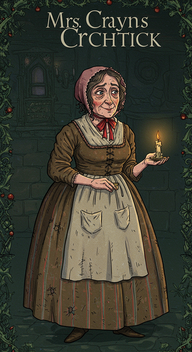
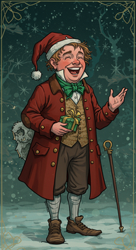
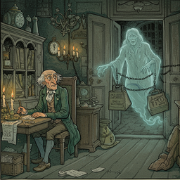
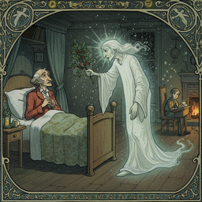
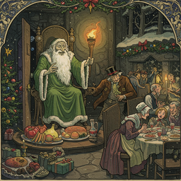
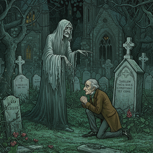
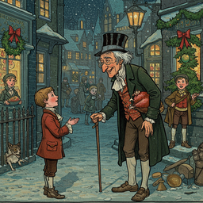

# a christmas carol in prose being a ghost story of christmas

<h3>Characters</h3>

  

    
    
000_ebenezer_scrooge_character_prompt_0

  

  

    
    
001_bob_cratchit_character_prompt_0

  

  

    
    
002_jacob_marley_character_prompt_0

  

  

    
    
003_mrs_0

  

  

    
    
004_fred_scrooge_s_nephew_character_prompt_0

  

<h3>Chapters</h3>

  

    
    
000_stave_i_marley_s_ghost_illustration_prompt_0

  

  

    
    
001_stave_ii_the_first_of_the_three_spirits_illustration_prompt_0

  

  

    
    
002_stave_iii_the_second_of_the_three_spirits_illustration_prompt_0

  

  

    
    
003_stave_iv_the_last_of_the_spirits_illustration_prompt_0

  

  

    
    
004_stave_v_the_end_of_it_illustration_prompt_0

  

