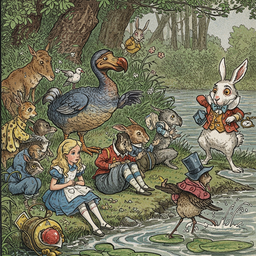
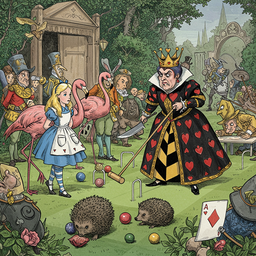

# alice s adventures in wonderland

<h3>Characters</h3>

  

    
    
000_the_white_rabbit_0

  

  

    
    
001_the_queen_of_hearts_0

  

  

    
    
002_the_mad_hatter_0

  

  

    
    
004_the_cheshire_cat_0

  

<h3>Chapters</h3>

  

    
    
000_chapter_i_down_the_rabbit_hole_0

  

  

    
    
001_chapter_ii_the_pool_of_tears_0

  

  

    
    
002_chapter_iii_a_caucus_race_and_a_long_tale_0

  

  

    
    
004_chapter_v_advice_from_a_caterpillar_0

  

  

    
    
005_chapter_vi_pig_and_pepper_0

  

  

    
    
006_chapter_vii_a_mad_tea_party_0

  

  

    
    
007_chapter_viii_the_queen_s_croquet_ground_0

  

  

    
    
008_chapter_ix_the_mock_turtle_s_story_0

  

  

    
    
009_chapter_x_the_lobster_quadrille_0

  

  

    
    
010_chapter_xi_who_stole_the_tarts_0

  

  

    
    
011_chapter_xii_alice_s_evidence_0

  

<h2>Book Video</h2>

  <video controls width="100%">
    <source src="../../assets/pg_books_ai_generated_videos/alice_s_adventures_in_wonderland.mp4" type="video/mp4">
    Your browser does not support the video tag.
  </video>

