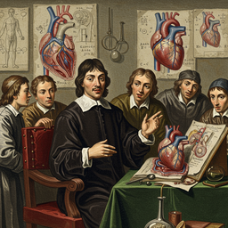

# discourse on the method of rightly conducting one s reason and of seeking truth in the sciences

<h3>Characters</h3>

  

    
    
001_learned_instructors_character_portrayal_0

  

<h3>Chapters</h3>

  

    
    
000_part_i_illustration_prompt_0

  

  

    
    
001_part_ii_illustration_prompt_0

  

  

    
    
002_part_iii_illustration_prompt_0

  

  

    
    
003_part_iv_illustration_prompt_0

  

  

    
    
004_part_v_illustration_prompt_0

  

<h2>Book Video</h2>

  <video controls width="100%">
    <source src="../../assets/pg_books_ai_generated_videos/discourse_on_the_method_of_rightly_conducting_one_s_reason_and_of_seeking_truth_in_the_sciences.mp4" type="video/mp4">
    Your browser does not support the video tag.
  </video>

