

# e mail 101

<h3>Characters</h3>

  

    
    
000_john_e_0

  

<h3>Chapters</h3>

  

    
    
000_chapter_1_the_past_and_the_future_of_internetworking_0

  

  

    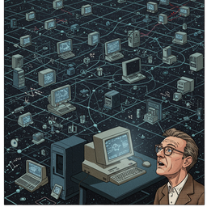
    
001_chapter_2_what_is_the_internet_0

  

  

    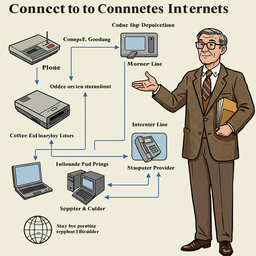
    
002_chapter_3_how_do_i_connect_to_the_internet_0

  

  

    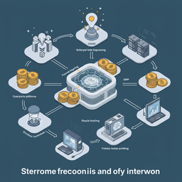
    
003_chapter_4_who_pays_for_the_internet_0

  

  

    
    
004_chapter_5_internet_basics_0

  

  

    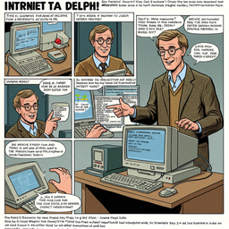
    
005_chapter_6_getting_on_the_internet_step_by_step_0

  

  

    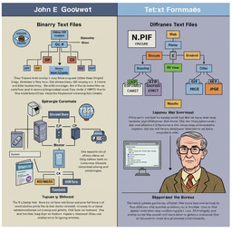
    
006_chapter_7_programs_and_pictures_0

  

  

    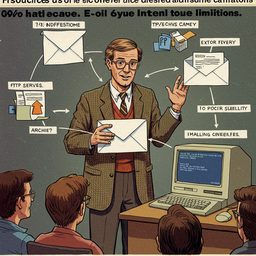
    
007_chapter_8_what_to_do_when_you_only_have_e_mail_0

  

  

    
    
008_chapter_9_employee_development_how_to_get_your_employees_internetworking_0

  

  

    
    
009_chapter_11_special_for_businesses_0

  

  

    
    
010_chapter_12_special_for_students_and_their_parents_0

  

  

    
    
011_chapter_13_special_for_writers_journalists_publishers_and_printers_0

  

  

    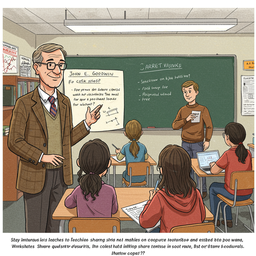
    
012_chapter_14_special_for_elementary_and_high_school_teachers_0

  

  

    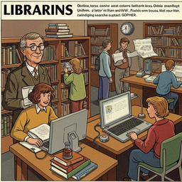
    
013_chapter_15_special_for_librarians_0

  

  

    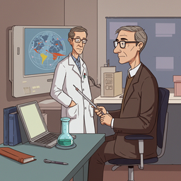
    
014_chapter_16_special_for_scholars_0

  

  

    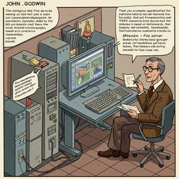
    
015_chapter_17_special_for_churches_synagogues_and_mosques_0

  

  

    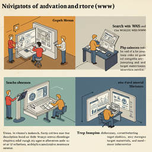
    
016_chapter_18_research_methods_i_basic_navigation_methods_0

  

  

    
    
017_chapter_20_research_methods_iii_advanced_techniques_0

  

<h2>Book Video</h2>

  <video controls width="100%">
    <source src="../../assets/pg_books_ai_generated_videos/e_mail_101.mp4" type="video/mp4">
    Your browser does not support the video tag.
  </video>

