

# frankestein

<h3>Characters</h3>

  

    
    
alphonse_frankenstein_0

  

  

    
    
robert_walton_0

  

  

    
    
victor_frankenstein_0

  

<h3>Chapters</h3>

  

    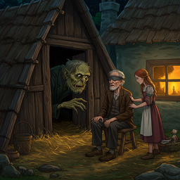
    
chapter_11_0

  

  

    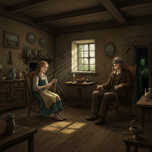
    
chapter_12_0

  

  

    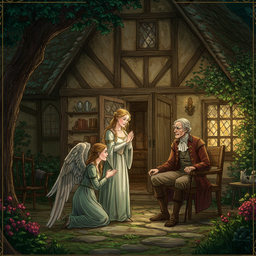
    
chapter_13_0

  

  

    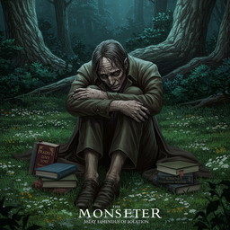
    
chapter_14_0

  

  

    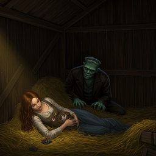
    
chapter_15_0

  

  

    
    
chapter_16_0

  

  

    
    
chapter_17_0

  

  

    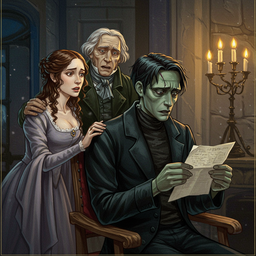
    
chapter_18_0

  

  

    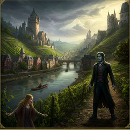
    
chapter_19_0

  

  

    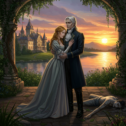
    
chapter_1_0

  

  

    
    
chapter_5_0

  

  

    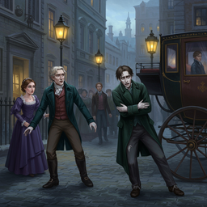
    
chapter_6_0

  

  

    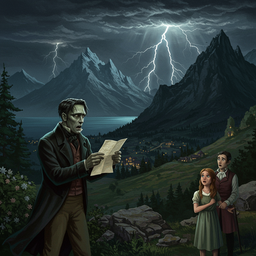
    
chapter_7_0

  

  

    
    
chapter_9_0

  

  

    
    
letter_1_0

  

  

    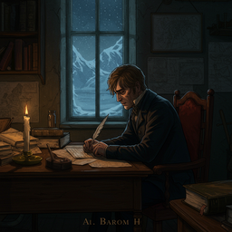
    
letter_2_0

  

  

    
    
letter_3_0

  

  

    
    
letter_4_0

  

