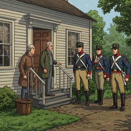
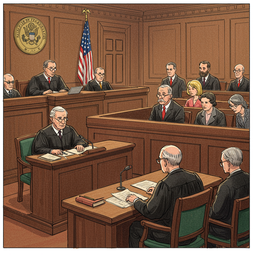
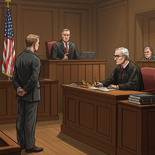
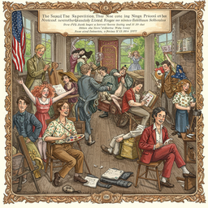
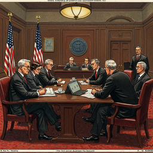

# the united states bill of rights the ten original amendments to the constitution of the united states

<h3>Characters</h3>

  

    
    
001_professor_michael_s_hart_0

  

<h3>Chapters</h3>

  

    
    
001_amendment_1_illustration_0

  

  

    
    
002_amendment_2_illustration_0

  

  

    
    
003_amendment_3_illustration_0

  

  

    
    
005_amendment_5_illustration_0

  

  

    
    
006_amendment_6_illustration_0

  

  

    
    
007_amendment_7_illustration_0

  

  

    
    
008_amendment_8_illustration_0

  

  

    
    
009_amendment_9_illustration_0

  

  

    
    
010_amendment_10_illustration_0

  

<h2>Book Video</h2>

  <video controls width="100%">
    <source src="../../assets/pg_books_ai_generated_videos/the_united_states_bill_of_rights_the_ten_original_amendments_to_the_constitution_of_the_united_states.mp4" type="video/mp4">
    Your browser does not support the video tag.
  </video>

