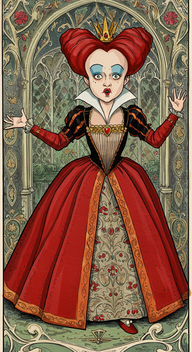
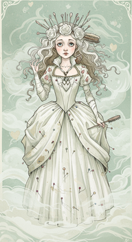
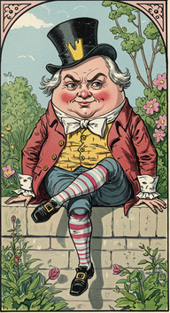
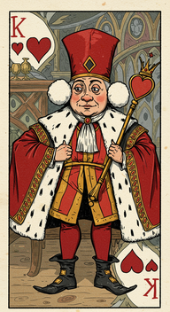
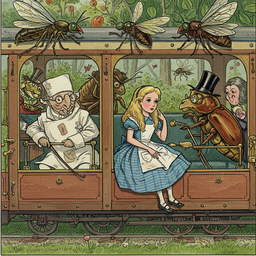
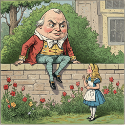
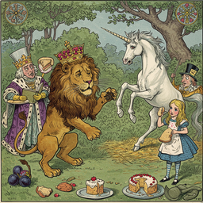
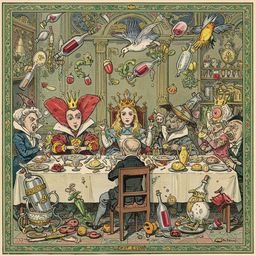
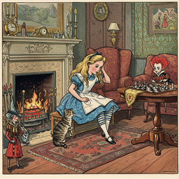

# through the looking glass

<h3>Characters</h3>

  

    
    
000_the_red_queen_0

  

  

    
    
001_the_white_queen_0

  

  

    
    
003_humpty_dumpty_0

  

  

    
    
004_the_king_of_hearts_0

  

<h3>Chapters</h3>

  

    
    
002_chapter_iii_looking_glass_insects_0

  

  

    
    
005_chapter_vi_humpty_dumpty_0

  

  

    
    
006_chapter_vii_the_lion_and_the_unicorn_0

  

  

    
    
008_chapter_ix_queen_alice_0

  

  

    
    
009_chapter_x_shaking_xi_waking_xii_which_dreamed_it_0

  

<h2>Book Video</h2>

  <video controls width="100%">
    <source src="../../assets/pg_books_ai_generated_videos/through_the_looking_glass.mp4" type="video/mp4">
    Your browser does not support the video tag.
  </video>

