

# what is man and other essays

<h3>Characters</h3>

  

    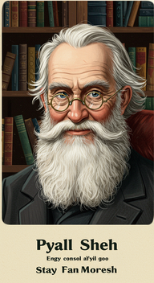
    
000_old_man_0

  

  

    
    
002_rev_0

  

<h3>Chapters</h3>

  

    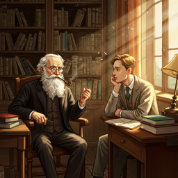
    
000_chapter_what_is_man_0

  

  

    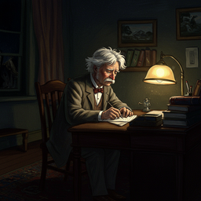
    
001_chapter_the_death_of_jean_0

  

  

    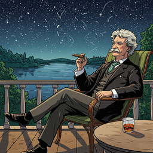
    
002_chapter_the_turning_point_of_my_life_0

  

  

    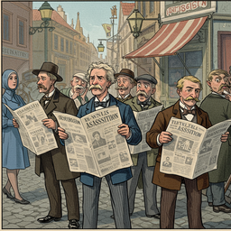
    
004_chapter_the_memorable_assassination_0

  

  

    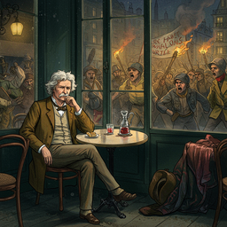
    
005_chapter_a_scrap_of_curious_history_0

  

  

    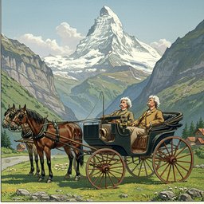
    
006_chapter_switzerland_the_cradle_of_liberty_0

  

  

    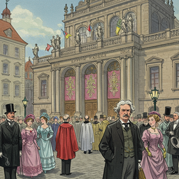
    
007_chapter_at_the_shrine_of_st_0

  

  

    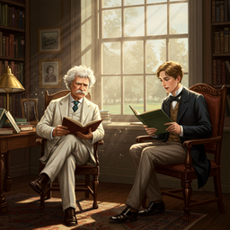
    
008_chapter_william_dean_howells_0

  

  

    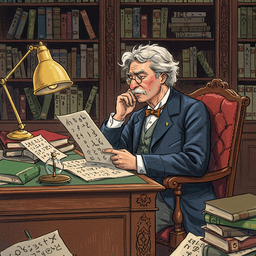
    
010_chapter_a_simplified_alphabet_0

  

  

    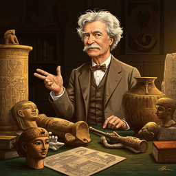
    
011_chapter_as_concerns_interpreting_the_deity_0

  

  

    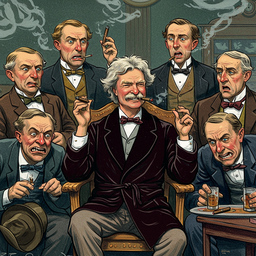
    
012_chapter_concerning_tobacco_0

  

  

    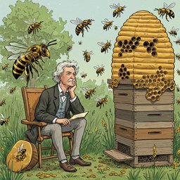
    
013_chapter_the_bee_0

  

  

    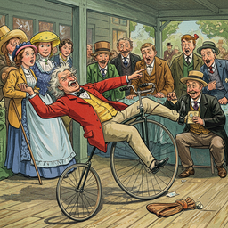
    
014_chapter_taming_the_bicycle_0

  

  

    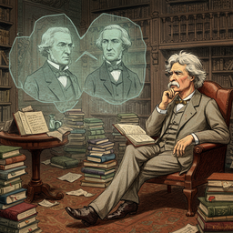
    
015_chapter_is_shakespeare_dead_0

  

<h2>Book Video</h2>

  <video controls width="100%">
    <source src="../../assets/pg_books_ai_generated_videos/what_is_man_and_other_essays.mp4" type="video/mp4">
    Your browser does not support the video tag.
  </video>

