

# wind in willows

<h3>Characters</h3>

  

    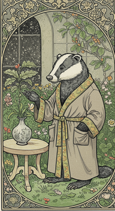
    
badger_description_and_prompt_0

  

  

    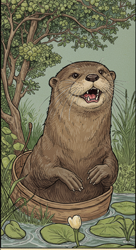
    
otter_description_and_prompt_0

  

  

    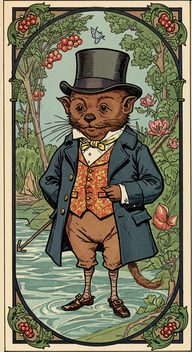
    
water_rat_description_and_prompt_0

  

<h3>Chapters</h3>

  

    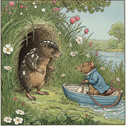
    
chapter_i_the_river_bank_0

  

  

    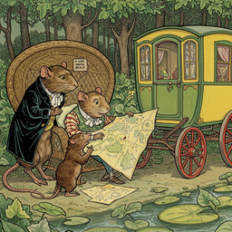
    
chapter_ii_the_open_road_0

  

  

    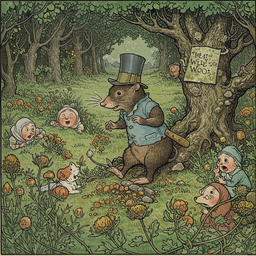
    
chapter_iii_the_wild_wood_0

  

  

    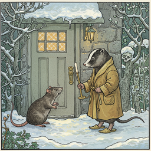
    
chapter_iv_mr_0

  

  

    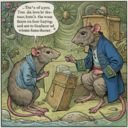
    
chapter_ix_wayfarers_all_0

  

  

    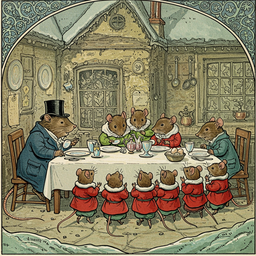
    
chapter_v_dulce_domum_0

  

  

    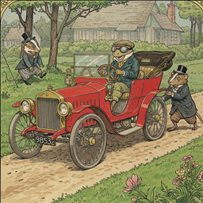
    
chapter_vi_mr_0

  

  

    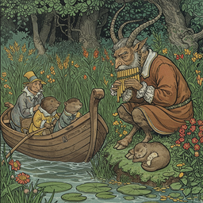
    
chapter_vii_the_piper_at_the_gates_of_dawn_0

  

  

    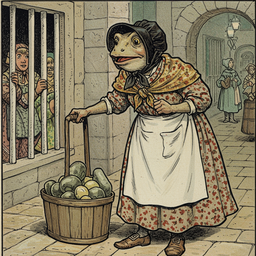
    
chapter_viii_toad_s_adventures_0

  

  

    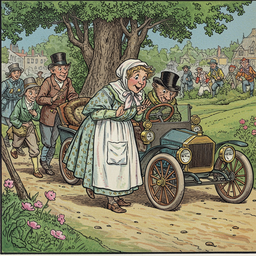
    
chapter_x_the_further_adventures_of_toad_0

  

  

    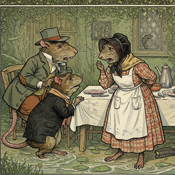
    
chapter_xi_like_summer_tempests_came_his_tears_0

  

  

    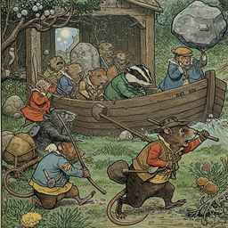
    
chapter_xii_the_return_of_ulysses_0

  

<h2>Book Video</h2>

  <video controls width="100%">
    <source src="../../assets/pg_books_ai_generated_videos/wind_in_willows.mp4" type="video/mp4">
    Your browser does not support the video tag.
  </video>

