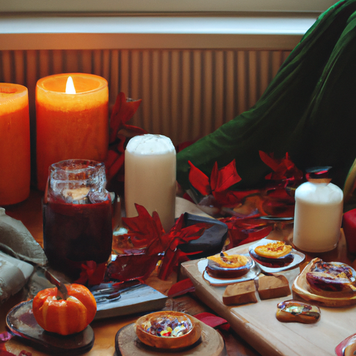
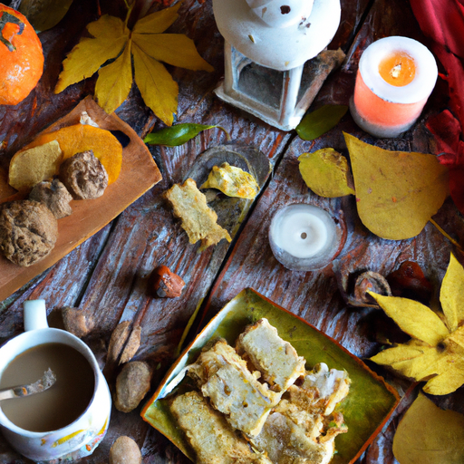
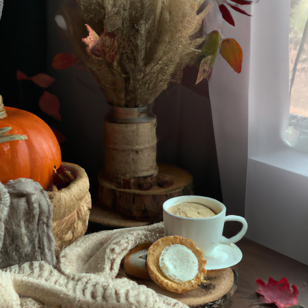

## [A Cozy Autumn Day at Home - Cottage Life Vlog](https://www.youtube.com/watch?v=yGLrEH_fN6E)

<table align="center">
	<tr>
		<td align="center">
<<<<<<< HEAD
			
		</td>
		<td align="center">
			
		</td>
		<td align="center">
			
=======
			
		</td>
		<td align="center">
			
		</td>
		<td align="center">
			
>>>>>>> ffe52613361410ad9d371a0f80e81de4dd24175f
		</td>
	</tr>
</table>

Salutations and welcome to my cottage. This week I wish to share with you a quiet early autumn day in my home. I haven't had a slow day in a while, my job has kept me busy, so it feels good to take a moment step away from the noise and submerge myself in a day of homemaking.

I will be baking a variety of sweet treats inspired by the harvest - as well as making some very luxurious vanilla extract. Also, at the end of this video, I will be answering a few more questions that you've been asking, so stay tuned.

There is something crisp and enticing about the harvest, and while it is only just in its infancy over here, I'm relishing the little hints of autumn in the air. I'm anticipating the first frost, the way it magnifies the scent of the pine needles. With that comes a welcoming feeling that I can't quite put into words... as if the earth is reaching out and asking you to follow its rhythm, to prepare for the cold, to take care of your body and mind so that you may rise up again renewed and ready for another year of beginnings and possibilities.

I have an abundant tomato harvest this year, so I am going ahead and dehydrating the ones I know I won't be able to eat before they spoil. They are very useful when adding to soups and stews in the wintertime.

One of my favorite things about the harvest is the abundance of squash. I'm currently growing butternut and last year I grew many delicatas. Do not mistake this for a particularly healthy meal. It is definitely a dessert, but what can I say, I have a sweet tooth.

Since no one asked I thought I'd share that I have the strange hobby of making miniature furniture and rooms for what purpose I'm not sure maybe it's for the fairies.

Firstly, I want to say thanks for all the beautiful and amazing comments that I've been reading on my videos recently. Though my channel has grown so suddenly that I’m not able to respond to every comment, know that I do read them and I love to see all the kindness and insight that people are sharing.

In response to all those questions on how do I live this way: I want to say that these videos help me feel calm and centered and peaceful, they remind me to be in the present because I often fail at practicing that own philosophy. I think many of us struggle when our lives are busy and there's a lot on our mind. Even though I am so far from perfect I keep practicing mindfulness and being in the present and I always try to center myself. When I see that my worries or thoughts are getting away from me every day, I improve just a little bit and I think that's enough.

However, I want to reiterate that my videos aren't a realistic portrayal of my daily life, I am an artist and I like to see things through the eye of an artist. I don't always want to portray things exactly as they are but how they could be. I do live here and I love where I live... I love to make crafts and bake and spend time with my pets, paint and go on walks... all these things are true, but I also have a job, I have a boyfriend, I have family, and my mother lives next door. I spend so much time with her it's not even funny. There are so many moments when I become overwhelmed, I worry, I am anxious about anything and everything. Even in the middle of nowhere you cannot outrun your humanity.

Last but not least, thank you to everyone who has supported me through my Etsy shop recently it means the world. It is such a wonderful support to have and it is so encouraging for a crafter and artist like myself. I will have new things available in the coming months. It is just the best feeling ever. Thank you all for your kind inquiries and questions and compliments.

Since I've gotten so many questions recently I thought I would ask one to all of you, and that is what is some way that you spread kindness in your daily life? I think there will be a lot of creative responses to that and I am interested to know what brings you joy and what helps you give joy to other people. Sending love and light to you and I will see you all next week. Bye!