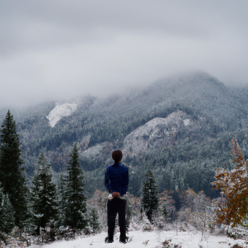
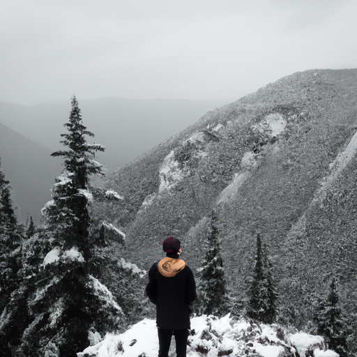
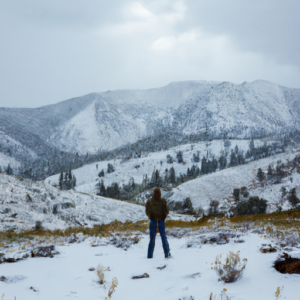

## [Choosing the Country Life - a bit about me](https://www.youtube.com/watch?v=Vb6xitXKQDs)

<table align="center">
	<tr>
		<td align="center">
<<<<<<< HEAD
			
		</td>
		<td align="center">
			
		</td>
		<td align="center">
			
=======
			
		</td>
		<td align="center">
			
		</td>
		<td align="center">
			
>>>>>>> ffe52613361410ad9d371a0f80e81de4dd24175f
		</td>
	</tr>
</table>

In this video, I would like to share a little bit about my experience of moving to the countryside. Many people have been curious about the steps I took to make this happen, and I will be sharing more details on my Instagram page. But in short, the answers to those questions are simple - no, I'm not wealthy, and yes, I have to work hard to be able to live here. Living rurally comes with its own set of struggles, and it isn't easy.

The opportunity to work here as a teacher was offered to me about two years ago. At that time, I wasn't sure whether or not to take it. I had a life and job as a clerk, and while my environment suited my siblings who live in cities, my spirit was restless. It was cathartic when I realized that the city was not where I was meant to be. I also discovered that I was terrified of change. Stepping into the unknown and taking the risk that things might not work out with my job, finances, and long-term sense of fulfillment was the hard part. But I believe that's true for many things in life - the first step is always the hardest.

For context, my father works in the military, so I grew up moving from place to place. By the time I was 20, I had lived in several countries and was well-traveled. Moving to the countryside was terrifying because I couldn't imagine being somewhere without eventually leaving it. However, there was something about this place that felt like home, and I knew I had found where I was meant to be.

If I could give only one piece of advice to anyone seeking to live in the countryside, it would be to come here with intention. In these parts of the world, where nature is thriving, we are stewards and must seek to live in alignment with our surroundings. This involves learning about our local habitats and animals and understanding how our choices directly impact them. In this day and age, we must live by the philosophy that by being here, we are representatives and protectors.

Of course, this philosophy can be adopted no matter where you live. For example, in my town, we have come together to defend our home when mining companies wished to take advantage of natural resources. If there had been no humans here, it could have happened without even making the news. We organize work parties to pick up garbage that accumulates on the roads after tourist season, and many of us make efforts to control the spread of noxious weeds by scanning our properties every year. Living out here is not easy, but it comes with great responsibility.

I seek to give my love to the earth in any way I can, even though my relationship with it always has room for improvement. But that's why I came here - to learn. Now that autumn is in full swing, the rain has come to my valley, and I am so grateful for it. It is a blessing on this earth, and I wanted to go out and witness it myself.

My favorite place to experience the rainfall is in the mountains. As I climbed, I realized that something much more exciting was in store - one of the first snowfalls of the season. It was so magical that I simply had to take you along.