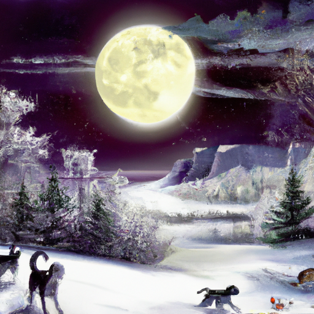

## [Come rest your tired heart - spend a day alone with me](https://www.youtube.com/watch?v=mTn_C-SyW84)

<table align="center">
	<tr>
		<td align="center">
<<<<<<< HEAD
			
		</td>
		<td align="center">
			
		</td>
		<td align="center">
			
=======
			
		</td>
		<td align="center">
			
		</td>
		<td align="center">
			
>>>>>>> ffe52613361410ad9d371a0f80e81de4dd24175f
		</td>
	</tr>
</table>

Hello there, and welcome to my valley. It is frozen and quiet and yet there's so much life everywhere. The paw prints of little rabbits dot the snow and today I found evidence of the very elusive moose. The winter birds are surprisingly active now, seeking out the bird feeders townsfolk leave on their lawns. January was the month of the wolf moon, paying homage to the many animals who are hungry this time of year yet ever patient for the first signs of spring. I'm looking forward to it as well, though my labrador and I are greatly enjoying ourselves. He loves to be outdoors even more than I and he insists on pulling my sled everywhere. I think it feels like a game of tug-of-war for him and it's always so funny.

Maybe you are curled up in bed while watching this, traveling, at work, out in nature, somewhere else all together. Wherever you are, I hope that today offers you some moments of joy, be it the moon rays, the chortle of a bird, or the warmth of the sun on your neck.

I decided to start the morning reading some texts that were about spirituality, but also just mindfulness and this paragraph really stood out to me so I thought I would read it to you or at least paraphrase it as best I can. We can choose to have an ancient psychology that holds a refreshingly positive view of human nature. Our emotional difficulties are temporary and more superficial instead of all-consuming. We can choose to emphasize what is right with us, not what is wrong with us and use that to inspire who we are. For example, a more ancient psychology acknowledges our disturbing emotions but sees them as covering our essential goodness, like clouds covering the sun. In this sense, our darker moments and most upsetting feelings are an opportunity for uncovering a natural wisdom, if we choose to look at it that way. By being attentive to our emotions we can delve deeper into the moment to perceive the little subtleties of ordinary life. In this sense, mindfulness creates a wise attention to our days, a space of clarity that emerges when we have a quiet mind, it makes us more receptive to the whispers of our innate intuitive wisdom.

I thought that was a very beautiful way to talk about being mindful in your day and I will keep it in my heart today and try to let it influence me because I was feeling a little bit anxious this morning being aware of all the things I had to get done. So that's just beautiful, anyway I wanted to share it with you and my tea has probably gone cold so I'm gonna go warm it up.

Today I was thinking about the past and what advice I would give my younger self. The person I once was is so different from who I am now and something that really helped me feel more at ease was changing the words I speak to myself and to others. I wanted to hear your thoughts on this because I think it is especially relevant right now when we communicate not only in person but online.

When I was younger, newly graduated, working at a department store, I had a habit of defaulting to negative statements when I was unhappy or frustrated. This was fed by feelings of not having control over my life, feeling like a constant victim of circumstance. I didn't like the person I was becoming, so negative and bitter. I worked a customer service position that was quite stressful and all it would take would be one rude customer to ruin my day. Sometimes customers would call me names, make fun of my job, and even throw tantrums and throw things sometimes. And if you work in customer service, know that I have the utmost respect for you and all your hard work and patience. It is not an easy job and often underappreciated.

These memories of the past amuse me because even though I would experience the kindness of so many people throughout my shift, I'd go home crying because of the single angry customer who told me I would never amount to anything. And yet, by doing that, I readily handed over all my power and agency to them, pretty much welcoming them into my heart and mind and letting them dictate the rest of my day. That is something I've slowly worked on changing, realizing that I have the choice to process experiences how I wish. And to my past self, I will always say, take notice of the words you use, see them as having power over others but most of all yourself. See them as little seeds that you're holding in your heart and be careful about which ones you water and allow to grow. Words have so much power and what we do with the words we speak but also hear has a lot to do with how much we can enjoy daily life in our own company or that of others.

In celebration of another trip around the sun and some excitement for the spring and the longer days that are fast approaching, I decided to make a spring-inspired embroidery pillow. I've never had much patience for needlework, so I did not have high expectations for myself, but considered it a wonderful practice in mindfulness and slowness and a wonderful way to just try something new. Even if it doesn't come out perfect, I definitely made many mistakes, but I really enjoyed how it turned out. Please let me know if you have any craft projects in mind or recipes that I should try because I'm looking to learn new things all the time.

I once had a very good friend who loved tea and she would heat up the water for her tea, drink her cup of tea, and then spend the next few hours just holding the teapot and keeping warm. And I thought it was so funny and I have been doing that a lot this winter because it really works. If you just hold your teapot to you, you feel nice and warm and cozy.

It's actually been quite a quiet week over here. One of my favorite times of the month is when there's the full moon because if you walk outside during the full moon, the moon rays dance across the snow and glitter. It is just amazing. If you have lived in a place with snow, you know that snow glitters at night when you shine light on it, but to see the moonlight creating this kind of shimmery cast over everything is really magical. I just love it. I'm looking forward to the next full moon. It'll be very beautiful for sure.

Anyway, last but not least, I did have a question several months ago that a few people reached out about and they were wondering about a green dress that I wore and have worn in some of my videos. So I wanted to show it to you, I will put in some clips. I don't know if you can call it a dress, it is kind of inspired - I think - by a bit of a sarong. It's a multi-use piece of fabric. You can wear it as a dress but also a skirt and I think you can even make it into a short dress or shirt. So there's a lot of different ways to wear it but yeah, I will show you a few. I have not been able to find anything like it online unfortunately. I have researched for quite a while, maybe I'm just not using quite the right keywords but it is a really wonderful piece of clothing. I bought it when I was at a medieval fair, they were available and I actually have seen them quite a few times available at festivals and medieval fairs so maybe that is the best place to go find them. But yes, it's just so beautiful and light and airy and I love it especially in the summer but also in the winter when I'm inside and I'm doing a lot of work around the house. I'd love to wear it as well and yeah, I wish I could give you more information on it but I am sure that it is fairly easy to sew it yourself. If you are someone that's handy with a sewing machine, it might be worth a try but I will give you an update once I know where that's from. That was something very random, but I had quite a few people reach out and email and message and all that so I did want to address that unfortunately. I just don't know where it's from but it is a really really fun dress so if anyone has any examples similar to it please share them down below.

Anyway, it has continued to be a nice relaxing week. I had a little meeting this morning with an editor to talk about changes to my book that I'm working on and that was really really exciting. I am going to be working on that this week, working on orders, working on a lot of different things and I am also continuing at the bookstore, thank goodness, so I was very excited to be doing that - so glad I am able to help out there every week. Anyway, I hope you all have a wonderful day and I will see you very very soon and I will hopefully give you an update on the housing situation very soon because we are trying to be approved for a loan so we will see if we are but anyway sending my love sending Mr. Darcy's love and I will see you soon, goodbye.