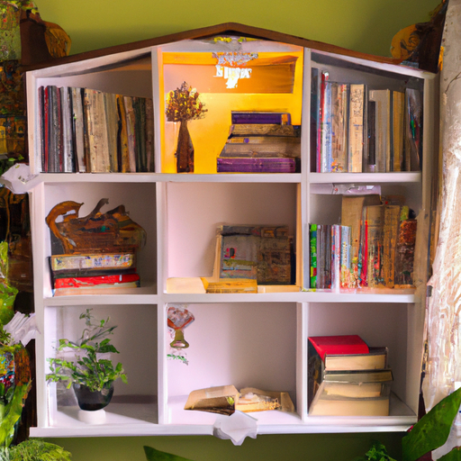
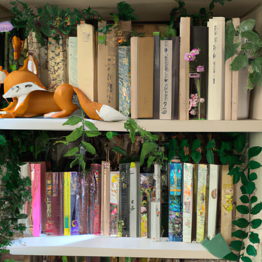
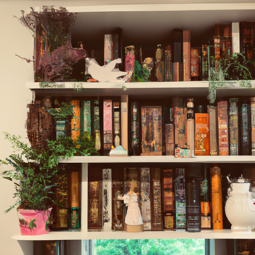

## [Creating my Dream Home Library - my book collection and favorite stories](https://www.youtube.com/watch?v=-uOBJoT_j8Y)

<table align="center">
	<tr>
		<td align="center">
			
		</td>
		<td align="center">
			
		</td>
		<td align="center">
			
		</td>
	</tr>
</table>

Luke is going to build me a custom bookshelf next year, but because we both don't have too much time for a lot of more in-depth projects like that right now, I decided to get some temporary bookshelves just as a placeholder for now and so that I have somewhere to put my books because they are just piled up around the windowsills right now and it's just um very chaotic. So I'm hoping this will help get them a little more organized. Thankfully, these bookshelves are very easy to put together. I really am not someone who's comfortable building things at all or reading instructions or doing any of that, so um so far I've achieved two, so we're gonna try to do one more. But I do hope you enjoy this because um I don't think you will ever see me building anything again because this is not what I do.

So I finally got the bookshelves built and now comes the monumental task of bringing all my books down from the upstairs treehouse and organizing them here. So that's the next step. Books, books, books, books. I thought perhaps that all my books would fill all the shelves, but I actually have three and a half shelves empty, which is good because I work at a bookstore and I do bring home quite a lot of free books. A lot of the books behind me are secondhand books or free books because I get advanced readers copies for working at a bookstore. That is kind of a benefit of working there. You do get advanced releases of books that are not yet available to the public, so that you can read and review them. However, I do also have a lot of new books because I love to support new authors and I myself have recently become an author.

So I did want to share with you at least a few books that I'm currently reading or I've just recently read or I am excited to try out. I recently did re-read one of my favorite books from my childhood, which is "The Apothecary". It is all about plant magic and these two children. It feels very cozy and all about nature and the wonder of nature, not in necessarily realistic sense, but it is a really, really fun book. So I have reread that one recently. I have not read this one yet, but I'm very excited to read "Oak, Ash, and Thorn". It was gifted to me by a viewer, so thank you if that was you. And it has a beautiful cover. It has all these little fairies on it, so it just seems right up my alley. I also recently reread "Nevermore", which is one of my all-time favorite children's books. I always describe this book as Harry Potter but with a female protagonist and a lot more emphasis on magical animals, which is everything I love. I'm also rereading this one because the second one just came out. I also recently re-read "The Wolf and the Whale", which is also a favorite book of mine. I did not love the ending, to be honest, but all the way up until like the last 50 pages, it was just about one of my favorite books ever. So I still reread it and enjoy it, even though I would have ended the book differently.

So yes, I do get a lot of questions of kind of what books I read, and I would say that it is a huge variety of books. I'm just a little bunny half the time, so I can't really handle too scary a topic, especially supernatural things are often a bit too much for me if it's in a darker portrayal. So I don't enjoy those types of books as much, but I do really try to read a little bit of everything. For me, reading is escapism and has a very positive effect on my mental health because I can immerse myself in a kind of other reality. So I really love fantasy and all these books that really transport me to another world and entertain my imagination of not just how the world is, but how it could be.

Some of my very favorite books are books that I read a lot as a child and I still have today. So one of them is "The Girls' Book of Flower Fairies", and it has a completely broken spine and you can tell that my seven-year-old self wrote this very poorly. I flipped through this book so many times. I would take it out into the woods. I would bring it with me in case I needed to identify anything I found out there. Another book that I've had since I was very young, it is another field guide all about fairies. I would also bring this book out into the woods with me as a child so that I could properly document anything I found. I also have Tasha Tudor's "Book of Fairy Tales", which I can't really find this book out there that much anymore. It is very old, and Tasha Tudor is, if you do not know who she is, she is a very well-known and admired children's author from decades ago. She has since passed away, but I also got to write a letter to her when I was very young, and she was too ill at the time to write me back, but she had her son help her write a letter back to me while she was in bed not feeling well, and she passed away shortly afterwards. And I think that for sure is one of my most special letters and treasures that I have in my house because I still have that letter that her son wrote that she was able to help out in writing. It was really, really sweet.

With that being said, I do have some space left on my shelf, so I thought I might go to the bookstore and pick up some more little things that I might be reading. Pretty much everything behind me I have already read, and so I definitely would like to get some new books and also maybe in the future go through these and find which ones might be able to go to a good home. So yes, again, I have written a book. I will leave the details down below in case you're interested. I'm sending you all my love. I hope you enjoyed this. This is definitely very, very fun. And yeah, always leave your book recommendations down below if you have any you particularly enjoy.