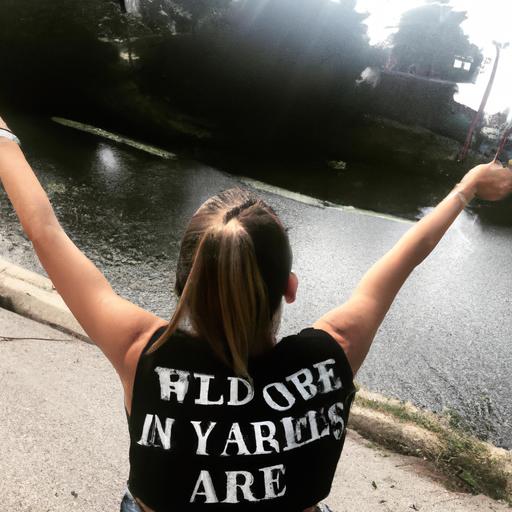
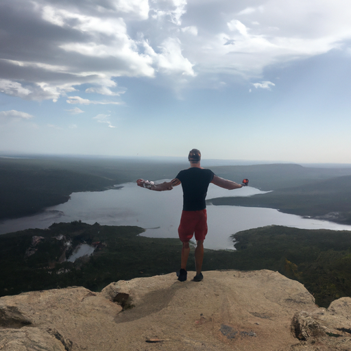

## [From a City Apartment to a Rural One-Room Cottage](https://www.youtube.com/watch?v=gK6m1CkoqA8)

<table align="center">
	<tr>
		<td align="center">
			
		</td>
		<td align="center">
			
		</td>
		<td align="center">
			
		</td>
	</tr>
</table>

People often ask me for guidance on how to make the transition from their lifestyle to the countryside. I cannot give any advice that applies to everyone, and so I'm reticent to give any at all. You know your own situation best and I will leave resources down below that may be useful to you. However, I want to offer you a perspective that may be helpful in a different way. I hope it can bring comfort to you as you try to change your life or encourage you to embrace your current situation.

Making a move to a rural area isn't feasible or practical for everyone. For example, I was lucky to be able-bodied and young and find a job within my skill set that gives me a livable wage - those can be hard to come by for millennials like myself. However, you can bring so much of what you love about another way of life into your own reality without making the physical move, and it is just as rich and meaningful.

Think about where you live, maybe it's a cozy city apartment, a town, or the countryside. Wherever you are, imagine that that is exactly where you need to be at this point in your personal story. Stories don't begin at the end, they present the hero's journey from one place to another, physically or internally. This is something that has truly helped me on my path to change my life, comforted me when I felt stuck, but to also see the worth in the process of taking months, years, or decades to get to where I want to go.

At 19, I was a student living in a condemnable, infested apartment right next to a highway. I deeply disliked where I lived and I would cry myself to sleep some nights because adult life was nothing like I imagined it to be. I was lonely and tired of being a student, staying awake all night studying only to have to go to my job as a magazine editor the next day. My dreams of a quiet, peaceful life in the countryside seemed completely out of reach. I was burned out and unhealthy in both mind and body. If you've ever been there, you know that one of the most dangerous parts of feeling that way is that you think it will last forever and believe tomorrow will be no different. And, for a time, I did give in and I despaired. And then, one day, I decided that my despair was a lie and asked for help. Ever so slowly, things got better and I started to feel again. Those were hard years, but looking back, it clarified what I wanted out of life, what I needed, and what I had to change in my mentality in order to succeed.

Was it a happy time? No, but life doesn't need to always be happy in order to be fruitful. I had to look within and examine the source of my feelings. Living in the future was ruining my present. I started taking practical steps towards the life I wanted, saving and researching and applying to jobs. I had to work hard for years to make my dreams come true, but the hardest part was learning to be satisfied where I currently was. I needed to know that I could build a wonderful life whether or not things were perfect, only then would I be ready to make the move successfully and to be happy.

Many of us will experience living in at least a couple different places in our lives. Maybe you love where you live, maybe you want to live somewhere else, whatever your situation is, I encourage you to embrace your current location and pour your love into living your best life. If that seems hard, find little ways to appreciate your place and the steps you take in order to plan for the future. For example, if you love your home in the city but miss nature, you can adopt plants and make it a space full of life. No matter where you are, you can live more sustainably and in alignment with the seasons. Instead of wishing to fulfill a future dream, try to live a version of it in the meantime. Imperfect, yes, but that's how life is - it challenges us to simply enjoy existing.

I have lived in the city, the countryside, and in between. Each place has benefits and suits different personalities and can lead to a wonderful story. I like to think that with the right mindset, you can cultivate contentment in most places, assuming that your basic needs are met of course. You may not be in your ideal location, maybe it's a stepping stone that will offer you many opportunities to learn and grow in the process. Either way, your thoughts and insights are always appreciated and helpful to all of us. Feel free to comment your experience down below, I wish you all the best in trying to change, improve, or simply love your life and location even more. Take care.