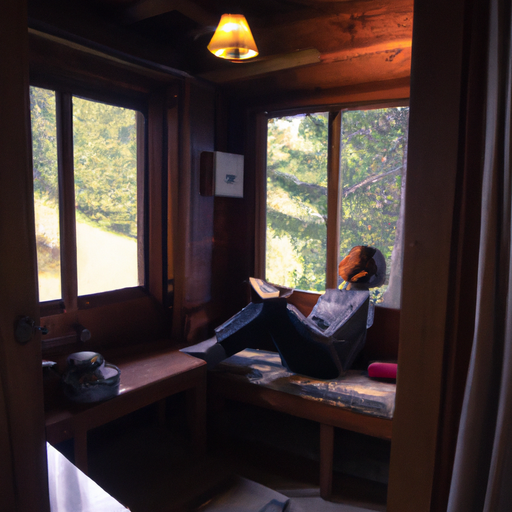
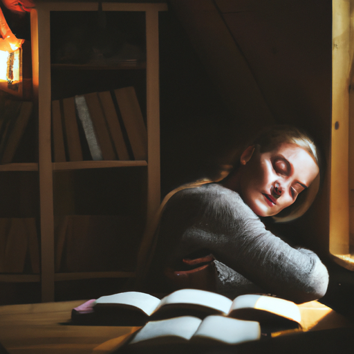
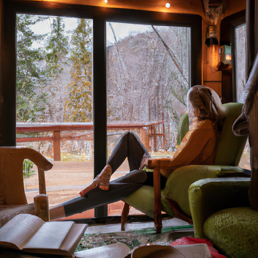

## [Healing my body in a quiet secluded place - relapse recovery and forgiving my ED](https://www.youtube.com/watch?v=9sGadrkS2PM)

<table align="center">
	<tr>
		<td align="center">
			
		</td>
		<td align="center">
			
		</td>
		<td align="center">
			
		</td>
	</tr>
</table>

Hello friends, I hope you are doing well and taking care of yourself - this week I’m starting my new temporary job as a bookseller, and I am so very excited. It has really sunk in that my life will very different next year, possibly in a new home.

Much of the last four years I have spent living alone in various places, sometimes by choice, other times because I felt like I was stuck. Thankfully I’ve always had some friends or family nearby but I’ve still found myself - for the most part - embracing a quiet life predominantly spent in my own company and on my own terms, at least the time I had away from work. It is a slower sort of life, mostly nature walks and cups of tea and reading books, not too much rush or excitement. But, I would say, experiencing an overarching contentedness with what daily life offers me.

To start cultivating that feeling I realized I needed to heal the relationship I had with both my inner self, but also my physical body. This was absolutely crucial to me when, years ago, I was recovering from an eating disorder and trying to develop a more positive relationship with myself. I remember for a long time I didn’t even use social media because for some reason I kept being recommended plastic surgery advertisements. Let me know if this happened to you at some point, I felt I was being haunted by own phone.

Disturbingly, many of the surgery examples seemed to be designed to change common ethnic features that I happened to share with my mothers side of my family - my larger, more protruding and curved nose comes to mind, something that I have grown to love and be very confident with, but that wasn’t always the case. I also had severe cystic acne, which is a type of skin condition that is extremely painful, sometimes my face would be so swollen I couldn’t open my eyes fully.

As someone who was quite fragile and insecure about those very things when they were younger, as many women are socialized to be, it was definitely a sign I needed to unplug for a while until I was in a better place. Through stepping away from those influences at a key point in my life, I decided to try to form a more independent definition of beauty, something far more inclusive than what I held before. It is no longer reliant on weight, or looking a certain way. I can now admire the unique features of others while valuing my own.

I still don’t feel comfortable in my skin everyday, but I think it’s important to know that that’s normal. Our emotions inevitably change, we cannot be happy every moment of our lives, neither should we believe difficult moments will last forever. I now look to the change of seasons, of the moon cycles, and all cycles of life and death as evidence that what I feel today will inevitably evolve into something else, and I can choose to believe things can, and will, get better with time. I’ve had my ups and downs this year, but I keep making progress.

Recovering from issues with your mind and body relationship takes so much time, and for me there was a spiritual component I had to resolve as well. For practical measures, I covered my mirrors for a while, permanently threw out my scale, didn’t buy new clothes or do anything focused at all on my body and external self. I read books on the topic. I threw myself into new hobbies and interests, started hiking and instead appreciating what my body could do for me instead of how it looked. In my case that was incredibly healing and while everyone’s journey to self-love is different I definitely think there’s always value in finding new passions and getting creative with how you spend your time. When I put value in things separate from my insecurities, over time it took power away from them.

I’m still on that journey, and I have struggled at times to maintain my health, and through that I’ve realized how important it is not to expect perfection from ourselves. To recognize the power of our own voice, to have courage in the face of a world that is scary at times. To recognize a seed of something beautiful inside each of us.