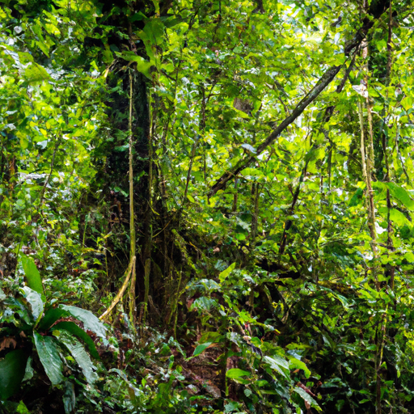
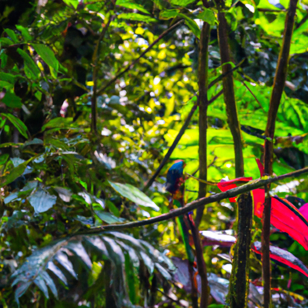
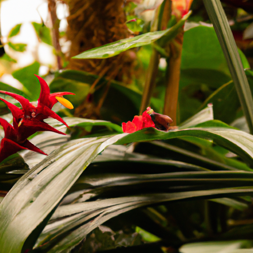

## [Hello there](https://www.youtube.com/watch?v=Dp0zQZTSS-Y)

<table align="center">
	<tr>
		<td align="center">
			
		</td>
		<td align="center">
			
		</td>
		<td align="center">
			
		</td>
	</tr>
</table>

[Music]
Hello everyone, I've been absent for a little while because I've been visiting my Theo and Abuelita in Fajardo in Puerto Rico. It's been a long time since I've had the chance to travel so far to see the people I love and speak my mother tongue. The sights and smells were so different from my home, as this is the land of rainforests and palm trees and cats and delectable fruit. I'll be dreaming of fresh mangoes for months. I'm pretty sure I went home as a prune because I spent most of the trip swimming, but it was incredible to connect with the nature here, knowing that it held the stories of my ancestors and appreciating all the hardships and triumphs that have guided them throughout the centuries and eventually led to my own existence. It makes me feel both important and incredibly small at the same time. [Music]

It was fascinating to come home to Washington State where Autumn is arriving in full force and everything looks so different. It is starting to feel chilly in the mornings and the Aspens are turning. It is so exciting. [Music]

Even though I didn't have much to share this week in the midst of busyness, I did want to remind everyone watching that you are loved and wherever you are, I'm sending you a big hug and well wishes for a new season. Perhaps this month, you can make it a goal to sit still a little more often, make sure you surround yourself with people that are respectful and kind, and consider what changes to your environment might help you thrive. [Music]

Foreign
I hope you've had a wonderful, wonderful week. I wanted to do a lot this week. It is starting to feel like Autumn, it is so beautiful outside. I have so many plans for Autumn videos, but it just wasn't gonna happen because unfortunately, I just got back from Puerto Rico and I'm moving my artist's studio from one place to another, and it has been quite the monumental task. My trip to Puerto Rico was absolutely wonderful. I loved every moment of it. It was so warm, it was definitely a little bit too warm at times, but it was breathtaking. And I got to see El Yunque, the rainforest, and I got to see my Abuelita in Fajardo, and I just had such a lovely time talking with everyone. It was so wonderful to speak my language and to meet new people, and everyone in Puerto Rico is so kind and welcoming for the most part, and it has just been the best. And it has been so lovely to see a lot of family members that I've not seen for a very, very long time. I lived there as a child, and my mommy is a native Puerto Rican, and so it was just so lovely to connect again with the island, my island, you know, my family's home. In the meantime, I appreciate you understanding. I'm not getting too much done this week, but I appreciate you, and I hope to see you very soon with much more Autumn-focused videos. I appreciate your kindness and patience with me as I am moving things around, finding a new artist studio, doing a whole other bunch of things, and I will see you very soon. Sending so much love. Goodbye. [Music]