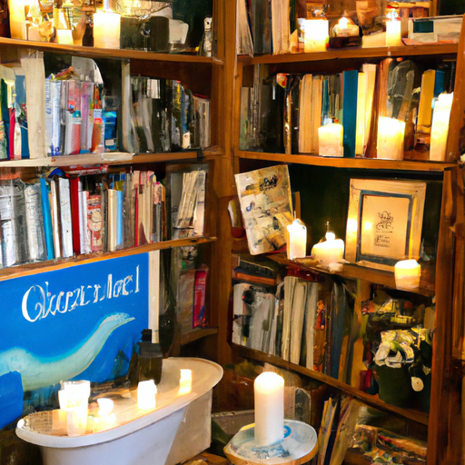
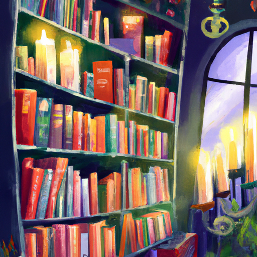
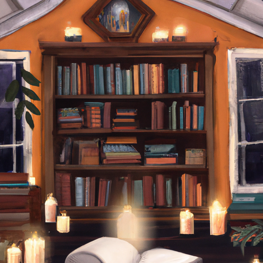

## [How I budget and live simply - finances living within means and rural life](https://www.youtube.com/watch?v=o7GyFa90klg)

<table align="center">
	<tr>
		<td align="center">
			
		</td>
		<td align="center">
			
		</td>
		<td align="center">
			
		</td>
	</tr>
</table>

It is a chilly February afternoon in the bookstore, and after the holiday rush, things have settled into a slower, quiet pace that I thoroughly enjoy. In this video, I thought I'd share a bit about how I manage my money in a rural area. There were definitely certain costs living out here that I thought may be interesting to share. Now, there's really no way I could cover everything and get into enough detail just in one video, but I will attempt to speak on a few things that I prioritize in regards to money management. I will discuss things more in detail about 10 minutes in, so you can skip to that if you wish.

So, I must begin with food because it is one of the larger costs that I budget for and is always several hundred dollars a month, usually about what I make working at my bookstore once a week. As you may know from watching past videos, I've had a history of not always prioritizing my health. It is an ongoing quest to eat quality foods and not just give into my sweet tooth when it's convenient. Noticing my frugal tendencies early on, I remember my parents always saying that saving money when possible is great, but try to never compromise your health. I now see the wisdom in their words and agree that if at all possible, we should prioritize feeding our bodies well and getting good sleep. It's such a crucial foundation.

In addition, when I have a new home, I definitely want to buy some extra food to store for emergencies. We are rural enough that it's possible, after an earthquake or other situation, we could be cut off from supply chains, so I really do want to be ready just in case. So, I expect to spend extra money on that when the time comes.

One expense I didn't anticipate when moving here was the cost of keeping my car in good condition. I need to usually change the tires for winter and then regular tires for the rest of the year. And of course, those need to be replaced. Rural roads can be hard on the car, causing it to need repairs more often. And then, of course, there's a very high likelihood that you can get into an accident with a deer on the road. Thankfully, I don't have to drive too much. I don't really go on road trips or travel very far, so I only really have to fill up on gas once or twice a month.

In regards to my wardrobe, I don't buy new clothes very often. I try to limit it and just use what I have as much as possible. You will see that I wear certain fast fashion items that I have owned long before I became informed about how important it is to consider where your clothes come from. But I also have to admit that I don't purchase sustainable fashion very often. I have found that the options available for tall people like myself are limited and very, very expensive, and I'm just not able to rationalize spending hundreds of dollars on a single piece of clothing. I really do try to just focus on using what I already have and just wearing it until it's all worn out. I also try to buy used clothing as much as possible. If you ever noticed something particularly unique in one of these videos, it's usually because it is second hand. I find a lot of interesting things at thrift shops, and it is one of my favorite places to go. I try to keep in mind that some of the most sustainable and mindful practices we can do in regards to how we consume is to simply use what we already have, to be grateful for it, using it fully, and not be excessive. I try to apply that mentality on many things in my life, financial and otherwise.

So, I was tidying up my house the other day, and I realized that I had about eight full-size candles, like this size. So, I thought that was probably a little bit excessive, but I definitely am a candle lover. So, I just kind of decided, you know what, eight candles, it's alright, I just won't get any more. I went to go meet a friend, and she actually had a New Year's gift for me, and it was a candle. And then, I went to my mailbox down the road, and there was a big package waiting for me, and I realized it was a gift box from the Mythology Candle Company, which I've bought candles from and I love, and they gifted me the entire spring collection, which is Shire-themed, which was so exciting. So, I had a blast opening it and smelling them all, and I was like, "Oh my goodness, this is like six new full-sized candles." It's okay, it's alright, it's okay, you know? It's not a problem unless you think it is, right? And then, the story gets even better. I went to my P.O. box in the town next to me, which I check at least once a month or so, and the postmaster said that I had a couple packages there. I just opened them, and they're from you guys, and two of you lovely, lovely people sent me more candles. I think within 24 hours, I have gone from owning eight candles to like 30 candles. Orange spice and vanilla, oh my gosh, I think that's my favorite. Anyway, I laughed so hard when I opened those packages. It is the sweetest thing to just accept that together we are creating this problem because if I'm turning into the crazy candle lady, I might as well make it a thing and, you know, share with you guys my recent discoveries. Woodwicks, cotton wicks, soy wax, beeswax. I could talk about candles a lot, quite a bit. The Mythology Candle Company is very, very sweet, and they definitely started me on a path where I'm gonna end up, I don't know, but I will keep you updated.

So, moving on from my day, I was reticent to make a video talking a little bit more about finances. I think sometimes it's a very complex subject to talk about. I think people have a lot of feelings associated with money, I definitely do. I thought it would be worth kind of mentioning some things that I try to prioritize every month. Maybe it would give you a little bit of perspective of how I manage my money in the countryside. Even though I feel financially stable, thank goodness, now, it's definitely a relationship I wanted to improve with myself and my finances. Not seeing money as an enemy or something that needs to be a constant source of fear. The vast majority of people I'm close with that are kind of spread out all over the place all seem to have equal difficulties finding affordable places to live, whether they're in the city or in the countryside. You know, and definitely here, I just wake up every day being so grateful I have a roof over my head. It means so much to start a new journey with Luke and to know that we hopefully will have a place that will be ours. I'm so aware too that if my life had just been the slightest bit different, it would have never been possible to do that, and so I'm just so happy that I will be able to stay and live in the valley I love so much when it is so hard sometimes to find places to live that you can afford.

This is an interesting area in the state. It is the poorest county, and yet this area, in particular, is a tourist hub, so it's kind of a lot of interesting, kind of contradictory elements. A local author wrote a book called "Dividing Paradise" on rural inequality, and it was really interesting, and it really, what I took from, and I think a lot of locals have taken from it, is how important it is to reach out to your community, to be active in your community, to give what you can, and to do everything possible to support not only the people here but the wildlife and the valley. Some role models I had growing up were people who really fought for preserving nature. Some that come to mind are, of course, Beatrix Potter, John Muir, Jane Goodall. They're really fascinating individuals, and I took a lot from their mission to try to preserve the beauty, preserve all this incredible landscape for the future. And so, every month, that is something I try to prioritize, to find ways to give back, especially through my nature conservancy, which has done some amazing things in this valley, especially after the wildfires. I share this because I personally have found that getting involved in something you care about, in any way you can, whether you are able to get involved in a big way or in a small way or just volunteer some time, it's just so fulfilling, and it's just amazing to think that you can be part of building a future. I think a really positive influence teaching young children had on me was that I saw the future in their eyes. I saw how important it was for me to be an example to them, not just tell them what I care about but show them. And I want them to see that. I want them to see that it is our responsibility to cultivate hope and to cultivate that positivity and to really be there for them and our little people. I think our little people really rely on us so much for an example on how to see the world.

Because of the challenges finding rentals in this area, I have noticed that many young people do get quite creative. I've met several people who moved to the area and just lived in trailers while they worked full time, and eventually, through kind of community connections, they were able to find a place to live. And that is really interesting and inspiring, and it's really fun to see young people getting so creative and finding ways to, little by little, work towards their dreams. And that's definitely something I've taken to heart. You know, it's just baby steps. It might take a year, five years, ten years, a lifetime to get to where you want to go. I will say that when I lived in the city, definitely as a very young adult, I had many friends who would live in situations that were not very safe for the sake of saving money. And that is definitely something I kind of inadvertently, through naivety and through lack of experience, got myself into as well. When I was in the city, I rented an apartment that, thinking back on it, was probably rented out illegally to me, though I didn't really understand that at the time. All I knew was that it was a lot more affordable than other places, and it was a very unclean space. It had a lot of rat infestations. There was a very high chance of getting your food contaminated in the kitchen because of that. And the room I was in was not insulated, and it had just one really small window because it was in an attic, and you couldn't get out of that window in an emergency. And that was something that had never occurred to me until one day a drunk driver backed into our gas pipe and flooded the house. A firefighter actually woke me up out of my bed. He stormed through the door and just about gave me a heart attack. I was already feeling quite dizzy at the time because I'd just been breathing in all this gas that was just flowing into the room and had nowhere to go. It was just kind of piling up in there. And that moment will always stick with me for the rest of my life. I will see firefighters as absolute superheroes. The reason I am sharing this story is because I moved into that apartment without really seriously taking into consideration the question of safety. And a big part of moving there was because it was affordable. And it's sad to think that for the sake of being able to save a couple hundred dollars every month, I was willing to risk my life like that. And it was a big wake-up call. It was shortly after that experience that I decided that I really needed to find a new job and a new place to live and that I needed to call up my mama and tell her my story and ask for help and stop being so stubborn. And I am forever grateful that I had a family that was willing to help me and was able to help me. And I don't know what I would have done if I hadn't had them there. I don't know what I would have done. So yeah, the moral of this story is whoever you are, whatever place you are in life, I hope that if you are able to do so, that you always keep your safety and your health into consideration. But yeah, take care of yourself. You are worthy of help. You are worthy of health. All these things are the foundation of, you know, working towards those dreams, trying to find peace, trying to find healing. But yes, there has been some progress on applying for a loan. Thankfully, it does seem to be going well for us so far. I was a bit worried because usually banks need two years' worth of tax returns. And while I was able to show the income from my business last year, the year before, I was still a teacher. That put me in a financial bracket where I wouldn't be approved for a loan with those two years of tax returns. So I had to wait until I filed my taxes for this year in order to be approved on my own. But thankfully, between Luke and I, it does seem like we're still going to get approved because he's had a stable job working as a surveyor for several years in this area. And he's such a dedicated and hard worker. And honestly, thanks to him, kind of all this is possible. So yeah, I'm so proud of him. But yeah, so we will see how it goes. I am so excited about all of it. And of course, I need to conclude this by saying thank you to all of you. You guys have changed my life, completely changed my life. You have allowed me to make a living through my art, through sharing things I love, through this valley. And I cannot thank you enough. All right, well, I think I have talked more than enough, maybe too much. But I hope you're all well. I will see you very, very soon. And take care. I am sending my love. Goodbye.