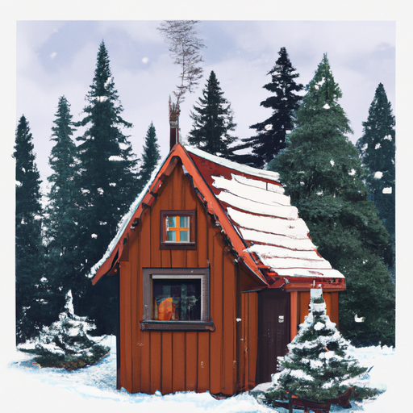
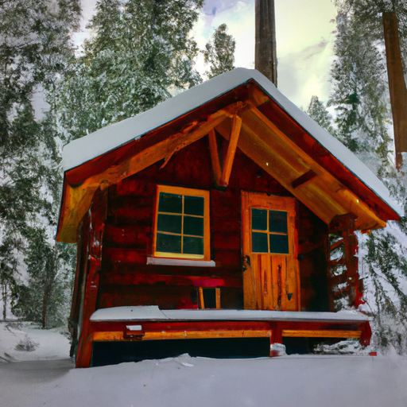

## [How I m letting go and embracing a new way of living - highly sensitive personality](https://www.youtube.com/watch?v=_gYEVxhDu6U)

<table align="center">
	<tr>
		<td align="center">
			
		</td>
		<td align="center">
			
		</td>
		<td align="center">
			
		</td>
	</tr>
</table>

I live in a house surrounded by a forest of evergreens, home to all manner of creatures from gentle black bears to Humble Downy woodpeckers. I consider many of the Pines my friends; they're excellent listeners and teach me that peace is simply being, not forcing feelings of joy or ignoring difficult questions. It's embracing your story and in that acceptance finding a sort of relief, knowing that honoring your feelings makes you very much alive and fully present.

Today, I'm celebrating life and dedicating time to simply having fun. January has been a month of transformation. I've done my best to not be avoidant in regards to how I feel, particularly when it comes to more uncomfortable questions. Strangely enough, I've found myself reflecting on the fact that in the scheme of things, I will only be here in my present state for a short time. I don't know how long, and there is so much out of my control. And I think that, so far, has been the key to becoming more peaceful. It's not avoiding big questions or the feelings they arise; it's being fully aware of them.

I've experienced a long battle with depression, and those years partly inspired me to become a counselor. Today, when I speak to others about feeling anxious and their tendency to overwork, I encourage them to sit with how they feel and to address the fear of the unknown, the fear of themselves. Sometimes, they're afraid they're not doing enough to leave the world a better place, and sometimes they fear they're doing too much and not slowing down enough to be in the moment. They're afraid of the ultimate reality that life is fleeting and that they need to cultivate the life they love, not wait for it to happen.

I don't know the answers to all the secrets of the world and beyond. I don't know a lot of things, but eventually, I just might find out. And that's a journey worth pursuing. I think all of these fears come down to a wish to control something that, by its very nature, cannot. And I know deep down that that wonder and mystery is what makes it all matter that much more.

If there is one piece of advice I can pass on from my lovely sister to you, it is to not be afraid. She was able to manage and transform her mental health when she began letting herself feel pain, love, hope. It was overwhelming at first, difficult, but it pushed her to connect. She now says she's neither extremely happy nor unhappy in her daily life. She acknowledges her strong emotions when they arise and, in the meantime, accepts that she's quietly content with how things are. And that is enough. Her journey brought her to a deeply spiritual place. I don't know if that would be the same for you, but I can assure you that when you open your heart, life may surprise you in unexpected ways and take you somewhere truly astonishing.

I have gone ahead and wrapped myself in a blanket because it is quite cold. I have such a low tolerance for the cold; it is absolutely ridiculous. It isn't just psychological, though. Every year, I get chill blains no matter how many pairs of socks I wear, how many hot pads I keep in my shoes. I just don't know why this can't function. Apparently, it's been a very quiet day. I've also been feeding the birds, and my mother has so many bird feeders all around this one tree in front of the house. There are all types of chickadees and Stellar Jays and Pine siskins, and even a variety of squirrels and chipmunks. We have a family of quail that come to visit and eat a lot of the food. It's quite funny to see how all the quail in the valley get quite slim during the winter, but this one family that lives right next to the house with all these bird feeders gets quite rotund. They get very plump by the end of winter; they're eating very well.

January has been a challenging month, but I think a good one. I found myself a bit cooped up sometimes, but I have been using that time to journal, reflect, and read quite a few books on topics that I've been meaning to read lately. Some were books for helping people like myself who have found themselves struggling to let go of work. That is something that I've made multiple videos on in the past and have improved upon greatly, but there is still so much room for improvement. It is interesting because in a book that I was reading lately, they mentioned how important it is to let go of control. That is something that so many of us want to feel in regards to our own lives, to feel as if we have control over all of it. And of course, we do have control in the way that we react to events and the small sustainable changes we can make to improve our day and experience. However, we don't really have control over what happens to us sometimes, and there are so many things in life that we will never have control over.

I think that in the past, I have been quite avoidant with a lot of those feelings and questions. And I think now, especially reading a lot about these topics of letting go and understanding the impermanence of life, I have found that instead of avoiding these emotions and the reality of our lack of control in many things in life, it is better to talk about them and connect over them. In a way, the beauty of the things that unite us is so healing, especially in terms of learning how to enjoy today and not always thinking about tomorrow. And of course, embracing working hard and working towards your goals, if you so wish, but also remembering what really matters at the end of the day and making sure you're nurturing those things and those relationships.

We cannot control everything. We don't know how much time we have here to connect, to love, to be kind and thoughtful, and live the way we wish to live. We might as well start imbuing aspects of that into our daily life, even if our situation is not perfect. I'm going to keep reading Frog and Toad and Wind in the Willows and Mother Westwind and all these books I grew up with and realized that I aspired to a life living in a little fairy house on a riverbank and spending time with all the woodland creatures all day long and getting into mischief with them.

Sending all of you my love. Do take care of yourselves, and I will see you so very soon.