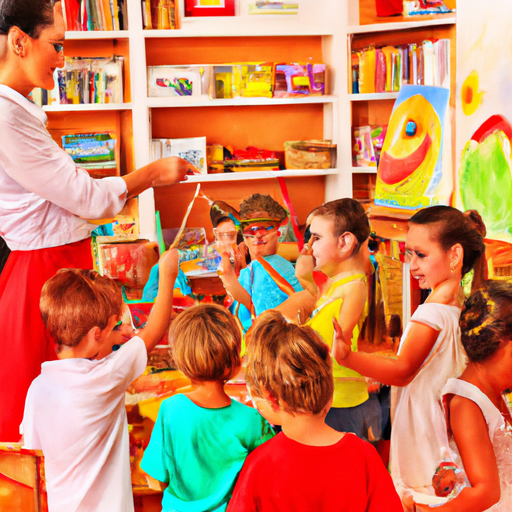
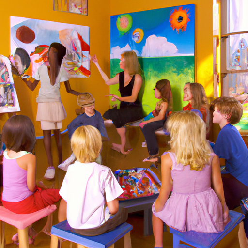

## [How I make a living - affording my country cottage life](https://www.youtube.com/watch?v=NIBzjuhawbs)

<table align="center">
	<tr>
		<td align="center">
			
		</td>
		<td align="center">
			
		</td>
		<td align="center">
			
		</td>
	</tr>
</table>

I got my first job when I was 15, earning about $7.00 an hour. I worked as a librarian, helping to sort books and process returns. After finishing university, I moved to a city and found a job at an independent bookstore, where I made $11.50 per hour. However, I struggled to find a job that provided enough income for me to live independently.

To make ends meet, I took on multiple jobs and freelanced my editing and writing skills. I also sold art at craft fairs. After a couple of years, I was doing okay financially, but I felt burnt out and unable to get ahead. Then, some terrible events occurred in my life that I find difficult to discuss. Despite the pain they brought, I learned the importance of being both emotionally and financially prepared for unexpected circumstances.

I realized that, although I enjoyed my current job and loved my coworkers, staying where I was wouldn't allow me to move towards a more stable future. Feeling defeated and dealing with severe anxiety, I reached out to my lifeline - my mother. I cried and asked for help. I had applied for and been accepted into a position as a preschool teacher in my hometown. I wanted to come home and be with my mother and father. I needed assistance with transportation and covering basic costs until I started my new job. I felt disappointed in myself.

Some friends have told me that it's embarrassing to rely on family for support and that it's more impressive to be self-sufficient. I even receive comments online suggesting that seeking family support is a failure at adulthood and something to be ashamed of. It's ironic because many young people have no choice but to rely on others to make ends meet in our current world. While having people in your life who can help you in times of need is a privilege, there is absolutely no shame in accepting support when you need it. In my case, it made all the difference in changing my life for the better.

Asking for help was one of the hardest things I've ever done. My father used my savings to help me relocate, covered my health insurance, and assisted me in transitioning into my new job. In my town, which is a developing rural area, there was a great need for construction workers, plumbers, and teachers. Although my salary as a childcare worker was still not very high, I was finally able to cover my monthly expenses more easily. However, I still feared unforeseen expenses, such as my car breaking down.

To supplement my income and feel more independent, I decided to turn my art into a side business. While farmers markets are not typically considered lucrative, I was fortunate because my town attracts a lot of tourists, and many crafters and farmers who sell there are able to make it a part-time job. I saw this and thought it would be a great way to supplement my income and feel more independent. And it worked! I received wonderful feedback on my art, which encouraged me to consider opening an online shop.

Starting my online business was slow at first. I didn't know how to get my work noticed, so I set myself a challenge of one year to deal with the hectic life of running a business, working at farmers markets, and teaching at the preschool. It was a lot, but little by little, things started looking up. I was making sales and working overtime at the school. I was so excited for the future.

However, in March of last year, everything changed. My country shut down, and I found myself temporarily out of a job. I was terrified that my school would close for good, and I would have to move back to the city. Despite my fear, I started looking for ways to get creative with my time off. It was wildflower season, so I decided to find a way to share the beauty of my valley with those who couldn't visit, hoping to bring some peaceful moments to others who felt like me.

Using my iPhone and a cheap tripod (which I had to replace almost immediately), I started making videos. It was a slow and thoughtful process that made me believe that tomorrow could be better and brighter. Learning how to be both the camera person and in the shots was tricky, but I improved over time. By the end of the year, I had received a wonderful response and connected with many lovely people.

My school partially reopened, and I resumed my work as a teacher. This time, I was able to supplement my income through my online business. I was and am forever grateful for that. And now, one year after my future became uncertain, I'm taking another leap. After much consideration, I realized that while I wanted to continue teaching, I specifically wanted to be an art teacher for young children. I'm passionate about inspiring creativity in little ones.

Recently, I transitioned out of my preschool job and started making new plans for the future. There are many unknowns, but I'm learning to embrace them, as that's where sparks of innovation are born. I would love to hear your thoughts and insights.