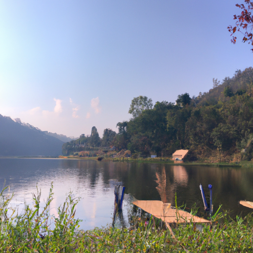

## [How I stopped comparing my life to others - success should be re-defined](https://www.youtube.com/watch?v=UcIIgwiLdmw)

<table align="center">
	<tr>
		<td align="center">
<<<<<<< HEAD
			
		</td>
		<td align="center">
			
		</td>
		<td align="center">
			
=======
			
		</td>
		<td align="center">
			
		</td>
		<td align="center">
			
>>>>>>> ffe52613361410ad9d371a0f80e81de4dd24175f
		</td>
	</tr>
</table>

I share my little corner of the world with a small collection of humans and abundant wildlife. It is a quiet town in a sleepy valley. Not much happens here, I rarely travel far from home, and I spend my days working mostly, enjoying little moments here and there to myself where I can partake in some hobbies or potter about the garden, or make quaint little videos like the one you’re seeing now.

It’s therapeutic for me to step away from the bustle of the world and exist differently, even if just for a moment or two. Usually, I use that time to create a haven of my own design, to show through these videos a glimpse into my interior world. Daily life may feel mundane at times, but I love to notice the subtle beauty and take comfort in simplicity.

I think comparison is a tendency we all have. Why isn’t my life more exciting, why do they get to have that when I don’t? Why is it that I can work hard and still not attain everything I wish? Life can be rather fickle that way. I remember when I was dealing with an illness, I suddenly became acutely aware of how free other people seemed, and romanticized their ability to live with so much ease and joy in their own bodies. In contrast, I felt like I could barely live with myself. I wanted so deeply to have inner peace, that it felt like everyone was happier than I, and it was incredibly unfair. But that wasn’t true, at least, not in the way I believed. And I now think it’s a pity that I spent so much time comparing when I could have taken inspiration from those very same people. I didn’t want their lives, not really, I wanted the happiness I believed they possessed.

A lot of these feelings, when unpacked, reveal so much about ourselves. For example, as a teen, a friend of mine was always looking at photographs of women she felt were beautiful and let it fuel her desire to look different. She didn’t like her face, her hair, her eyes. She wanted a new body. Speaking to her on the subject years later, she said that she realized that she didn’t truly want to change her face, she wanted that feeling of self-love when looking in the mirror. The feeling of confidence in her own skin. Of wanting to know her worth and not needing other people to make her believe it. Changing her body wouldn’t have resolved that, not over the long term.

If you are chasing something external to feel at peace with yourself, the cycle seems to never end. At least, that was my case as a competitive student. I spent so many years trying to be the best scholar I could, only to graduate, having finally accomplished the goal I thought would change everything, and realizing that now I could only think of being an even better student. Being a professor, getting a PhD. If I put my worth in my credentials, I’d spend the rest of my life moving up an endless ladder. It was my choice when I would say, no, this is enough. I have enough. I am content with the way things are.

Once I became aware of this pattern, of aiming for something and then being disappointed once I got it, I began to question everything. So many patterns in life, in my series of toxic relationships, in my eventual dislike of any job I had, my tendency to circle back to my former eating disorder in order to avoid facing the fact that my life was my own. It’s scary to realize you have that power to shape your reality and deal with the consequences.

If there is one thing I learned from my illness and the personal growth that was required to overcome it, is that becoming the person you want to be is rarely a linear path. It’s a cycle of forward and backward movement that slowly gets you to a good place. It takes patience and compassion, and while I don’t know that I’m there yet, I do know that it gets easier with time.