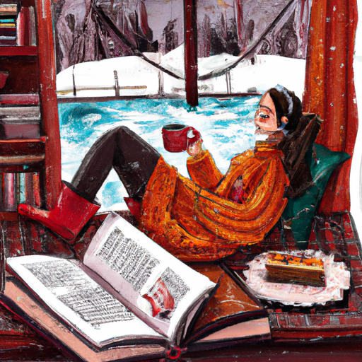
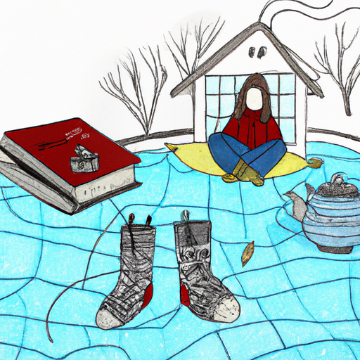
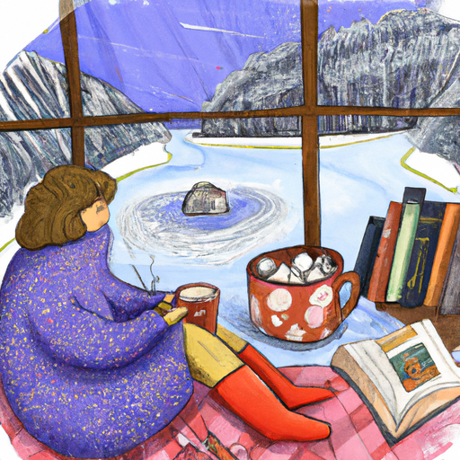

## [How I take care of myself living alone - rural tiny home](https://www.youtube.com/watch?v=7AeMhVN-TFA)

<table align="center">
	<tr>
		<td align="center">
			
		</td>
		<td align="center">
			
		</td>
		<td align="center">
			
		</td>
	</tr>
</table>

The lake outside my house has begun to freeze over and I'm starting to brace myself every time I open the door of my cottage and the biting wind pushes through. Consequently, it was time to stock up my pantry and pick out some new teas to use over the winter. I remember reading the line from Emerson, "There is a great deal of poetry and fine sentiment in a cup of tea," and I really like that saying. I think it is very true for me. Brewing a cup of tea along with breakfast is a simple and wholesome form of self-care. I begin the day with the accomplishment of nourishing my body, and in my case, small achievements like this need to be celebrated.

One way I take care of myself in winter is that I welcome my most comfortable clothes, particularly sweaters and my favorite cozy skirts, which are very warm (which is unnecessary here). Dresses and I also wear leggings. In connection to my last video, one way that I've tried to feel more comfortable in my skin has been through finding clothes that have a comforting texture and making sure they fit me well with room for movement. If I'm at all self-conscious or uncomfortable, my attention is drawn inward and my general enjoyment of the day is affected. An important part of improving my own mental health is to practice seeing the world, truly seeing it instead of constantly being in my own head. More than I want to, one way I do this is by making sure I feel comfortable. It is definitely easy to dress for others instead of ourselves, and that is one reason I began to embrace the styles of clothes I truly enjoy.

I remember when I was a little girl, my abuela lived with us for several years. I begged her to sew me a very long, old-fashioned looking dress so that I could wear it to school. I was in love with Beatrix Potter at the time and I apparently wanted to emulate a person that had not been alive for over 70 years. While I studied at home for the most part, I did take a few science classes at a local middle school, and on my first day, I wore that dress with boots I'd found at the Salvation Army. I definitely looked a little strange, and I find it hilarious that I was willing to walk into that school looking like I had stepped out of 1901. I've definitely modernized my fashion since then, and I now enjoy dresses along with jeans and leggings and all the lovely modern clothes I own. I do, however, love how confident I was in my wardrobe as a 13-year-old, even if I was not always confident in myself. I still take inspiration from her to this day.

I have made a change in my life recently that has proved quite helpful, especially in the winter when I'm indoors more and in the quiet company of my own thoughts. And that has been to distance myself from a constant onslaught of tragic and negative news. I tend to listen to audiobooks now while I drive instead of the radio, and this has helped a lot. Of course, it's so important to stay informed and understand what's going on in our world, and I believe that. I also think we need to take breaks when it is necessary and also balance negative news with positive. With only a couple quick searches, I'm able to find so many forces for good in the world right now, which are often not being talked about nearly as much as they should. It is a good reminder that while we should honor our feelings associated with tragic news, we can then also spend energy going out and sharing love and kindness with someone and being part of something just as worthy of being on the news. This practice has been so healing for me. It's amazing how you don't realize the impact media has on you until you step away from it in order to find a balance between consuming it and going out into the world to be the change you want to see.

Hello everyone, I hope you're all having a wonderful day. It's been just a really great week over here. I started at the bookstore and I'm just enjoying it so much. This time of year, all the little shops in town put up their Christmas lights and then it snows, and it's just so magical walking through it. It really feels like a Thomas Kinkade painting, you know, like one of those paintings of the little idyllic little towns. It's really cute. I just love walking around after it snowed and all the holiday decorations are up. So, I'm really excited. It's been so much fun, and working at the bookstore has made me realize how important it was for me to put a little more balance in my life between home life and work life. And working in town, it's been really positive. Even though I've only just started working there, I really realized I kind of wasn't in balance with the amount of time I was spending at home working, and going out and being in a different environment and interacting with people is really, really helpful. So, I've been really enjoying it.

In last week's video, I got some amazing comments and emails and letters from all of you explaining your own personal journeys with body image and disorders and addiction, and it was really meaningful to read. My fiance put it very well once. He said that to make room for new things in our life and good things in our life, we often have to take out other things to make space for it. And I think in so many cases, that's very true. For me, there was a lot of bad habits I really had to replace with much healthier ways to spend my time. And also, for me personally, as an artist and lover of stories and fairy tales and all types of art, for me, replacing unhealthy escapism with healthy forms of escapism was just absolutely crucial for my journey of health and recovery. And that is something that I still do a lot today. For example, creating art, getting a job in town when I felt like I was at home and in my own head a little bit too much, really finding that harmony and balance. Definitely, working at the bookstore has really helped because I have become even more passionate about books in such a short amount of time. It's so exciting to talk to people about books and get book recommendations since it's one of my favorite forms of healthy escapism. You know, I love to just step into another story, another reality for a little while. It is so therapeutic to do this.

This time of year, I always, for some reason, get attracted to mythology and folk tales and looking into the stories of other cultures and also my own. And especially the ancient stories that have been passed on through generations. And that is something I've been doing recently. I have been reading some books on Native American myths and legends, which are fascinating, and also some Polynesian myths and folk tales. And it's been really interesting. The book of Polynesian stories is kind of a word-for-word translation, so I have sometimes really gotten lost while reading it. But it's been really fun to just look into it and get to learn about the stories of other cultures and to see also the similarities. So many different stories from around the world all kind of have, as well, so many similarities and a lot of the same topics that are being examined, such as what is honor, what does family mean, how do we face our fears, how can we have courage when we're scared of the world or we're scared of something. And I find those stories very comforting because it makes me feel like my ancestors who lived a thousand years ago are still asking the same questions and still experiencing the world in a way that I can still relate to on some levels. And I just absolutely loved getting back into some old myths and legends. I have a book on stories of the Taino people from Puerto Rico, and I was reading it last night, and one of the stories was about the Chupacabra. And if you are Hispanic, you've probably heard of the legend of the Chupacabra. It's very popular in some areas. It is a legendary monster, and the story I was reading was really, really scary. So, I just felt like I was such a baby. It took me a long time to sleep that night. It was really spooky. So, if you're looking into the old myths and legends of your people, I highly encourage you. But be careful because they really didn't mess around in those stories. Some of them can be really, really spooky.

So, after reading some stories from Puerto Rico, I was really motivated to revisit some of my favorite Puerto Rican recipes. And I've been having a lot of fun, especially because my mom has a really great book on traditional Puerto Rican recipes that I've been looking at. Some of my favorite recipes from the book are arroz con pollo, pasteles, and coquito. I really love coquito. It's kind of like Puerto Rican eggnog. It's made with coconut milk. It's really, really good. So, I thought that I would share some of those traditional recipes during this winter when I make them for my family because they are delicious. And I've been really motivated recently to try old recipes but also new recipes and really get involved more in my cultural traditional foods on my mother's side. So, I've been very excited about that.

Anyway, I hope you all have a wonderful day or night. Thank you again for reaching out to me with your very personal and kind messages. And it has been so appreciated. Some of them were really, really touching this week. And yeah, and I wanted to say thank you. I know I'm not always able to respond to everyone, and know that I read them and I do appreciate them. I always put a blurb in the description bar of my videos, but do let me know that if you have been expecting a postcard from me and you haven't received it, please send me an email. I have my email in the description bar because the US postal system, and just the mail system in general in the US, is just going insane. It has been going crazy all year. It has been really hard to manage, and it's been very unpredictable when things are delivered. And I have noticed a couple postcards and even a couple packages have been lost in the mail this year. And it's been a wild ride. So please email me if you're expecting something from me and you haven't received it because I really want to do my best to make sure that everyone gets what they were expecting, and that's very important to me. So, please do let me know. Don't be shy. I really want to get things to you if you are expecting them.

I hope you have a wonderful day or night, and I will see you next week. Take care.