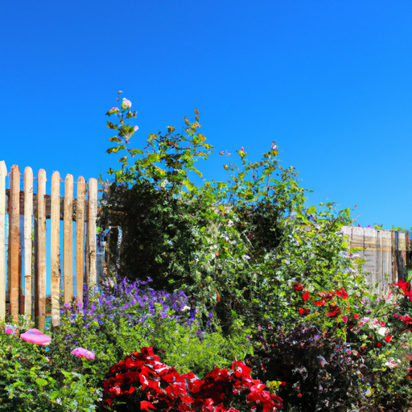
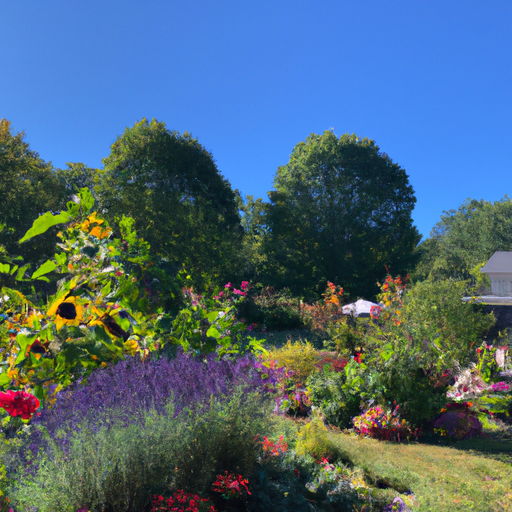

## [How I train my mind to be peaceful - simple practices for a simple life](https://www.youtube.com/watch?v=un98ViFDwtQ)

<table align="center">
	<tr>
		<td align="center">
			
		</td>
		<td align="center">
			
		</td>
		<td align="center">
			
		</td>
	</tr>
</table>

It is cold and wet outside, and as winter seeps away into the watersheds and streams, my garden has been lying dormant for nearly half a year. However, my hair has not, and the tangle of curls was in much need of a trim. I've never been someone who consistently follows routine, but I have found benefit in having at least one to two nurturing things I try to do each day.

Recently, I spend anywhere from 1 to 20 minutes in meditative peace with some soft music in the background. I used to do this with my preschool students when I worked as a teacher. We would focus on relaxing our entire bodies, limb to limb, and taking deep breaths through our bellies. I do this in the evening as well, letting my mind find a peaceful break from the day. Doing this is not easy if you weren't used to it, but you can build up your ability to sit in pure enjoyment of the present and focus on your breathing and full body relaxation.

Each day, I attempt to write down how I'm feeling, focusing on words of encouragement in regards to whatever I'm trying to accomplish. Addressing my feelings of stress and speaking to myself as if I was a loving friend. I try to shy away from planning out my day in too much detail and only note what truly needs to get done. As for me, my Writing Practice must be a place for encouragement and gentleness, not a judge of how productive the day was and a reason to be disappointed if I'm not efficient. Instead, I celebrate taking things slow if I've had a hard day and write down encouraging words for the next.

I have found that the more consistent I am in doing these things each day, the more my mind responds and trains itself ever so slowly to seek out peace instead of stress. I don't understand much about neuroplasticity, but it is worth reading about. I've been witness to the transformation of my thoughts over the last six months as I face the more anxious side of my character and decided that while I will always be sensitive and feel deeply, I no longer wish to be a victim of my stress. Instead, I want to learn to manage it better and thrive. It has been a long journey and very humbling, but I am so much happier and healthier now, and what I never thought was possible has slowly come true. Thank you.

I'm far from figuring things out. I still feel like a clueless student of the soul, but I hope I can offer some words of encouragement. There are some things we cannot change, but with each thing we cannot, there is something we can. And by believing it is possible, we may slowly leave our cocoons and transform into something we never thought we could. Isn't that exciting? And what better time to adopt a nurturing pastime than in the spring when everything is growing and blooming alongside you?

This is the first time I've made cookies with raspberry jam, and I have to say, it's delicious. These are supposed to be a gift for my mother, so I'm going to try to restrain myself to one cookie. Since the theme of today has been Alice in Wonderland, I admit that I feel quite royal and queenly eating these, much like the Queen of Hearts without the homicidal instincts, which I think is a good thing.

So often this month, I found myself standing here by my window, just staring out at the snow, wondering when it will finally melt. This time last year, there was barely any snow on the ground. It's gotten to me a bit recently. I have so many things I want to do outside, and while you can do all sorts of things out in the snow, I love to garden, and all my pots and everything are still under snow. I'm just so impatient, and I know that's not the best, but I also am so impatient to share all my foraging and wild crafting adventures out in the beauty of this valley. I find it hard to film in the winter because it's so cold and it's much harder to bring my gear to places. But as you can see, I've been keeping myself quite entertained with baking projects and home crafts this year.

For 2023, my morning routine and daily routines have changed drastically. I think in an attempt to deal with the darkness and the cold of the winter that was so long this year. I have said in the past that I don't regularly meditate or journal, and I don't do that consistently. But recently, over this winter, I've just rediscovered a deep passion for those pastimes. Meditating from a spiritual perspective has been so helpful to me and has aided me so much in really learning on a new level how to manage my anxiousness. I feel like I am slowly but surely becoming the version of myself I always wanted to be. Someone who still feels emotions and still feels stress from the day, from work, but they're not a victim of it. They're not a victim of these feelings. And that's something I've always wanted to be able to do, managing those feelings in a way that I respect them and I listen to them and I feel them, but they do not throw things in a chaotic direction in regards to my life. I'm so happy that I've been able to make so much progress there.

Oh, I forgot to mention, I will be adding an extra bookmark to my Etsy Shop sales this week. If you are interested, I really appreciate the support. It helps keep this channel running, so thank you. Let me know if you have any hobbies or pastimes that help you through the winter and help keep your spirits light. I always love to hear it. And I hope you have a wonderful week. Take care. Goodbye.