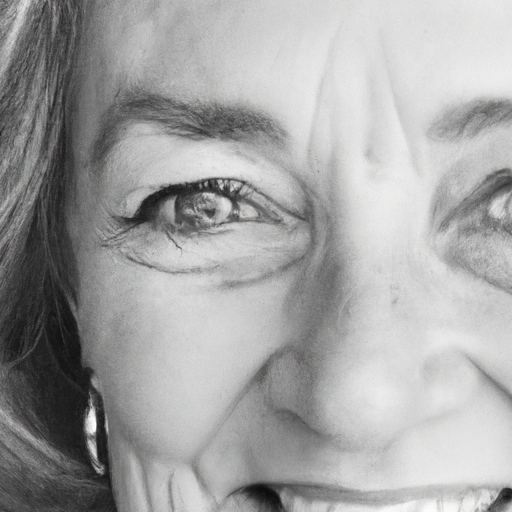
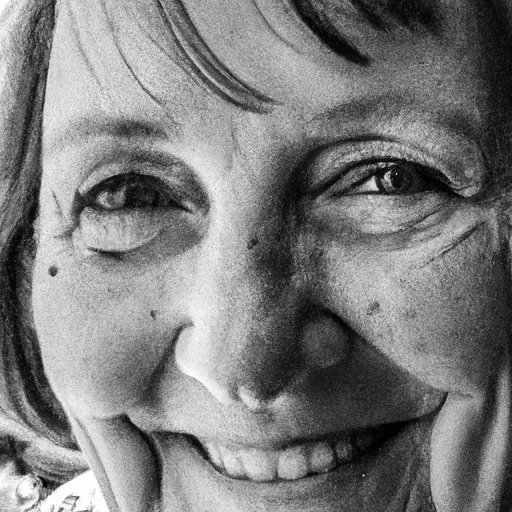
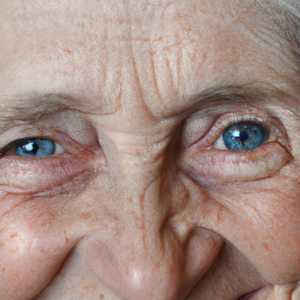

## [How to be beautiful forever - a note from living gently in the forest](https://www.youtube.com/watch?v=Q6QpSl6-CQw)

<table align="center">
	<tr>
		<td align="center">
			
		</td>
		<td align="center">
			
		</td>
		<td align="center">
			
		</td>
	</tr>
</table>

Whenever I meet a person, I often notice their eyes. I particularly love those little wrinkles that form around them when they smile. I enjoy when someone shares a topic they're passionate about; their face has a way of lighting up and the vibrancy is in their voice. When someone is kind, they shine a light that makes others feel as if the world is a little better than a minute before.

I know what it is to have no self-esteem, and when I was able to finally crawl out of that hole and find stability in regards to how I see myself, I was surprised that being comfortable wasn't necessarily being confident in how I looked. It was simply being at peace with who I was. To give a very silly example, I'm told quite often online that I have an unfortunately large nose. It comes with the territory of being someone on the internet. These comments are often attempting to make me feel self-conscious, but I'm happy to say it doesn't, because it relies on me agreeing with their perception and internalizing it. And that is where my power lies, and yours does too. Indeed, words become real only if you believe they are. When you get to that place, it's incredible to feel that freedom, and all time spent critiquing my own or others' external selves seems like a waste of potential. My life minutes could be used in so many other wondrous ways.

I asked all of you what made a person beautiful, and without fail, I got the words of compassion and honesty. And that's interesting because in a way, those are some of the easiest things to be. It may be hard at the very start when we have layers of fear and hurt in our way, but once those walls come down, we're free. And just like that, we become something so beautiful it cannot be described through a physical representation. We can spend the rest of time debating physical beauty, but I would really like to spend that time wondering how I can cultivate a beauty that lasts forever. I think that's a far more interesting question.

I have been working on this little bunny rabbit all morning, and I have to say, it has filled me with so much joy. I am always surprised by the little things that bring me little moments of just happiness throughout the day, and this is one of them. I think getting creative and making something, you know, that isn't necessarily very complicated or anything, but just something that brings you joy, it's so beautiful and I think so important on a daily basis. You know, if it's possible, depending on the person, you know there are different things that may bring you joy. I know for a lot of people, it's coffee. For some people, it may be their pets. You know, laying in bed after a long day of work. Cupcakes and cookies. For me today, what brings me joy is painting a little bunny with a mushroom cap because it's so simple, but something about it just makes my day. So sometimes, it's just the simplest, most darling little things that make all the difference.