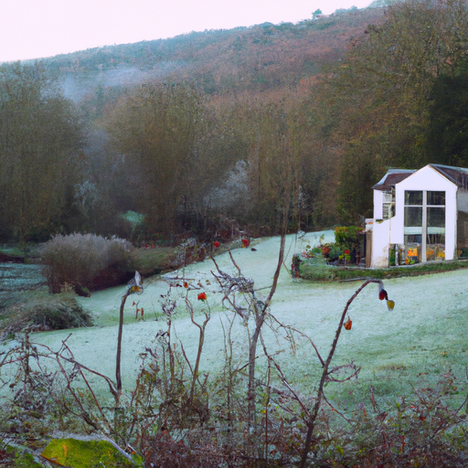
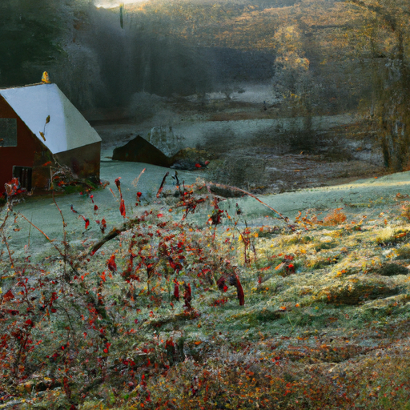
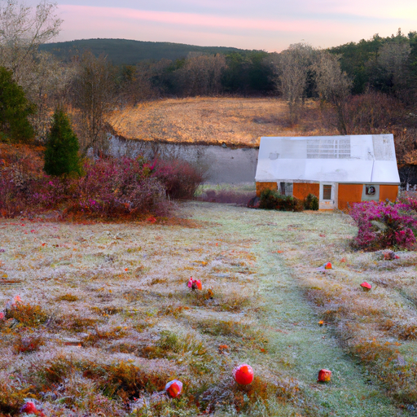

## [I am a bookseller - a day in my life working at a small town bookshop](https://www.youtube.com/watch?v=MFQg4zIWWjw)

<table align="center">
	<tr>
		<td align="center">
<<<<<<< HEAD
			
		</td>
		<td align="center">
			
		</td>
		<td align="center">
			
=======
			
		</td>
		<td align="center">
			
		</td>
		<td align="center">
			
>>>>>>> ffe52613361410ad9d371a0f80e81de4dd24175f
		</td>
	</tr>
</table>

My valley is in a time of transition. Sweetbriar grows next to my cottage and it has long gone to seed. This morning, I noticed there was rhyme ice growing over the rose hips. Just then, the dawn came and before my eyes, it melted away. It's a very interesting and strange time of year, but cheerful. While I need to work full-time, diversifying the jobs I do has really been the best choice for me, and I've quickly fallen more in love with my local bookshop.

Days are sunup to sundown. I get to chat with customers and find it to be a lovely and mostly quiet type of work, which is unusual for retail jobs, to say the least. It makes me value the calm rhythm of my small town. It suits me and, of course, has inspired my writing and daydreaming. I enjoy these days spent with books, knowing I've had quite a few jobs in the past that I deeply disliked.

I think it can be easy to feel defined by your job or not having a job or not having the career success you wish you had. And if you ever feel that, especially if you find yourself in a job that you don't enjoy, I'll share a line I recently heard in a movie based off the book Stardust by Neil Gaiman. To paraphrase, the line was in reference to the main character Tristan, who was working at a shop he really didn't like. It goes like this: "If I know something from observing this planet for so very long, it's that humans are never quite what they seem. There are shop boys, then there are boys who are simply working in a shop for the time being."

Whether you enjoy your job or want to do something different, I think there's wisdom in this line and remembering that who you are isn't defined by your job or achievements. It really doesn't matter too much in the end, or at least not as much as we may think. If we can believe one thing, it's that we have intrinsic value no matter what. And if you're like Tristan, you take that advice and decide to go on wild adventures involving magic and stars and sword fighting and all types of creative pursuits. He's definitely one of my favorite literary characters.

Many independent bookshops around the U.S. have had trouble staying afloat. My bookshop has had a tough time during the wildfire seasons that were so bad this year, and they barely got customers. If you want to support this or your local bookshop, I'm going to leave a link to an equally affordable alternative to Audible called Libro that supports your local small businesses. I think that's so important right now. I know Audible is able to afford a lot of YouTube sponsorships. Online, I see them everywhere, so I just wanted to give my unsponsored two cents and offer an alternative.

I was gonna wear these glasses to film, but I'm realizing they're very reflective, so we'll just do this blind. If you hear chewing in the background, it's because Mr. Darcy just got a bunch of new fresh Timothy hay. So, I wanted to share a little bit of working at the bookstore. Even though I'm only working for the holidays, I am actually hoping to potentially keep working there next year. It would be really nice. I'm just enjoying it so much, and the holidays, even though they've been pretty busy, have been just so enjoyable so far. I would say this retail job is by far the one I've enjoyed the most of all the ones I've done. And there have been some really funny challenges that have been presented to me.

As the holiday help, I get paid about fourteen dollars an hour, and the average book in the store is about fourteen dollars. And pretty much every hour looking around, I spot a new book that I'd really like to read. So, um, yeah. So, I could just be paid in books at the rate that I'm amassing a list of new things I want.

In this video, I kind of wanted to share some books that have been very meaningful to me or that I am recently reading that I've enjoyed. And if you are not a huge reader or you're just not into book content, don't worry. I will be back next week with my more normal content.

So, as you know, two of my favorite books of all time are The Snow Child and Once Upon a River by Diane Setterfield. They are both just so beautifully written. They have kind of a poetic feel to the style of writing, and they're so atmospheric. And they both have elements of kind of a connection to another world and kind of lifting the barrier between the real world and another world. It was just so magical, and I definitely recommend those two for this time of year.

And I recently started reading The 10,000 Doors of January, and I was told that that book has a very similar feel to those other two. So, I'm really excited. I just started it, but I am really enjoying it. And the writing is very artistic and just absolutely superb.

Some of my favorite books are books that follow kind of normal lives, just of people who are just living quiet, simple life experiences. And yet, they are also in touch with something else, something more. I don't want to even say supernatural, but definitely of another world. And it just kind of adds this little element of something really exciting into the life experience and the stories of these people. So, I just really love that, especially in the winter when everything feels a lot more kind of magical. So, been really, really enjoying that. And definitely when there's a spiritual component and a bit of a narrative on spirituality, I really like as well.

Anyway, highly recommend those. I do read a lot of children's books. I think, especially because I assume it's perhaps because the writers are really keeping in mind how they felt about the world when they were very young and they want to cater to that. But I do find children's books to be predominantly so hopeful and positive and uplifting. And I think that's such a beautiful message. And so many books for teens and adults, it's very common to have much darker and depressing themes. And while those themes are definitely very important and those books are extremely well written and very important, I don't always want to read stories that make me really sad. Middle grade and YA books, I feel, come back to that seed inside each of us that wants to believe in a better world. And I think that's so important.

I recently started enjoying graphic novels a lot more. I used to never read them, and they've usually become more mainstream. And I really have been enjoying Hilda. It's this very adorable graphic novel series about initially a little girl who lives in the wilderness and who is in touch with the little people, you know, and these little magical people that live in a partly invisible world. And it's really sweet. It has a TV show adaptation on Netflix, and it's just very calming and just has such a wholesome and sweet sentiment. I really enjoyed those books. So yeah, if you enjoy stories like that and kind of whimsical, wholesome, you know, adventure stories, definitely check those out.

I also recently read My Father's Dragon, which is a book that I was raised on. I used to have it read aloud to me a lot, and it's hilarious and it's just so sweet. It's perfect for children, and I just love it very, very much.

I also recently listened to the audiobook of the very first book in the Bunnicula series, and it is hilarious. It's about a cat and a dog who are living in a household. The family brings home a rabbit who is not everything that he seems, and the cat and dog are just about the funniest characters ever written. I just, I usually don't laugh in books, but I just found myself laughing all the time while listening to that story. So, I highly recommend that one in audiobook form. It is just so adorable.

I recently started reading The Fox and I, and it just seems to be such a beautifully written nature story. And I'm very intrigued to buy it. But one of the reasons I started reading it is because I read a couple other books in the nature section that I was really surprised by how much I love them. Others that come to mind are The Secret Life of Trees and Winter World. Winter World, especially, was a little more scientific, but I found it so fascinating to read about how animals behave in winter. One thing I realized recently is that the lake next to my house has a lot of painted turtles. There are these very beautiful, gorgeous turtles, and there's dozens of them at the lake. And they're very sweet animals. They're skittish. I always wondered what happened to the turtles in winter because they all disappear. And I was reading about how they slow the mechanisms in their body so much that they're able to drift down to the bottom of the lake. And the lake freezes over, and they're able to survive just off of their own energy. And it's incredible to think that those turtles are underwater for four months, and they do just fine and they survive such a harsh condition. And it's just incredible to get insight into all the mechanisms that animals and nature use to survive. It's amazing.

I've always really enjoyed fantasy books, and I did recently start The Name of the Wind, which I was recommended by my father and my brother because they both love that book. And I only just started it, but I can already tell it is incredible. It is just so well written, and it is so exciting. So, I'm gonna keep reading that one and give you guys an update later.

After working at a preschool, I started to really value children's books as well, even more than I did before. And I have collected quite a few that I really love. And one of them is called Maybe, and it's just one of the most beautifully illustrated books I've ever seen. And it's all about the power of imagination and about your own potential. Journey is another book that really moved me. And I think we, as adults, we somehow think that once we grow out of the children's book section or the picture book section, we are never allowed to return because, you know, unless we are buying books for children. And yet, I think so many of those books are so beautiful and meaningful, and they offer short, concise, interesting stories that we can still get a lot out of. And Maybe and Journey are two of those books that were that for me.

Another beautiful book that I saw recently was called Honey Smoke, I think. Hopefully, I'm remembering that title right. And it's about a little girl in her quest to embrace who she is and her curly hair and the color of her hair and her skin. And just that journey of self-love, self-acceptance, and the universal truth that your story is your story and no one can take that away from you.

I wanted to recommend some books on myths and legends about Puerto Rico as well, but I couldn't find any really good ones that were in English. And so, I will leave some information down below, but I just couldn't find any that I felt comfortable recommending because translations just don't always do stories justice, especially when they are myths and legends that really rely on specific words that might not have a direct translation in English. So, I did keep that in mind, but I did share some books about just the history.

Anyway, I have just about a thousand other books I could talk about, and so I'm just going to try to cut it off here. These aren't books that I particularly think changed my life or are huge, crazy, amazing, important books for me, but they are ones that I've kind of read more recently and that I really enjoyed. Anyway, I wish you all very well. I hope you have a wonderful day. I hope this was not too rambly for you, and I will see you next week. Take care. Goodbye.