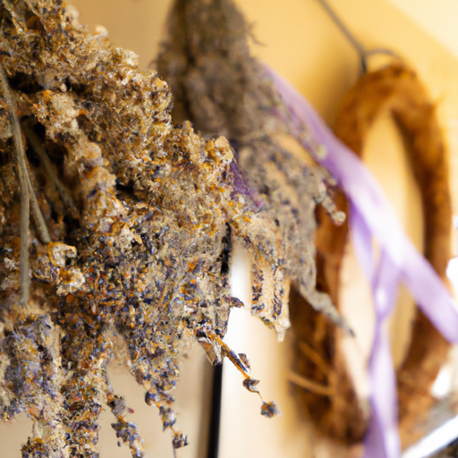
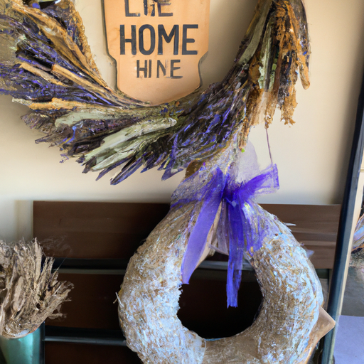
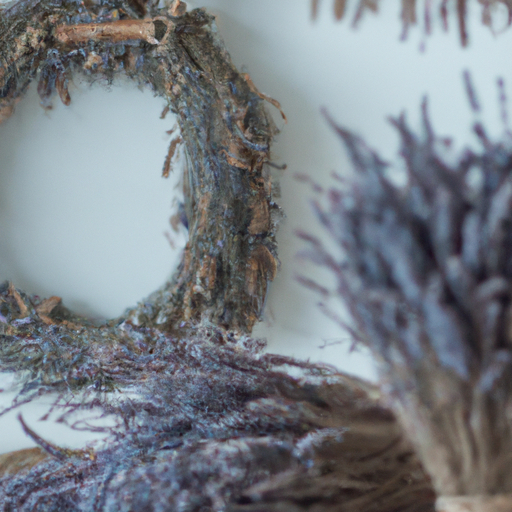

## [I am not who you think I am](https://www.youtube.com/watch?v=QHfuiT1Y7Hw)

<table align="center">
	<tr>
		<td align="center">
<<<<<<< HEAD
			
		</td>
		<td align="center">
			
		</td>
		<td align="center">
			
=======
			
		</td>
		<td align="center">
			
		</td>
		<td align="center">
			
>>>>>>> ffe52613361410ad9d371a0f80e81de4dd24175f
		</td>
	</tr>
</table>

[Music] Thank you. My favorite place to be in summer is in a field of lavender when it's blooming. The air is filled with that delicate scent that is so delicious and yet hard to describe. You just have to experience it. I went ahead and gathered several bundles in order to make a wreath for Autumn when the cold inevitably sets in. It is so refreshing to have dried lavender to freshen up the cozy space when we're seeking refuge indoors more often.

Thank you. Harvesting these flowers reminded me of the last time I visited a lavender field a couple years ago and that I cannot believe how much has changed since then and how I have as well, for the better I think. [Music]

I was about 23 and had very big goals for myself. I wanted to heal and rediscover who I was, but I didn't know how to do that. So, I decided to film some videos about life in a rural valley, share some scribblings from my journal, and connect with other kindred spirits. I thought making videos on these subjects would help me express myself and hopefully find a way to cultivate joy in my own life.

On this channel, we've discussed many topics in regards to improving our days and outlook. And yet, when I first started, that's all I knew how to do - to discuss making these changes. What confounded me was how to actually apply them effectively. For example, a large part of my life, I was weighed down with negative thoughts. I knew changing them was important but didn't really know how. When I put in an effort to do so, I would experience slow but steady improvement. But the moment things got hard, I would fall back into old bad habits because they were just that - habits. I talked about trying to create a work-life balance online, but on late nights when I'd self-imposed work deadlines to meet, I couldn't find a way to shut off and reserve time to rest and recover.

I'd like to say as I kept making YouTube videos, these things improved, but for a while, they only got worse. I put more and more pressure on myself to work on a strict schedule, adhere to an unsustainable work regime, and internalize criticism to the point that I was very fearful every time I uploaded. Everything came to a head a couple years later when I finally buckled under the pressure. I started to feel physically sick all the time, and suddenly, I didn't know what normal was anymore. I realized I had a deep fear of losing control in regards to anything in my life, and yet, that very same fear was making things worse. [Music]

It was something I knew, much like a long-term bad relationship, I didn't know how to let go of what was most familiar. At the time, it felt like everything was crumbling around me, and in hindsight, I'm so glad it did. I'm glad my world fell apart. It needed to because it was the only way I truly became open to change. Sometimes we need to go through tough times, no shortcuts. We need to plot along and discover a new way of living that could be far better than what we had before if we only have patience, perseverance, and faith to see it through. But true change will probably ask you to strip yourself of your former identity, so be prepared. It is not for the faint of heart. [Music]

I read in a book called Atomic Habits that applying positive change in our lives relies completely on new habits becoming part of our identity. So, I decided to force myself to set boundaries in regards to work, to learn how to take actual quality time off to rest. Not only that, I had to grow spiritually and emotionally and decide who it is I truly wanted to be and truly work towards that goal. Not a half-hearted attempt, but true perseverance.

Now, I'd love to say that the moment I decided to make all these life changes, everything got easier, but that would be a lie. Once I started working on my problems, my anxiety got 10 times worse. I had a nervous breakdown due to all that subconscious material I'd been suppressing for years coming out and demanding I face it. I felt pretty awful some days while recovering from severe anxiety. I saw a huge nose dive in regards to my productivity and even my career, and most of those things have never recovered to what they were before. But things had to be that way, and I had to fully accept that there was nothing outside of myself in this world that would offer me what I was looking for. And that meant letting go of a lot of things that used to make up who I was. It meant letting go of my desire to control everything. With a lot of dedication to meditating, journaling, reading therapy books, a lot of mindfulness, a lot of mistakes, I'm feeling more satisfied and fulfilled than ever before. I am literally a new person now because my brain has created new neural pathways to help me think far more positively and peacefully. I am becoming the person I never thought I could be. And I have to say, a part of that is thanks to all of you because this experience of having a channel challenged me in all the ways I had to be challenged. And it made me realize that while discussing things we want to put into our lives to make them better is wonderful, we also need to turn around and actually make those changes if we want to see results.

So, that's all I really had to say. A reminder to all of you that I don't have things figured out any more than you do. Truly building happy lives is a process that cannot be rushed. I'm sending you so much love, and I appreciate you showing me patience and love and compassion because 2023 has been simultaneously the worst and best year of my life, and I see the irony. I've had some bad moments, and yet I've also been discovering how to let my soul really take over and hopefully shine. I read an article about how humans need to have faith in something bigger than themselves. It doesn't matter what it is, but just something big to hold on to. If they do, it means that everything hard, be it a small challenge or huge tragedy or anything in between, it has meaning and therefore an opportunity to grow. It's a chance to cultivate resilience and to learn life is worth living. But we may be learning to live in new ways all the time. [Music]

[Music] [Music] [Music] [Music] [Music] Thank you. [Music] [Laughter] [Music] [Music] For a while, I've wanted to make a video about my own awareness of how much I have changed as a person in regards to this YouTube channel. Even though my videos are still quite similar to maybe what they were when I started, at least from my perspective, they are. The essence of them has stayed the same, and yet the person that has created them is so different that I almost can't imagine how I was able to function when I started this channel. Because I did not know how to set boundaries for myself in regards to work. I also did not value a healthy lifestyle and taking care of myself. I didn't really have that perspective of the future.

I've heard that quote floating around online, and I don't know who said it, so I apologize in advance, but it says something along the lines of, "You have two lives, and the second one begins when you realize you only have one." And I really, really like that sentiment because that's how I have felt over the last year and a half. I don't know how long I'll be here, and I really want to make the most of it and take care of myself and set boundaries and let myself live and live fully. Not tomorrow, not next year, not five years from now when everything's just right and perfect, but right now. And that may sound like a pretty simple idea, but I think applying that, depending on who you are, can be one of the hardest things you do. And for me, this was extremely difficult because I had no idea how to do it. I had gotten very used to feeling stressed most of the time. As an adult, you know, I became an adult and I immediately went into school and a lot of academic pressures that I was putting on myself throughout school. I didn't take care of myself at all. But also, throughout those years, a habit was created, and that was using stress as a motivator to get things done. And stress became a very normal part of my life, and I wouldn't know what to do with myself if I didn't have something to be stressed about. And so, I would find that thing, and it became this really awful habit that kind of followed me throughout a good portion of my young adult life.

Another interesting part of truly applying lifestyle changes that I'd wanted to apply for a very long time but hadn't truly committed myself to was that my productivity and, in some ways, even my career and work outside of my home kind of took a nose dive in a successfulness. You know, by external standards, I was no longer able to put in overtime every chance I got. I set a lot of limits, and that is, I think, a really good thing because it also helped me redefine success. In retrospect, it is such a sad thing, I believe, to spend your life chasing external success instead of cultivating that fullness and that wholeness within because all you can really take with you everywhere is you. And to develop a deeper awareness of what it means to be alive and be successful, helping others as well as having the wisdom that when we do help ourselves become our best version, then we are able to love more freely and make even greater change in the world as our best self. You are worth it. And I think a lot of things get harder before they get better, but it is still a worthwhile journey. And do share your own wisdom and insights below. I will be traveling to visit my Abuelita, so I appreciate all your well wishes for safe travels because probably by the time you see this, I will be traveling and during Hurricane Season, so fingers crossed everything's gonna be okay. So sending you so much love. [Music]