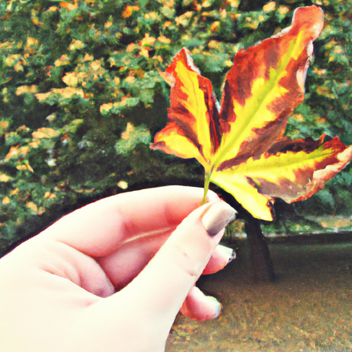
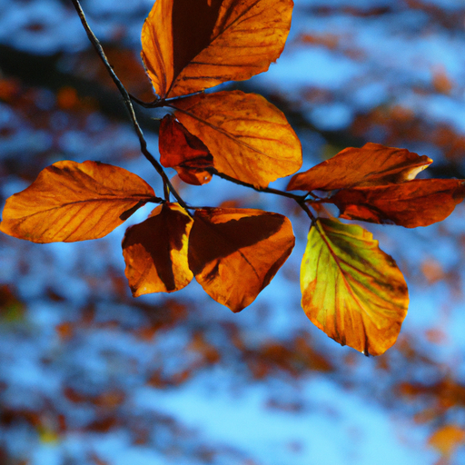
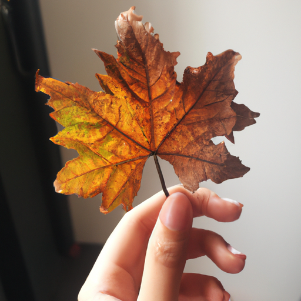

## [I am on a budget this autumn - living simply for the season](https://www.youtube.com/watch?v=IWTPVvBahkA)

<table align="center">
	<tr>
		<td align="center">
			
		</td>
		<td align="center">
			
		</td>
		<td align="center">
			
		</td>
	</tr>
</table>

[Music]

Right there, come here [Music]. It is late September at the cottage and the wilderness surrounding me is plunging in the full autumn. The willow leaves are turning to deep gold, the huckleberry bushes bright crimson, and I find myself sporting a red nose as the morning chill tickles my face [Music].

Today, I needed to stop by my local shop to refill some of my empty toiletry containers and buy simple grains and tea. I'm on a tight budget this season as we're trying to put money aside for starting a family in the new year. Due to this, I can't afford to go over budget to partake in the flurry of autumn shopping [Music].

This month, the stores get packed full of all types of decorations, and they're quite enchanting. Autumn in my country feels like much more than a natural occurrence; it is a shopping season above all else. However, it is not really an option for me to buy a lot of seasonal things apart from restocking my pantry with some orange spiced tea and picking up a new autumn candle. Something warm to drink and a book to feel cozy for fall. Of course, I will be buying some treats, but I'm doing my best to only purchase essentials and be frugal where possible. I've always lived simply, but right now, every little bit counts, and it has actually been a really wonderful practice to make as few unnecessary purchases as possible. Most of the decorations in my home have been borrowed from nature, with plans to return them for composting in the new year. If I really want to decorate with something less compostable, I will be gravitating to thrift stores to reuse and repurpose older items [Music] [Music].

These practices got me thinking about how I can best celebrate autumn, and it occurred to me that if you truly and deeply love a season so much, if it fills you with all those cozy feelings, then I can't think of a better way to honor this gift from nature than giving it some love back by choosing simplicity and sustainability when possible [Music].

And if you get the chance to go outside and let the autumnal weather fill you with wonder, if you don't happen to live in an area that has an autumn season, this is simply a chance to learn about your local natural world. Even in the busiest cities, nature still exists and is just a little more hidden, waiting to be noticed [Music].

In this way, I like to think I'm doing my part in preserving the future of autumn itself and to say thank you to the beauty. Anyway, this is just what I'm up to this week. You will certainly see these new practices reflected in my channel because I will be trying to reuse things a lot this autumn and winter. Perhaps it won't be as exciting, but hopefully, it inspires you to find unique ways to enjoy each season with simplicity. I find it helps my mind feel more peaceful as well. It's a practice that becomes imbued in all aspects of my life [Music].

Hmm, there is nothing like the taste of cider in early fall when it's just starting to get more chilled. It is so delicious. I am officially in the in-between time of the season when it is just a little bit too cold to wear short sleeves, but it is also too warm to wear a sweater, and I keep changing in and out of this. So hopefully, the weather will kind of decide what it's going to be soon enough. As I said in this video, I will be trying to find ways to enjoy the autumn season through keeping a realistic sustainability and simplicity in mind, which is not always easy. I totally understand everything in the stores right now is so fun to look at, and it's just such a lovely season. But due to being on a very tight budget this year, due to planning a lot of changes in the future and trying to save for that, I realized that, you know, I do think the best way to honor a season is to really keep the nature in mind and think about ways that we can live a little more simply and enjoy a season for what it is. Autumn is certainly a state of mind. It is not about the amount of things you have, and no one should ever feel any pressure to buy autumnal items when autumn is already all around us. If it is not autumn where you live or if you happen to live in a quite urban area or in a city, I will leave some recommendations down below of books that all talk about discovering the hidden natural world all around you, no matter what environment you're in. I cannot remember the title, but I will leave a picture here. It is a really lovely book that talks all about the ecosystems and the ways that nature exists within cities, and it is fascinating, and it's beautiful, and it will just open up the wonder of your home. So over the next couple of months, you'll be seeing a lot of autumnal celebrations that will be very budget-focused and cost-friendly because that is where I personally am right now. I, of course, will be purchasing some quite necessary treats, in my opinion, for the autumn season. One is I always get an autumn-themed candle, of course. I tend to look for a new book related to the autumn or seasonal living, or I get it from my library. However, you will see some new candles, that is for sure. I can hear my bunnies causing an absolute ruckus upstairs, so I'm gonna go check on them, and then I'm gonna take my dog, Iger, out for a beautiful nature walk. There's a specific trail we like to go on in the autumn because all the trees have left their leaves on the ground, and it is so beautiful. It is all golden and red tones. So we're gonna go enjoy that, and I'm gonna take you along because it is way too special of a place not to share. Sending you so much love, and I will see you soon.

Time, a fairy who had somehow gotten into mischief, was condemned by the high court of Fairyland to live for several years under the form of some creature, resuming her natural appearance once again to make the fortune [Music] [Music]. Thank you [Music].