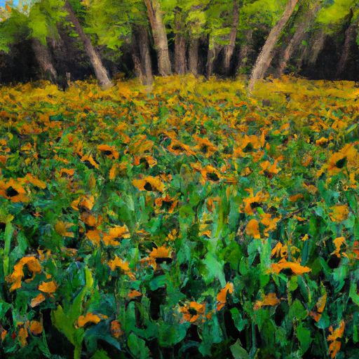

## [I became a cynic and it s the worst thing I ever did - on being young and jaded](https://www.youtube.com/watch?v=5LyksSB6APY)

<table align="center">
	<tr>
		<td align="center">
<<<<<<< HEAD
			
		</td>
		<td align="center">
			
		</td>
		<td align="center">
			
=======
			
		</td>
		<td align="center">
			
		</td>
		<td align="center">
			
>>>>>>> ffe52613361410ad9d371a0f80e81de4dd24175f
		</td>
	</tr>
</table>

Today, I'm gathering arnica, a healing flower that grows wild in the forest of my home. This year, I found a lot of it in an area that succumbed to fires not long ago. It reminds me that no matter how bad things get, even watching an entire forest burn down, if you wait long enough and have faith, life will begin again.

There are so many bees and birds everywhere, creating a chorus of noise that may drown out my voice. But I wanted to share this moment with you because this field of arnica is so abundant. It makes me happier just to be here, without having to do anything. The vibrancy of the color puts me in a better mood. It occurred to me that this is one of the most meaningful and fulfilling parts about simple living - embracing the rhythms of the seasons and the beauty of simplicity and repetition.

I'm going to collect some arnica again, and I hope you can enjoy the cyclical nature of the seasons in your own life and embrace those daily rhythms and predictable practices.

As many of you know, I had a rather alternative upbringing and grew up mostly without using social media. It was only as an adult that I started using it regularly. I love to keep track of other artists and book lovers, as it makes my life better, especially living in a small rural community where it's not always easy to find people who share my interests. However, the online space can be both wonderful and cynical, with normalized doom scrolling and constant critique of others. This got me thinking about how easy it is to surround ourselves with negative thoughts and perspectives on a daily basis, and how unhealthy this practice can be.

In my personal case, I had certain life experiences that left me feeling distressed and negative. I held onto pent-up anger and projected it onto others and society at large, leading to a dismal outlook on the future. Simple, slow living became my answer. It may not be the answer for everyone, but it worked for me. It made me realize that a cynical and jaded mindset only contributed to burnout and left me uninspired to be a force for good and do something meaningful with my life.

No doubt, it is healthy for us to share our frustrations and talk about injustices and poor decisions. But I can't bring myself to express them by looking down on others and the world in general. I prefer to use that energy to do acts of kindness, even if they are small. I try to find joy despite the darkness, with hope in the power of goodness. There is a whole lot of goodness in the world, as well as ugliness. Seeing both does not make the bad any less real, but it reminds us that there are many who are fighting for change and spreading love along the way. Their efforts are valid and beautiful and should be acknowledged more often.

I'd much rather spend my life trying to make the world a better place and choose friendships with people who believe it's possible, rather than giving up before even trying.

I've been working on a painting for several days now, taking inspiration from all the wild herbs and edibles that are either medicinal or consumable. There are so many incredible flowers and herbs in this area, and I wanted to put them together in one art piece. So far, I've included veg mint, purple sage, blueberry, fireweed, tansy, burdock, chicory, yarrow, rosemary, thyme, wild strawberry, violets, dandelions, and several others. It's certainly featuring a lot of very special herbs and flowers. I hope to sell this new original art piece in my Etsy shop, along with some large prints and posters.

I apologize for the audio quality, as I'm spending a lot of time on my porch. But I hope you can appreciate enjoying the springtime with me and all the nature sounds.

I was listening to a podcast that interviewed actor Rainn Wilson, who talked about his experience with feeling cynical and negative at certain points in his life. He mentioned a wise man who warned him not to be cynical, as it would prevent him from making the world a better place. This resonated with me, as I had experiences in my life that made it hard for me to see things through a positive viewpoint. I had a lot of anger pent up and projected it onto others, leading to a dismal outlook. But I've learned to be more open to others' perspectives and practice compassion and kindness. It's easier to love people openly and love myself when I realize my own flaws.

I'm sharing this personal journey because I'm far from perfect, and I hope it inspires others to be kinder to themselves. True humility is accepting that these things happen and using them as opportunities for growth and evolution.

In other news, we have a new friend in our lives - Luna, a gentle and sweet bunny. She has helped me through difficult days, and I'm excited to introduce her to all of you.

Thank you for spending this beautiful day with me, and I appreciate all the support for my work as an artist. It makes this channel possible, and I couldn't do it without you. Sending you well wishes for a wonderful week, and I'll see you soon.