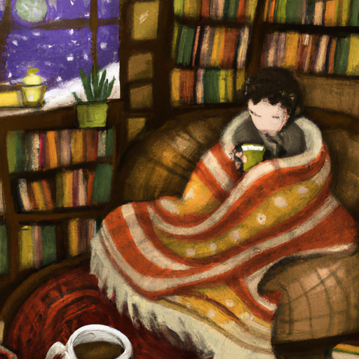

## [I didn t have friends most of my life - being unsocial and finding belonging](https://www.youtube.com/watch?v=9vcQqPLDDgo)

<table align="center">
	<tr>
		<td align="center">
			
		</td>
		<td align="center">
			
		</td>
		<td align="center">
			
		</td>
	</tr>
</table>

Today, I’m putting some leftovers out for the Hungry Birds and making some snow cream. It is a delicious treat that I can only make this time of year. Winter has found me staying at home more than usual, cozied up in blankets after a long day working and living within four walls.

I grew up watching movies and reading books that portrayed Misfit Heroes who stumbled upon a quest, having to face their greatest fears in order to succeed in their life. More often than not, their success involved finding friends along the way that supported them on their Journey. The hero was no longer a lone Wanderer; instead, he was part of a group. It was what he had needed all along.

Over the course of their story, these characters often find friends who teach them the meaning of life. These are wonderful and sacred stories about love and connection, many of which I cherish today. But I admit, even as a child, I was attracted to the side characters that were more sage-like and quiet monks and sacred Wise Women. People that were on unconventional paths and yet contributed to the story in crucial ways.

Finding a group of friends has never been as easy for me as these protagonists, particularly in the region of finding a group of friends. I was an extremely socially awkward child. I was practically mute half the time. The more time I spent in a school and around people, I found I needed time away in the forest beside my home, daydreaming alone and finding energy to face The Busy World again. Or perhaps, I only needed one or two very close friends to spend a quiet day with.

This confused me, and I started to wonder if I was just anti-social or broken in some way. I love people. I've always loved people, their stories, ideas, their flaws as well as their dreams. And yet, close and intimate friendships were something I felt was often Out Of Reach. I thought my problem was that I spent too much time alone. And so, once I got into my late teens, I reinvented myself, pushing away the side of me that just wanted a cozy night in, in exchange for clubbing and nights out.

I was not able to sustain a big social life without starting to deeply miss my books and aloneness. I found it difficult to find people that were comfortable enough to share their vulnerability, leading to those heart-to-heart conversations I craved so deeply. I often felt I made people uncomfortable by sharing my feelings. And yet, I knew there must be a lot of people out there like me. The answer, unsurprisingly, was simply to be patient and remember that finding your Kindred Spirits may take a lifetime.

I eventually discovered Souls I hold very dear and contribute greatly to my sense of belonging, and I in return. But in the process of not having friends for most of my childhood and a good portion of my adult life, I started to realize a very interesting thing. And that was that I didn't mind as much as I thought I would. I still needed connection and got involved in book clubs and other activities. But when it came to close Kindred Spirits, it took years and years to find them.

I had started my hero's journey apart from family, alone. And I had embraced it, channeling energy into my art and dreams for the future. And it was only until I began comparing myself to societal norms and my peers that I started to fret that something was wrong. Perhaps much of our dissatisfaction can be ameliorated by simply remembering our path as our own and that we will find our way.

The thermometer on my car said it was negative one early this morning, and I don't know how accurate that was, but it does feel extremely cold. I have to admit, I have no plans to leave the house today. I had a wonderful birthday week, and I appreciate all the well wishes I got. We went out to dinner, and I got a couple little gifts, and it was really lovely.

As many of you know, I spent my entire life moving from place to place, growing up in a military family. And this is the first time living here in this little town and this tiny Rural Valley that I have felt that I can really set down my roots and build a community and start to meet people and connect with people on a more permanent basis.

Meeting new people and cultivating friendships has never been something very easy for me. It has gotten drastically easier as I've gotten older, but especially in my very young adult years, as I'm still a young adult, I really struggled with connection and finding my tribe in a way. And I have to admit, as someone who is quite introverted, friendships are very important to me, but also time alone and a lot of time kind of alone at home is something I value as well, or at least alone with family or in an environment that's really comfortable for me.

For so long, I really internalized those values, you know, of what made someone well-adjusted or healthy. And that being someone who has a large group of friends and is always doing social things. And I think that's so wonderful, and I love that there are so many extremely social, lovely people in this world who value that because the world would be very dull if we were all the same.

But I think it is worth reminding our little people and reminding ourselves that having only a handful of quality friends, or if those friends are simply family, or if those friends are just a couple select people that we might not even have in our general area, I know for some people, friendships with animals are just as meaningful. And I think it's so wonderful to celebrate that. So, there are all sorts of friendships and bonds and relationships that we might be comfortable with depending on our personality.

I am so happy now to be in a place where I do have several people I call friends, including people at work, in my personal life, as well as having created some really close relationships within my own family. I also deeply appreciate just spending time with my puppy and my cat, and spending time in nature feels very fulfilling as well.

I know, especially as someone who really enjoys children's movies and cartoons still as an adult, I know that friendship is often put on an extremely high platform as if it is the goal that everyone needs to meet in order to find belonging and fulfillment and acceptance. And I think, in a way, that for sure is true. Our connections with other humans are very important to our sense of well-being.

When I first moved to this Valley, I didn't know anyone, and it took me a long time to make friends. But in the meantime, I worked at a preschool. I connected with children. I connected with those families. And even though I wasn't really spending time with anyone outside of work, it was extremely fulfilling, and I felt like I deeply belonged to my own Community. I also consider my husband one of my best friends, and it is just so wonderful to just spend time with him.

So yes, all through my early school years, through high school, and even through a good portion of University, I did not feel at all like I had friends and I had people that I was close with. So, I really have embraced that idea of quality over quantity. And I've also, though, embraced that idea that if there are times in your life where you feel disconnected, you feel like you haven't yet met your people, to see that as a beautiful time that can have a lot of meaning and a lot of benefit. And you might even realize that you enjoy spending time with yourself, and that doesn't mean that anything is wrong with you. That doesn't mean that you are lacking in some way.

For me, some books that have really deeply helped me in my journey, especially when I was younger, understanding myself was "Quiet" and "The Highly Sensitive Person." I found both of those to be extremely helpful, and I still recommend them to this day to older children who are trying to understand themselves and why they need so much quality time alone or if they struggle with anxiety or emotional regulation. You know, it's very normal. There's a lot of people that feel the way you feel. You are never alone.

Also, I wanted to say a big thank you for all the encouraging words in my last video. As you may be able to tell, some of my videos have been a little shorter lately, and that has been my attempt to take a little more time to figure out what I want to do with this channel in the future and what I'm going to be doing next year. And it is definitely a journey. I have some projects I want to work on that I would like to share with all of you, some ideas for children's books and other projects. So, we shall see. I really don't know. I am lost in a good way, thinking about that quote, "Not all who wander are lost," right?

So yes, I will keep you updated as things go, and I will be uploading a Q&A very soon because I wanted to finally answer some questions that have been haunting this channel for a long time. So look forward to that in a couple of days or so, and I will see you very soon. Take care. Goodbye.