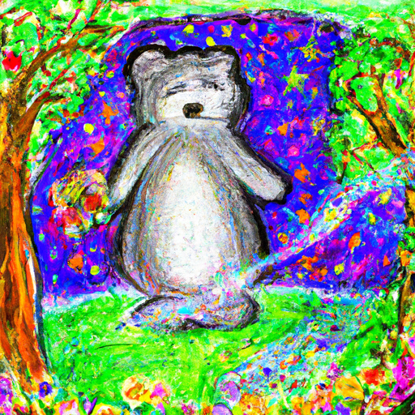
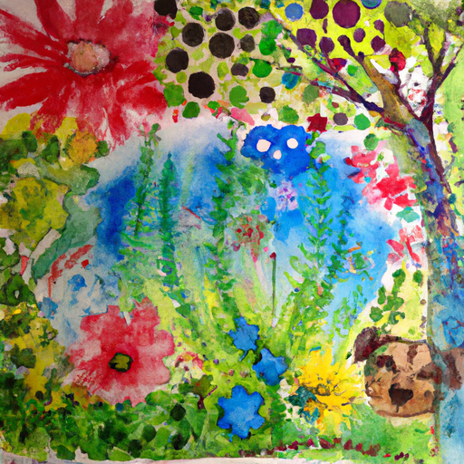
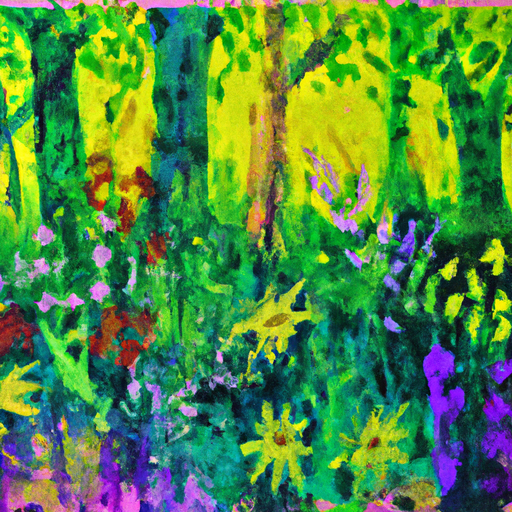

## [I don t know how to be an adult in this world](https://www.youtube.com/watch?v=Yf-xNfRkX_Q)

<table align="center">
	<tr>
		<td align="center">
			
		</td>
		<td align="center">
			
		</td>
		<td align="center">
			
		</td>
	</tr>
</table>

Today, I am taking you to an Enchanted Forest. At any other time of year, it's an ordinary Woodland but all who come here for a few weeks are blessed with the fairy site and you become witness to a wondrous Realm. The forest floor is absolutely covered in wildflowers that love to grow in the chilled earth right after the snow melts. I brought my watercolors in a painting I've been working on for several weeks, which I finally made into prints for my shop. Something about the forest aids my hand, encouraging slow and thoughtful movements of my paintbrush. I could have stayed there for the entire day, but alas, the sun was setting and I had to go home.

A comment that pops up periodically is that I seem like someone who has refused to grow up. I like to look at the bright side of things and therefore, ignore the harsh realities of adulthood in a world that is full of negativity. I talk too much about imagination, I read books meant for children, I'm a childish individual. It is an interesting assumption to make, I believe, because these videos only portray a small portion of who I am in regards to the darkness that is ever present in the world. It is that exact awareness in my own life experiences that have driven me to notice the love and the beauty that exists alongside the ugliness. If I only see cruelty and anger in the world, in a way, I become part of it and continue to perpetuate that mindset. Instead of trying to do something different, that has been the first step to healing and realizing that my own small existence can still help make things a bit better.

In regards to having childlike interests, I want to encourage other Kindred Spirits, artistic and sensitive souls, to be themselves and not feel shame for embracing who they are. Shame can have such a strong effect, but it is also possible to dismantle with time. I certainly struggle with certain aspects of adulthood. I'm a fairly disorganized person and find it difficult to stay on track and be efficient. I do much better if I slow down and focus on one task at a time, at a pace that most work environments would find unacceptable. But I do the best I can despite these limitations. Though I often have thought that I have no idea how to be an adult sometimes, but perhaps Growing Up by other standards isn't as important as growth in general and finding a way to nurture all the best parts of yourself.

I spend most of my time wrapped up in very mundane and sometimes quite tedious tasks. In regards to my job and future plans, I spend most of the day at work. It's only outside a career, chores, and other familial responsibilities that I'm able to encourage the side of me that loves to wander dirt roads on Misty spring mornings or sitting on the porch with tea to watch the bats lit about in the Moonlight. But when I do get some time to myself, I enjoy entertaining my imagination and storytelling. It inspires my art and offers me great joy. Perhaps I am childlike in a way. If that is what it means to still enjoy activities I did decades ago, it may seem as if I spend time not doing anything, sometimes just wandering and sitting and breathing. But if that means that being an adult is spending every second of the day being productive and busy and efficient without even a stolen moment of mindful contemplation or appreciation of the clouds overhead, then yes, I'm proud to be childlike in nature.

Perhaps I have not grown up, but if this is true, then I'm at peace with who I am. And I hope that you can embrace whatever lifestyle suits you best, as long as you're living with kindness and a humble heart. I don't see how it can be wrong to be you. Thank you. I was quite happy with how this design turned out. It is by no means perfect. I know there's quite a few things that I can adjust to make it better in the future, and there's still the other design I created that I'm hoping to try once I find a piece of clothing I'm willing to put a design on, so I need to find that first. And then I hope to share that in a future video. But yes, I thought for as a first try, it is quite simple to make, you know, this design, and it is a very easy process. So if you are interested in screen printing, I think that there's some very easy beginner kits that you might enjoy trying out.

Apart from that, the topic of this video, of course, was something quite close to my heart and hopefully some words of encouragement for everyone who is trying to connect to their more kind of inner free spirit and their inner childlike spirit and, um, also more sensitive, you know, people or people just who enjoy certain things in life that might not be as commonly associated with adulthood and being quite mature. I have found it interesting that there is not always, you know, a deep appreciation for more meditative contemplation and mindfulness in our daily lives and that it seems sometimes that that's even connected to being more uh childlike or frivolous. And I I find that to be interesting and unfortunate because yes, you know, spending time with the wildflowers, dancing outdoors, telling stories, enjoying fairy tales, these are all things that I really loved as a child and a lot of children love, especially you know, being fascinated with nature and finding entertainment in places that might seem boring and not valuing productivity and efficiency but instead valuing the daily experience of life.

I know that that is something associated with children so much. It is something that I never felt a need to reject as I got older. There of course were times in my life when I was trying a lot more to fit in, you know, whatever that means because you know, there's a lot of a huge variety of people out there, so there's no reason you need to try to fit in with any one group. Seeking out that excitement and joy in the little things, right? I feel like that's a lot what this channel is all about, even something as simple as an art project just made my day and it was so exciting to learn something new, even if the final product did not come out perfectly.

I do think it is wonderful, you know, that we can continue building this awareness that slowing down, observing, appreciating the world like we did maybe when we were much younger is a quite healthy and beautiful thing and not necessarily for everyone, but for people that are perhaps more creative or more sensitive or just enjoy that lifestyle, it might be what helps keep them going and keep them feeling really positive and joyful. Enjoy and encourage your passions and your interests, find things to be excited about. If that is fairy tales, if that is children's books, if that is something else altogether, then I think it is just so wonderful to listen to that inner spirit.

I think accepting your true personality and nurturing your true personality, at least for me, was a huge step in appreciating who I am. If we are living with love, I find it hard to find something wrong with that. And as long as we're trying to do our best to be kind, and that is definitely the inspiration behind so many of my videos, and just I wanted to reiterate that because I am still get messages of how my paintings are so childish or how what I do is boring or not productive. I think it is so crucial to stay true to your personality and who you are. That doesn't mean don't be open to change or grow, but make sure you're nurturing and you're getting what you do need in terms of your own life.

I wish you all a wonderful week and that you continue to nurture what your soul needs. And I'm sending so much love and support, and I will see you very, very soon. Goodbye.