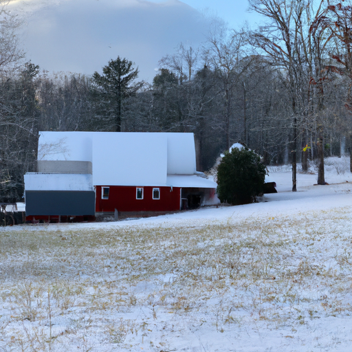
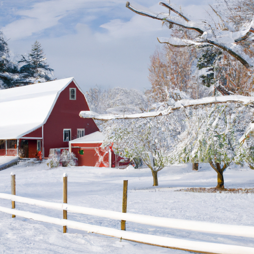
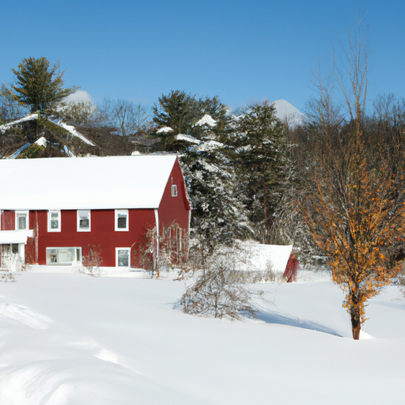

## [I found a cabin in the forest - searching for a new house - renovating a barn](https://www.youtube.com/watch?v=DUAmuCYTQjk)

<table align="center">
	<tr>
		<td align="center">
<<<<<<< HEAD
			
		</td>
		<td align="center">
			
		</td>
		<td align="center">
			
=======
			
		</td>
		<td align="center">
			
		</td>
		<td align="center">
			
>>>>>>> ffe52613361410ad9d371a0f80e81de4dd24175f
		</td>
	</tr>
</table>

Good morning friends, I have to say it's getting very cold over here. There is frost covering my windows at dawn and snow is on the forecast. It's fascinating to walk outdoors and absorb the atmosphere this time of year because there's activity everywhere, there are little creatures scuttling about and coyotes howling all night. I've seen far more ospreys and owls recently. The animals are clearly expecting a change of weather and are making a visible effort to prepare the pine siskins and quail are everywhere scratching up the ground for leftover seeds. I love to observe them from my window.

As you may know I've been searching for my own home for a while now. It has been discouraging at times, especially as of late. I enjoy renting but would like a permanent location. For a long time I wasn't a fan of the idea of settling down mostly because I was used to a more nomadic life and connected travel as the most interesting way I could spend my time, but I've come to understand that there's also value in getting to know a special place like the back of your hand, to know the ins and outs, the changing landscape throughout the seasons, to eat food you've grown yourself, to call a place home. I've decided that I found where I want to live and I've been presented with an unexpected opportunity a home that both my fiancé and I - with a lot of hard work - might be able to purchase next year. We are so excited, it seems like one of the rare homes we could actually afford and my heart has been in a wild beat since I got the news and I just had to share it with you.

It's cold over here, I woke up to about an inch of snow and it has mostly melted away now, but it was very cold this morning. I'm realizing that fall definitely is leaving quickly and it's going be a long winter. I'm excited for winter but at the same time I really do wish autumn would stick around for a few more weeks. It would be so nice, but that's not the way it works around here.

Anyway, I have extremely exciting news and it I just haven't been able to contain myself this week and I really wanted to share a little bit because some very recent developments have come my way. I am still processing and still kind of in shock and still not sure what to think but I wanted to share a little bit just because it's something exciting going on. As I have alluded to in past videos I've always been keeping an eye out for an affordable fixer-upper or a little piece of land where maybe one day 10, 15, 20 years from now I can finally build a little home that I can call my own. I was starting to feel very discouraged with that idea after the world changed because the housing prices in this area went from semi-affordable to insane. It just skyrocketed and even very small homes were just so unaffordable and it was just really discouraging to be honest and I letting go of that dream of just thinking maybe I'll just rent and see where that takes me.

Recently my fiancé Luke surprised me with some news and since then we've been kind of keeping tabs on developments with a possible new home. Luke has been very patient and he's even gone to see some land before that I was interested in and he's always kind of encouraged me to keep looking for some little place that could be affordable. Recently Luke shared with me that his parents have a older barn on their property and it's this kind of a larger more square-like building. I'll show some clips of it - but it's a lovely lovely barn and his parents had been thinking for a while to renovate it a little bit and make it more of a home. It used to be a house for horses and for hay and there was a hay loft. His father told me all about it and it was really fun to learn about the history of it. Both Luke and his dad have experience in construction and building and so his dad has been working on it to try to get it into a place where it could be a home. Potentially a home for us, it's just been a very very exciting process and so it felt like something fun to share with you guys even though nothing is set in stone at this time. It definitely seems like a very exciting and very possible prospect for next year because we were hoping to get married in may and then move into a new home.

Anyway, it got me thinking about so many people who reach out talking about their dream home and what they hope to have in the future and I've always been able to relate to that so much because I've always dreamed of that perfect little home, in the perfect location and I think we all love to think about those dreams and fantasize a little bit. The real life version of it is often involving a lot of compromise. Things aren't exactly how you imagine them in your head, but then you realize maybe they're even better than what you imagined because it's part of your real story and nothing is perfect. I think that's what makes it so beautiful.