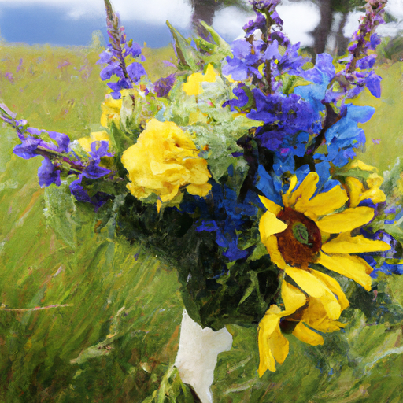
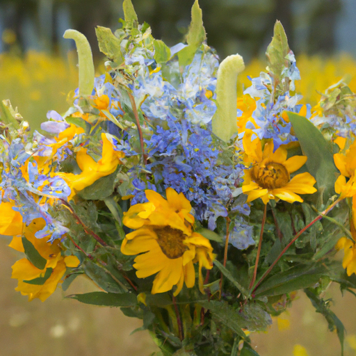
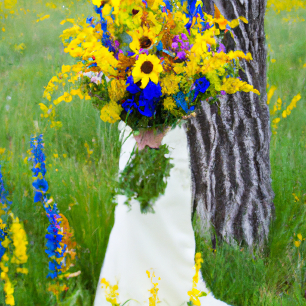

## [I got married - a little countryside farm wedding](https://www.youtube.com/watch?v=PS0gXPNBZy8)

<table align="center">
	<tr>
		<td align="center">
<<<<<<< HEAD
			
		</td>
		<td align="center">
			
		</td>
		<td align="center">
			
=======
			
		</td>
		<td align="center">
			
		</td>
		<td align="center">
			
>>>>>>> ffe52613361410ad9d371a0f80e81de4dd24175f
		</td>
	</tr>
</table>

My wedding was on a cool May day. The morning started out in the way I love best - quietly, patiently waiting for the twilight to give way to the sun. And then I went out to select the flowers I would use for my wedding bouquet.

So, do I kind of have all that nervous excitement, you know, fluttering butterflies in my stomach? So, um, I really want to start the ceremony, I think, because anticipating so much to happen can be a little, um, a little frightening. But in a good way. It's hard to explain.

So, I did put together my own bouquet because I knew that was something that was very important to me. They are larkspur, arnica, and balsam root. These are all flowers that have always brought me a lot of joy to be around them and always uplifted my mood whenever I'm outdoors. And so, it felt appropriate to thank them by involving them in this very special day.

It seems I've done an absolutely horrible job painting my nails, but we're going to ignore it and move on. So, I'm going to go try on my dress and try to take a few pictures with it out with the wildflowers. And then I'm going to go meet up with my family.

So, I knew it was quite important to me to at least spend the morning quiet and thoughtful as I get ready and then meet them to start the celebration. I'm sending you all my love. I am nervous and excited and nervous and excited. So, anyway, I hope you have a wonderful week. I will see you soon. Goodbye.

So, the day ended up being beautiful. There were scattered showers and we got a rainbow. And even during the ceremony, a little hummingbird came by to visit with us. It was absolutely wonderful, and I'm so happy I can share at least a little glimpse of the festivities with you. Do you?