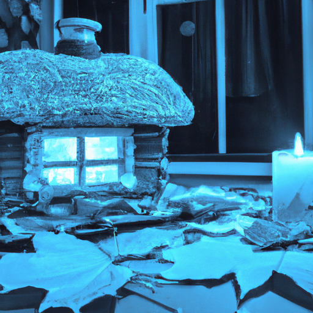
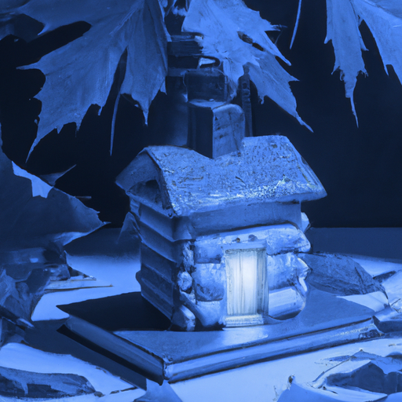

## [I have never felt so at peace with myself - an autumnal evening 2021](https://www.youtube.com/watch?v=9GxGuisMcqQ)

<table align="center">
	<tr>
		<td align="center">
			
		</td>
		<td align="center">
			
		</td>
		<td align="center">
			
		</td>
	</tr>
</table>

Good evening everyone, and welcome to my little cottage. It was a quiet evening at the cottage yesterday, the days are quickly growing darker and already several of my more delicate flowers have been taken by an early morning frost. I try to spend at least half an hour reading every night, and lately the days have been so much shorter I have embraced lighting candles. I remember as a literature student in Ireland I read about how people used tallow candles in the past. They were made of animal fat and smelled horrible, consequently paraffin or other types of wax were much preferred and eventually replaced it. I am quite grateful I can light my beeswax tapers, and that my home consequently smells like roasted honey instead of animal fat.

I find that using softer lights this time of year help connect me to the season, bringing more of an awareness on how things are changing, how it is affecting the plants and animals. It is a harbinger of the coldest half of the year, a warning to the natural world to prepare in haste, as time is running out. Over here the cottonwoods are some of the first to shed their leaves. I think of them as having quite cautious personalities, much like my own. The moment things seem overly dry, or at the slightest hint of a frost, they begin to diminish, drop their leaves, and grow dormant. The other trees soon follow suit, and the little animals busily prepare their food stores. I’ve said goodbye to many birds in this area, gone to warmer climates until the spring. For once, I’m not jealous of them since after a hot, rainless summer I am welcoming the cold. So is my dog, who loves being outdoors this time of year as he does not get overheated.

In the spirit of the changing seasons, I thought I’d create some new decorations for my home. Recently, I have been reading a lot about old photography techniques from the past. My interest was piqued since I have spent so much more time using my camera this year. The technique of making blueprints - also known as cyanotypes - is one that originated over a hundred years ago. After it’s invention, a woman named Anna Atkins became known for using the technique in making shadowgraphs of algae. The process has a fascinating history, and was still in use in some lines of work up until modern printers became popular. Nowadays the technique is preserved by artists and photographers interested in the niche, and their professional cyanotypes are no doubt much better than my own amateur attempts. However, It is so much fun to try new things and through that relive more positive aspects of the past.

Now and then I get comments on my videos comparing how we live today to those in the past, often romanticizing an era before technology and industrialization took over. While there definitely has been a lot lost through these transitions, and many tragedies in the process, but I believe much has also been gained, depending on how you look at it. As someone who loves history and learning about the past, through my own process of discovery I began to deeply value living not only in my specific location, but in this century. For example, my mother is not-white and she and my father would have struggled to have their marriage legally recognized in the US up until the sixties. My existence wouldn’t be guaranteed, and if I had I would likely have not been raised bilingual or proud of my origins, neither could I have so easily gone to university and started my own business. I do not romanticize the past, but I do think it is full of rich stories that we need to know. And I find nothing more fascinating than learning about the daily lives of people in any era, much like we are fascinated with how other people live today. It connects us to one another, and trying out this technique was a wonderful way to relate with other creatives who lived long ago and also liked experimenting with art.

I will share some of my favorite books about history in the description bar, as well as details on how to make your own cyanotype. This was so much fun and I encourage you to try this technique out, as the materials are affordable and can be used on fabric as well as paper. Wishing you a night full of sweet dreams and peaceful moments. I will see you next week.