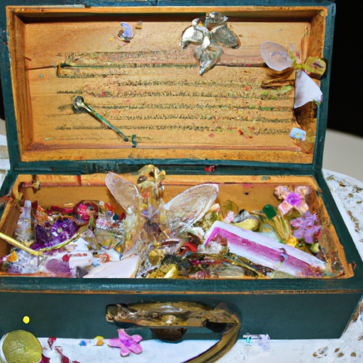
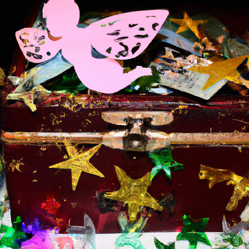
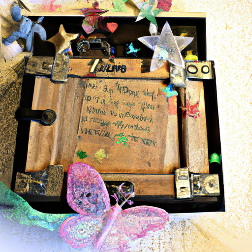

## [I m Leaving My Cottage - I was not ready for this](https://www.youtube.com/watch?v=lxBb0xv-cZU)

<table align="center">
	<tr>
		<td align="center">
<<<<<<< HEAD
			
		</td>
		<td align="center">
			
		</td>
		<td align="center">
			
=======
			
		</td>
		<td align="center">
			
		</td>
		<td align="center">
			
>>>>>>> ffe52613361410ad9d371a0f80e81de4dd24175f
		</td>
	</tr>
</table>

So it looks like I'm moving out earlier than I anticipated. Initially, I was expecting not have to do this until late May or early June, but things changed. It's an interesting reminder that you can plan and anticipate and prepare for the future and still not be able to predict what will happen. Plans change, and sometimes an opportunity will arise even if you don't feel ready for it. It can be hard to know the right course of action in the moment, but I find that with time - and some courage - answers eventually come. It's up to us to listen and understand ourselves.

While it will take me at least a month or so to transition to a new location, I've started the process and by next week I should have all my things moved out. If you're going through a change right now - be that a physical location or a more personal transformation - know that you are not alone and change - even if it is hard - can lead to such beautiful things. It really hasn't hit home yet that I am leaving, I think it will take another week or so to really start feeling those emotions.

I haven't yet started going through my more personal items, objects filled with memories and letters from people I once knew but I know that it will be a very cathartic and interesting experience to go through things that you've kept hidden away and examine them once again, re-evaluating what things mean to you. Maybe this video can inspire you to also welcome the spring and a beautiful new season by going through what you own and considering what you value… what you should keep in your life and maybe what you should let go.

I filled this up without even thinking about the fact that it would be too heavy to move. I clearly don't know what I'm doing, you think after moving 17 times in my life I'd know how to pack everything up really well. But I don't, I don't, oh my… here we go again…

So I was going through some of my old things and I found this box and I'm pretty sure I made this box when I was a teenager. It is spray painted and it says Neverland on it. It is the entire map of Neverland, I'm sure it's very geographically accurate and it has some quotes on the side. It even has glitter and Tinkerbell on it. I just thought it was too funny, and of course, inside there are some dead leaves, dead flowers, random pieces of journal paper, a picture of a fairy, pine cones, some covered with glitter… and acorn cups. I remember getting these acorn cups because I remember thinking they look like little teeny tiny cups for fairies and that it was obviously something I needed in my life. So, I'm questioning my past decisions now. I don't know what I'll do with all these little things. But yeah, it's funny to go through it and look into the past and just remember little things about you.

Paola to Aegir (dog): what’s up buddy? Aw… chaos. Everything feels so chaotic right now. I have books everywhere so I'm definitely still in the process of kind of getting all that organized but yeah it's been an interesting week. It's been a lot of emotions, yes by the time you have seen this I will hopefully be completely moved out.

It is interesting to me because for many years in my life when I was not as healthy, physically and mentally, I definitely felt that any decision that made me uncomfortable or self-conscious in any way was a decision I should avoid making. I should just always stick to what's in my comfort zone and what makes me feel the best and what doesn't challenge me. I think that's a time of life that we all find ourselves in in some shape or form. This move is the very first decision that I have made that has not been out of necessity, it has been 100% my own decision and my own wish to start a new life, and to start a new phase of life in a new home.

It has been such a wonderful experience to move everything out, it's been very cathartic. I have found a lot of items from my past, especially some letters from years ago and certain mementos that I was able to remember those memories, really see them in new light, and understand that it was time to put those items aside and put them away. Most of the letters are made of paper so I did end up composting a lot of those items and finding natural ways to dispose of them.

So there have been certain experiences I've had in my life in which I have forgotten what happened during certain portions of time, I can't recall them - there's kind of a blank space in my brain that doesn't allow me to access certain memories and it's been interesting through the process of going through a lot of these items having some of those memories return. It's been very, very interesting and very cathartic and it's been good and also bittersweet and fascinating.

Perhaps this can be inspiration to all of you to consider the springtime as a new beginning. We are almost in spring, we are so close, and I think it always can be a good experience to go through the things you own and remember their meaning, see if their meaning has changed, maybe some of these things that you thought were very important to you, you feel differently about now. I'm sending so much love and I will see you very, very soon goodbye.