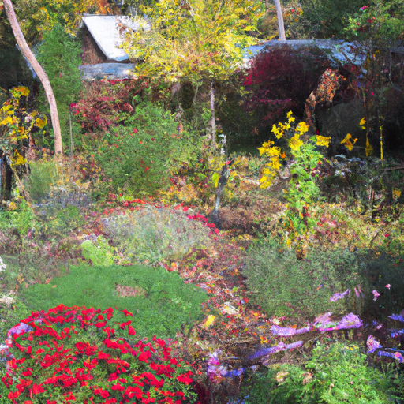
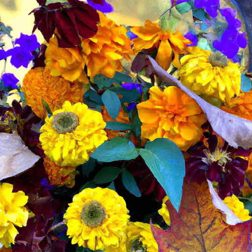
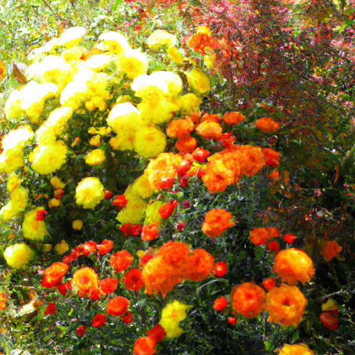

## [I m getting married - and leaving home next year](https://www.youtube.com/watch?v=HuiHrzVBQV0)

<table align="center">
	<tr>
		<td align="center">
<<<<<<< HEAD
			
		</td>
		<td align="center">
			
		</td>
		<td align="center">
			
=======
			
		</td>
		<td align="center">
			
		</td>
		<td align="center">
			
>>>>>>> ffe52613361410ad9d371a0f80e81de4dd24175f
		</td>
	</tr>
</table>

As October frost spreads over the valley, my home is transformed into shades of red and gold. There's a distinct smell in the air of pine trees and wet earth. I love it. And while I had a very different type of video planned out for you this week, something unexpected happened and I wanted to share it. I don't really have a reason to, only that it has been a very happy time and it felt right to share a little glimpse into our celebrations.

I remember watching movies about love stories when I was a child. In most cases, the couples in them go through a whirlwind romance of roller coaster emotions, fighting one day and making up the next. It definitely made an exciting plot. But after several difficult relationships in my adult life, I realized that, at least for me, my experience of love would never be like those stories. True love wasn't something that happened at first glance. It surfaced over the course of years and through countless acts of kindness and commitment. A timeline that these movies didn't always portray, which would make the story less exciting from the outside but extremely meaningful nonetheless. It was an assurance that, in my case, love isn't temporary but a more stable foundation of trust.

Through negative experiences, I've come to value people who try their best to approach situations with kind words and patience instead of hurt and disrespect. Choosing to cultivate a gentle energy instead of chaos. Being open to see themselves as imperfect, to communicate, to listen. While everyone's definition of love, their personal experiences, and beliefs are different, I'm happy I found someone who shares mine. And we hope to enjoy a future of growing in love together.

As you can see, I went out into the garden and took the very last of the flowers that are holding on, that haven't succumbed to the autumn frost yet, and I decorated because it just felt like appropriately celebratory. And of course, I put on a nice dress as well because it felt like the best way to celebrate with you guys.

One thing that my boyfriend and I do a lot is that we spend the weekends going on hikes or doing things, and I usually bring my camera. That's kind of one way we can have some time together, plus I get to capture some amazing moments on the hikes and all that to share with you guys.

Luke was very sneaky about the proposal because he convinced me to walk up on this ledge where he could film me and help me make my video. And he was, it just seemed like he was really trying to be very helpful, but he ended up asking me to marry him there. So he was then, through that, able to capture it on camera. So that's really special too. He has made me quite a few very beautiful wire-wrapped rings, but the one he gave me as the engagement ring is actually one that was passed down to him from his grandmother and it's over 60 years old. It's very beautiful.

I know you really haven't seen Luke that much in the videos, and that's mostly just because I like to respect the privacy of the people in my life, for obvious reasons. But I will definitely get him on camera sometime soon.

Anyway, the reason I'm also sharing this news is because that means that this channel will change sometime next year. I'm not quite sure when, but I won't be living in this little house forever, and fairly soon things will change. And I will no doubt share parts of that with you, but it's a big step for me. Things will go on as normal, and yet they will be completely changed as well.

So anyway, I didn't really have a good reason to share this, only that I just wanted to share some joy and share some good news. And again, thank all of you for all the support and kindness you've shown me. Luke also loves being part of the videos and helping me make them. And I have read to him many of your comments, especially in the video that I made with him, in which I showed his jewelry. And I will leave that video linked down below if you want to see a little more of him.

Anyway, it has been an eventful autumn already, so stay tuned for more autumn videos. And I'm just very excited to share little updates along the way. It was such an exciting thing that happened, I just didn't know what else to do but to share.

So I noticed there were quite a few new people here recently, so please feel free to comment down below and introduce yourself. I really do enjoy reading the comments, and I know quite a few people comment every video or almost every video, and so I do notice that, and I do really value your continued support and feedback.

So I'm sending you all my love, and I hope you have a wonderful day or night. Goodbye. Oh my god, Eiger, move! You're right there, you move. Anyway, either way, just back or forth, left or right, buddy.