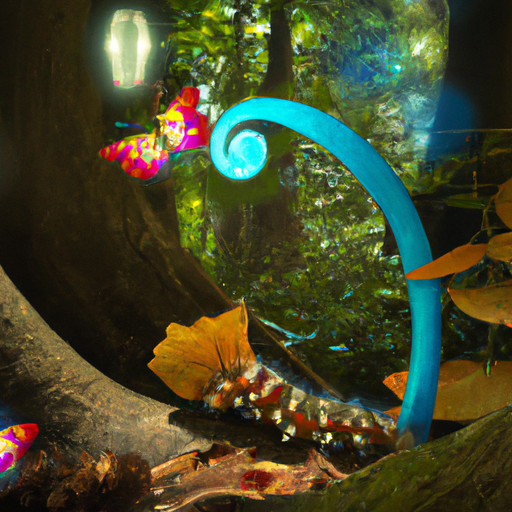
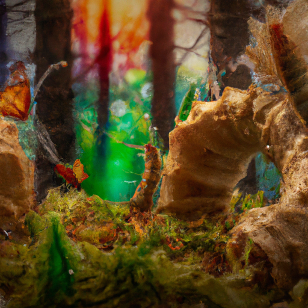

## [I m leaving home for a while + a little update on me](https://www.youtube.com/watch?v=CgjCk9hB3Xs)

<table align="center">
	<tr>
		<td align="center">
			
		</td>
		<td align="center">
			
		</td>
		<td align="center">
			
		</td>
	</tr>
</table>

Hello everyone! I just wanted to give you a little bit of an update because I’m going to be leaving home for a little bit. Air quality over here has been really bad, there’s so much haze and smog in the air and it’s been pretty hard to tolerate. I’m usually fairly tolerant, I’ve been here a few summers either visiting or living here.

We’ve had smoke before and I’ve gotten through it pretty well, but this summer it’s been different because it’s been so close to home. So I decided that with my boyfriend and we would go to the West Coast for a little bit to distract ourselves and get some fresh air, which we both really need. He’s a surveyor and he works outdoors so he’s had to wear a really big mask for most of it and I can’t imagine it’s comfortable. I think we’re both really good looking forward to the crisp sea air which I’m very excited for.

Of course I wanted to give a little more of an update in this video since obviously it’s a little bit different. It’s really hard to film here right now with the smoke. I wanted to tell you guys a couple shenanigans I’ve been up to recently and that is I have been raising caterpillars. Able to raise caterpillars has been possibly one of the weirdest things I’ve done so far while living here, I will explain play story from the beginning, my parents had guests over at their house and that night the porch light was left on by accident.

So that morning I went over there to visit because it was during a heatwave and I was coming over a lot to enjoy the AC. I noticed that a what I believe is a One-Eyed Sphynx Moth at the door and it was right under the lamp. It looked very exhausted, she had been very distracted by the light that had been left on. She had also been heavily pregnant and so she had left all these little eggs on the windowsill nearby.

I felt really bad because moths should leave their eggs on trees, for example these moths eat willow leaves. She would’ve probably flown to a nearby willow tree and had her babies there. The eggs from the moss have a residue on them that makes them stick to anything they are in contact with and so it would be really tricky to remove them from the windowsill and move them to a willow tree without breaking most of the eggs.

So what I did was I put fresh willow leaves around the eggs waiting for them to be born and then I had about 60 caterpillars after about a week or two. They were all climbing all over the windowsill and I didn’t know what to do with them so I ended up just putting them in a big jar with a bunch of willow leaves so they can eat the leaves while the other born. 1% of baby caterpillars actually make it to adulthood and that’s because the majority of them feed birds and feed other creatures. It’s a very important part of natures lifecycle.

So I went and I put a bunch in the trees and I just kept two because I thought it would be really great to take some photographs of the caterpillars and show the whole process of the caterpillars transforming into moths because they’re really interested in that whole life cycle. I don’t think the’ve had the opportunity to witness caterpillars transform and so I wanted to do that as well.

Anyway I hope to share with you an update on the caterpillar situation and also I will be sharing with you next week some highlights hopefully from my little trip. I appreciate you if you made it all the way through this video because I clearly didn’t have a plan for this. But I still wanted to share at least some thing with you.

Last but not least I wanted to follow the rest of this video with a little clip of one of the songs that my brother recently composed. He’s a very talented musician and recently made a lullaby that I’ve been listening to. It has brought me so much comfort during this strange time in the valley and I really wanted to share this. If you want to get updates on him you can, of course, follow him on Instagram and get in contact with him. Anyway, I hope you have a wonderful day and you enjoy the music.