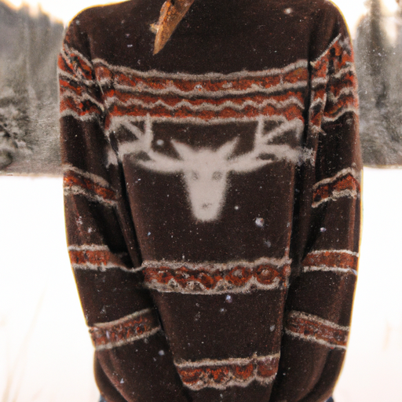
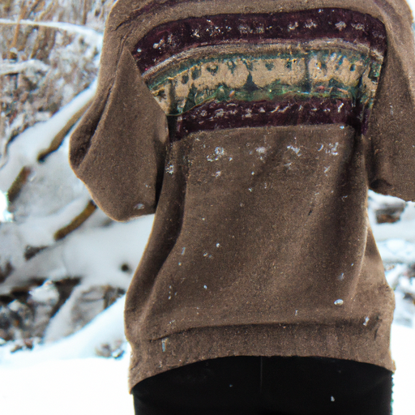
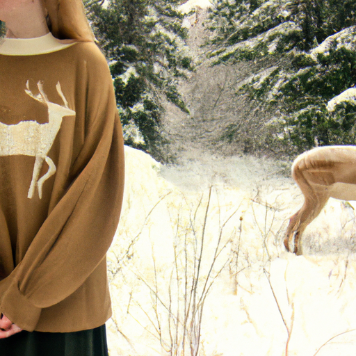

## [I m leaving my cottage in 4 months - change is hard](https://www.youtube.com/watch?v=zkuWjH1d6RU)

<table align="center">
	<tr>
		<td align="center">
<<<<<<< HEAD
			
		</td>
		<td align="center">
			
		</td>
		<td align="center">
			
=======
			
		</td>
		<td align="center">
			
		</td>
		<td align="center">
			
>>>>>>> ffe52613361410ad9d371a0f80e81de4dd24175f
		</td>
	</tr>
</table>

I got this sweater from a lovely neighbor of mine. She told me it was a vintage piece that she thought I may like to use when making videos. And she was so right, it’s not only beautiful but it is so warm that I barely need to wear anything under it if I’m exercising outside on a sunny day.

And I’m grateful, because the weather has finally warmed up a bit and i get out and move and break a sweat simply by wading through the snow, I have never seen this much in my valley. It nearly reaches my hip in certain places. With that comes concerns. There was an avalanche up the road from me, so we are being a little more careful than usual when Aegir and I take our walks, and choose safer routes. The bobcats and cougars are more active, seeking lower ground and very hungry, so we need to be cautious about that as well.

While I am careful, I am never fearful living out here, because I’ve always seen my relationship with the wildlife as my responsibility to preserve. I’m the intruder here, not the bobcats and coyotes. I need to reverently walk these roads, to show respect when I see them, not get too close, and turn away if they are large predators or I sense my presence makes them uncomfortable.

After a long day of playing in the snow, the next morning I was in the mood to stay indoors and keep warm. And what better thing to do on a cozy day but some baking. Today I am taking inspiration from a very old cookbook that has been in my family for as long as I can remember. As you know, I predominately share desserts on this channel because I a con is sour of all things sweet, and while unfortunately I cannot eat cake and pudding for every meal lest I suffer consequences, I love to end each and every day with a dessert of some kind.

And today I wanted to make some of my favorite traditional Hispanic dishes, adding my own spin of course, as there is no exactly correct way to make these foods. That’s one thing I love of peasant dishes that use basic ingredients, because experimentation is not only allowed, but expected depending on what you have on hand, so I altered these recipes slightly to suit my specific tastes. Today I’m making budín de pan, y flan con leche fresca. It always brings back memories to make recipes associated with my childhood and the people in my family that hold positions or great respect and admiration.

My abuela, Miriam Morales from Puerto Rico, experienced a very difficult start to life. Pretty much the worse than you can imagine. She was born into a disfuncitonal household that went back generations. There seemed to be no end to the cycle of neglect, and yet my abuela decided enough was enough. She realized it would be easy to become like those who came before her, letting pain and anger and hurt define her life. But she didn’t want to give others that power, she wanted to be free, so she decided to build something new. It made things, no doubt, harder for her, and what came was a lifetime of back breaking work and struggling to get out of poverty. Thanks to her and my abuelo papa my mami went to New York, learned English and joined the reserve. She and my papi are veterans, and I cannot imagine being more proud of them. Thanks to these strong women and men I only do I exist, but I don’t spend one day not being aware of how grateful I am for what I have, everything from clean water, to food, to safety. Things could have been so different. I will forever cherish the people in my life that decided to stop hurting and start healing. They are heroes because of that, and showed me first hand that that is what matters in life.

IN SPANISH: Some people asked me if I speak Spanish. I do, but the majority of people watching these videos speak English and I want them to be able to understand me. My mother had a rule in the house that we always had to speak Spanish, and that helped me a lot. I love to be able to speak Spanish.

I did decide recently that I wanted to reopen my etsy shop. It is something that brings me a lot of joy and really inspires me to keep creating art and so I did decide to reopen it and I appreciate all of you who have reached out wondering if I will reopen it. It has been very motivating and encouraging. I've always been passionate about words and poetry and I wanted to find a way to mesh that with my art, so I have a few new things available. But I would love to get your feedback. Please let me know what you think, it is kind of a new idea that has sprung on me as I've been working on my book project which thankfully the first draft I think is complete, hopefully, I will continue making progress on that and keep things updated. I'm very excited, it's been a wonderful experience so far.

I wanted to announce that, i'm just very very grateful for all of you who have sent such kind messages and support, it has really really helped me out and it has made so much possible, not only these videos but also just being able to create more art. It's also been very helpful as Luke and I have come to this point where we realized we want to be able to find a house. There is absolutely no way that we could afford afford a house in this area, I think all over the US but it feels like here as well, housing prices have just gone crazy. We have been presented with the opportunity to get a house that we could actually afford and that opportunity will not come again and we've realized that you know if we do ever want to be homeowners in this area we do need to be able to take advantage of this opportunity to renovate a barn that belongs to his parents and make it a home. And so that's just been a really exciting prospect and I'm just really happy we can find a place. For me personally I've always wanted my own home, you know, just any home - it doesn't have to be the perfect home it just needs to be a home, and so this opportunity has just been just so amazing, anyway yeah I have to admit I'm quite nervous about a lot of changes coming my way but I also think that I have found, in my personal experience, that I am my best self and most happy when I kind of embrace change and I embrace those fears a little bit and understand that, you know, it's just part of growing and maturing and and being a better person. So yeah, anyway, thank you so much for all your kind words and messages. I hope you are having a wonderful day or night, I hope you're taking care of yourself. I am sending a lot of hugs and love and I will see you very very soon. Goodbye &lt;3