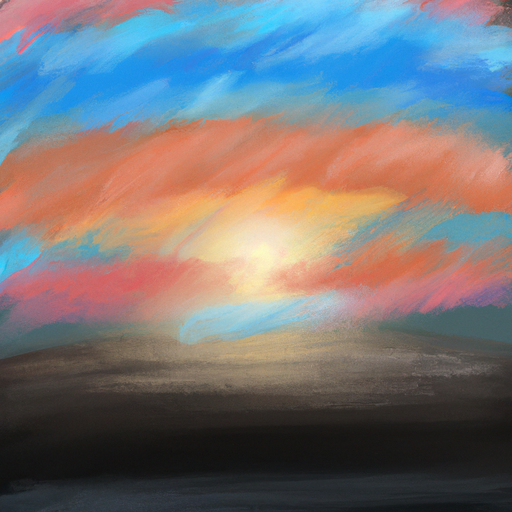
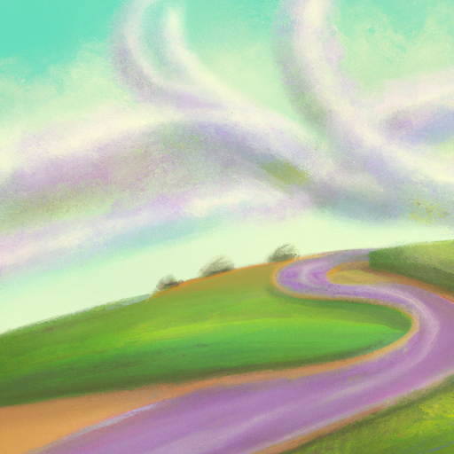
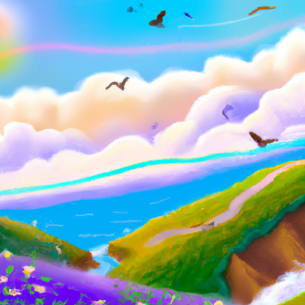

## [I m not sure what I m doing anymore - another side of life in the forest](https://www.youtube.com/watch?v=r84gznTNUk8)

<table align="center">
	<tr>
		<td align="center">
			
		</td>
		<td align="center">
			
		</td>
		<td align="center">
			
		</td>
	</tr>
</table>

"You don't like it?" No doubt the main thing that has made my anxiety quite difficult to handle lately has been just the huge changes in general and I think anyone who has an anxiety disorder or just understands what it is like to live with those feelings change in general whether it's good change or bad change can be very, very difficult when you are wired as an anxious person. I have been extremely nervous about the release of my book. I have never put my writing out there in this form before. It is definitely the uh crystallizing of a dream that I've had since I was very young and now that it is happening, I am making up all these scenarios in my head of fears of how it will all turn out, many of which don't really make sense, and it has been a little daunting at times.

I think due to all these factors and um anticipating change as well as such a huge shift in my life, as well as the passing of my bunny, my one of my best friends, I have found myself experiencing very severe panic attacks, ones that I have not ever experienced before. They don't really have a trigger, they just seem to happen due to generalized um stress perhaps, and I feel like I cannot breathe. I am certain that my throat is closing up and it is a terrifying feeling, and it has been quite awful. Luke has been so wonderful and supportive through this process. He knew and I knew it was going to be a difficult transition, changing your way of life and location, and I'm so grateful for him.

These sorts of very anxious periods in my life are quite natural to who I am. I'll leave a link down below to a book I once read that did a lot of research into people like me, and it was extremely helpful and eye-opening to understand that being anxious is not a sign of necessarily fragility or it does not make you a weaker person or a broken person. The feeling of anxiousness in its best form is the feeling that you care, that you care what happens to you, you care what happens to others, you care about the planet, and I love that at the core of these feelings is wanting to help, wanting to care, and not wanting to despair and turn my back on issues we face, either me as an individual or as a group.

Being anxious makes me a better person. It makes me compassionate. It makes me experience empathy on a degree that is overwhelming at times, and I truly believe that people who feel this deeply can use that as both a gift as well as a challenge they need to learn to manage in a healthy way, but I do think it can benefit other people to experience these emotions. I think it is simply learning how to manage them in a way that is not detrimental. For me, recently panic attacks have been quite exhausting and affecting very much my sleep, but yes, recently it has been a time of happiness, of joy, also of stress and worry. Believe it or not, these feelings can co-exist.

How I nurture myself back to a more peaceful place is by doing the things I love and focusing on the bright side, which is definitely what this channel is all about. That is what you've seen me doing for the last several months, has been focusing on the bright side, remembering what I'm so grateful for and all the beautiful things in my life, and celebrating the beauty of this area and spring and all the things that bring me joy. A huge benefit recently has been reading. I've been reading more than ever. I have been reading and reading and reading. It has always been a wonderful and healthy form of escapism that helps me nurture myself back to a place where I can come back to the real world a better person and more at peace.

As you see, this week's video is a little bit different. I just was not up to making my usual content. I know I'm going to be back there very soon, but I did want to take this week to reconnect with some people that I love, and of course, that includes my husband Luke, who has been such a wonderful support as I get used to this new life. I am unsure how much you enjoy hearing me talk to the camera. It helps me to speak to the camera sometimes in order to connect with you, but I also know that that is not everyone's cup of tea. I know it is impossible to create something that everyone enjoys. I do appreciate you being here, and I know the next few weeks I will be settling in even more, and yeah, I think you can tell I didn't really have a plan this week, but I appreciate you nonetheless, and I hope you have a wonderful week. I am sending you my love. Goodbye.