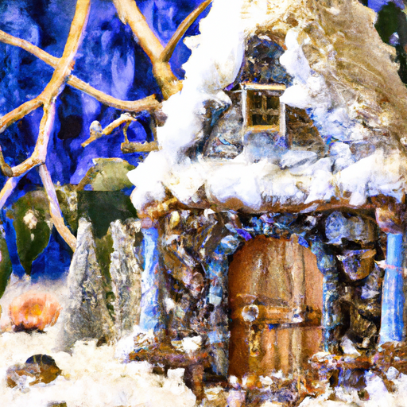
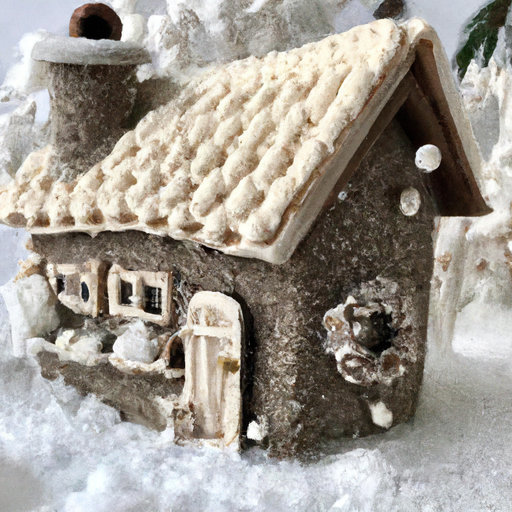
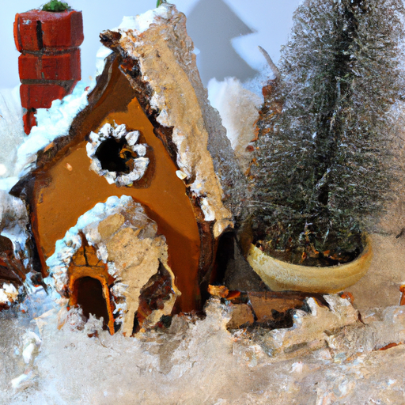

## [I moved to the countryside at 23 years old - how I made it work for me](https://www.youtube.com/watch?v=mmlfpNS_ruA)

<table align="center">
	<tr>
		<td align="center">
			
		</td>
		<td align="center">
			
		</td>
		<td align="center">
			
		</td>
	</tr>
</table>

And just like that, Autumn is gone. The snow came last week, then turned into a blizzard that left everything buried under a thick blanket of snow. We usually don't get this much so early in November, and I have a feeling it's going to be a long winter. Even though I don't always deal with the cold well, I'm excited for what this season represents. It's time for peace and renewal, to go into the quiet with grace and a humble heart. The winter fairies are fearsome creatures, but they have much to teach us. I think this time of year challenges me to learn about my inner self as I cozy up in my home to wait for the new year.

I've made countless videos on why I chose to live out here and why it works for me, but I wanted to consider another side to my reasons to keep living out here. And that story starts at five years old. Even though, due to my father's job, I was mostly schooled at home, I did have the opportunity to go for a bit to an enrichment program on the weekends, spending time with other students and teachers. While I was there, many of my superiors noticed I was having a hard time listening and following instructions. My mind would wander, and the noisy environment would constantly distract me. With so many smells, sights, colors, and sounds surrounding me in my classroom, I was overwhelmed.

I got tested for a variety of things, but all that was found for certain was that I love to read, write, and create. And though I struggled a bit socially, I was a happy child with a love of learning. And to my mother, that was what mattered. I loved chaotic and busy places. I wanted to travel and explore, but I needed a place to go to be myself in quietness. I didn't have to live in a rural area to find that haven. I could create a version of it most anywhere. But once I got the opportunity to work as a preschool teacher in this little valley, I had a feeling I was going to be here long term. And so far, it is true. I'm ever grateful and humbled by that opportunity.

Many people, like my lovely sister, much prefer the city environment and couldn't imagine living anywhere else. And to this day, I love to visit her and experience the immense wonder that is a metropolis. It's exciting, and I can enjoy it while still looking forward to returning to my life in the countryside. And I think this contrast is the reason living out here doesn't work for everyone. It is quiet, too quiet for many. I know people often joke that that sounds great, but the reality of it can be hard sometimes, even for me. However, I knew from a young age that I'd enjoy living in a place where I could experience more of that slowness, giving my body a nervous system of safe space. I'm in an environment that aids me, but I can apply these things wherever I live. That is why living out here works for me as a sensitive person. I thrive in an environment where I can find that simple space.

And don't get me wrong, I think you can create that space wherever you are. I treated my former apartment in the city as my haven. After a long day, I had a closet full of pillows where I would sit and listen to calming music. If I felt drained, I had a weighted blanket I'd lay on top of me if I couldn't sleep, and it would help me relax. I had boundaries in regards to socializing so that I could have time to rejuvenate. And if you think any of this sounds strange or abnormal, I've heard it before. But I think it's more important to understand and honor who you are and find ways to bring peace into your life if you need it, and not worry so much about being labeled as odd or unusual.

I've been able to keep creating videos, start my little Etsy shop, and even work at a couple of bookstores because I keep learning how to listen to what I need, both in my lifestyle and priorities. And that has helped me be someone I'm proud of. You don't need to live in the countryside if you're a sensitive person, not at all. But you do need to accept and embrace who you are. I firmly believe that every well-adjusted individual has a hint of strangeness and whimsy in their person, or if not, it's simply waiting to be discovered.

It has been a lovely week over here, and very quiet. I've not yet gotten the snow tires changed on my car, so I'm trying not to drive too much, and it kind of feels like I'm snowed in. So, I've been taking all this time to create some ornaments and other craft projects for my family. I'm getting an early start on winter holiday gifts, and I wanted to try to create some clay ornaments with dried flowers, as well as some paper flowers. I saw some tutorials online I really wanted to try. I hope these give you some ideas if you're trying to make your own gifts this year. And I appreciate you being here. Thank you so much. My Etsy Shop will be closing in a couple of weeks for the month of December. I appreciate your support of my work and this channel. I hope you have a beautiful week. Do you send the winter fairies well wishes? They are working so hard over here to cover every inch of this valley with snow.

I always knew that I would be suited to living in the countryside. It comes very naturally to my personality. One of the reasons I started this channel was because I was aware that rural living really does not work for everyone, and that's wonderful because that means we are all different and unique, and that's really important. I did, however, want to share a little bit of the nature and the beauty of wildlands, hopefully inspire other people to get involved in the preservation of these beautiful areas.

I think it is so lovely to have a platform where artists can share their short films and their creative endeavors. I think, for me, I've always described these videos as my own way of immersing myself in a fairy tale. And I love to find angles and interesting ways of portraying the beauty of nature and home life. These videos are often my way to celebrate the beauty and life and the wonder and whimsy of the world, while still sharing the natural ups and downs that all humans deal with. I'm so grateful that I have found other people that also appreciate that and that more artistic take on life.

I will be taking a little bit of a break from YouTube. It's going to be short, but I really had some more personal things I wanted to figure out and a little bit more of an idea of what I want to do in the future. I realized there were some things that I really need to figure out in regards to work and my schedule, and some personal things as well. So, I'm going to be taking some time this week to think about that and how that may or may not impact this channel.

So, I'm sending all of you my love. Thank you again. Sending you kisses from the snow fairies because they are working so hard. Goodbye for now.