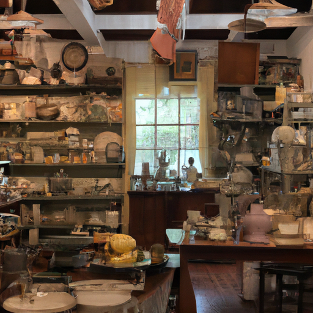
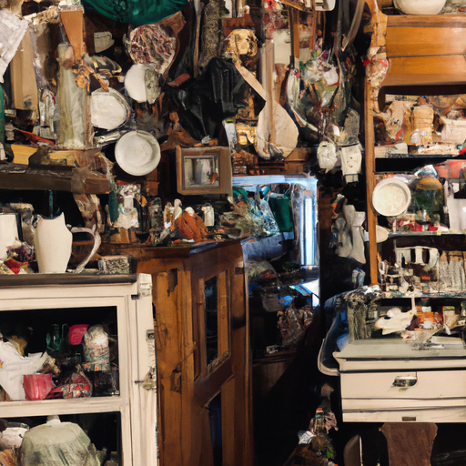
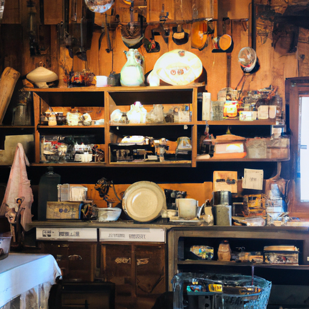

## [I need to unlearn what success is - a simple mindset for a new year](https://www.youtube.com/watch?v=dY1ko9n3rd8)

<table align="center">
	<tr>
		<td align="center">
<<<<<<< HEAD
			
		</td>
		<td align="center">
			
		</td>
		<td align="center">
			
=======
			
		</td>
		<td align="center">
			
		</td>
		<td align="center">
			
>>>>>>> ffe52613361410ad9d371a0f80e81de4dd24175f
		</td>
	</tr>
</table>

We continue to enjoy a deluge of snowfall in my Valley to the point that many are snowed in quite consistently. I found myself spending even more time than usual at home by the fire, warming my toes, and this week was no different. However, I recently went with my mother to an antique shop as we were both feeling a bit of Cabin Fever. It was much needed, and I found some lovely items to use in the kitchen. It's always a pleasure to explore these places full of so many old things with so many stories.

Shortly after my visit to the shop, the temperatures warmed up a bit, and I got out on my snowshoes to enjoy the forest surrounding my home, checking on the Sleepy Pines and sending them well wishes for an abundant spring. As The Long Winter stretches into the new year, it has made me reflective on my path and the goals I used to hold on to so tightly. Goals regarding what it means to be successful. And I thought it would be interesting to hear what you define to be success and what things we can learn but also unlearn as we go into this new chapter and a new beginning.

I always received a clear message of what success is from movies, commercials, and media I consumed as a child. First, to be successful is to have many, many friends, which wasn't something I was ever that good at. Second, your job will be one of the most important things in your life, which was something I was good at because I always tended to get consumed with my career goals, particularly when I was much younger. Third, once you achieve your dream home, job, or relationship, you will also magically resolve all your personal problems. Fourth, be happy that you have all these things and don't ever suggest that you're struggling to find deep fulfillment in them.

Now, when stated like this, it seems very childish and rather silly to believe any of these things actually work that way. We are too complex and too human to simplify ourselves in such a manner. I recently came across a book that had the title "There is no cure for being human," and while I haven't read the book, that line stuck with me because it's true. I like to think that the reason we are alive is to be stewards of the earth, to connect, to give, to love, and learn about ourselves and evolve into the best version we can be. That path cannot be an easy one, and that's the whole point.

And if it was so easy to simply fulfill an external definition of success in order to resolve all those internal feelings of lack of fulfillment, I would have little drive to develop who I am, my spirituality, and try to be a little better each day. And yet, these beliefs are deeply intertwined in my experience and particularly my mindset when I was in university, and it still follows me to this day. And as I've achieved many of my dreams, many I never thought I would, I continue to find amusement in the fact that none of them have ever fulfilled me long term.

Presently, I'm pursuing my new definition of true success, and that is a feeling that cannot be taken away from me so easily. It is something deeper in my heart. So this year, I'm working on unlearning a lot of messages that often seem rather materialistic or superficial at their core. Perhaps we can unlearn things together and make our own path to joy and success in a less conventional way.

I always find myself painting flowers this time of year. I think it is simply because the forest, the nature everywhere around me, just feels so lacking in life, even though that's not necessarily true. It's just dormant. But usually around mid-January, I really start to miss the Spring. It has been a wild winter. I think cumulatively, we've probably gotten close to five and a half, maybe even six feet of snow in some places. And it's hard to believe, but it's also wonderful because we are a little tourist town, and so we really rely on a good ski season during the holidays. So we are all kind of celebrating but also wishing we could not have to shovel our driveways for the 16th time this month.

My little cat loves to just put her paws all into my watercolors and then walk around the house. She's done it multiple times. Oh my goodness, by the way, I've totally forgot to say this, but thank you so much for the support of my Etsy Shop. It has been so exciting to reopen, and I have seen that my Owl print and my rabbit print have been quite popular, and I really appreciate it. Those are some of my favorite paintings, and I'm so glad you enjoy them too. So thank you.

I can remember when I got my very first job. I worked at a library a little bit when I was a teenager, and I remember I felt so insanely proud of myself for getting a job. I think I was the only one who interviewed for it, but you know, I don't think high schoolers were just lining up to work at a library. But I was. I was. But I remember I felt so proud of myself, and I felt so kind of successful in my own small way. And I felt that same way after I graduated University and started working at a bookstore. And I finally was able to afford an apartment. Governments, and I just felt so full and so excited and just very full of that feeling of "look, look Mom, I'm doing it." You know, it was a really exciting feeling, even though, you know, it was not always easy.

I think always those kind of two things have always been the only things that really contribute to my feelings of success. Of course, being able to have some sort of living arrangement and a job. I think after that, after those things are found in which you can live, kind of that feeling of success is diminishing returns, I think. And you get to a point where you realize that you need to seek out something much deeper in order to feel that more long-term fulfillment.

However, this new year, I really want to work on kind of unlearning a lot of messages that I really took to heart when I was much younger. And I realize they're still with me. Perhaps success for you will be very unconventional. Maybe it will not be what your family said it should be or your society or even just what you told yourself it could be. Spending a day snowed in, talking to your cat, which is what I'm doing right now, right Mavi? So success can be very unconventional. Here's my example.

Oh Lord, it was just something I was thinking a lot about coming into the new year and things I want to work on in regards to my life and hopefully gain some wisdom from all of you. You know, all together, I'm sure we can offer some really interesting insights into our own journeys and at least offer some different examples of what success is to you.

I had an absolutely wonderful time going to antique shops. I just always love it. It just feels like a little treasure hunt. One thing that I did find was this extremely heavy picture frame, and it has a woman on it. And I don't know who she is or what her story is, but I really liked her expression, and she seemed so thoughtful and happy. And so I picked it up. I think it was like four dollars. So I may end up removing the photo and putting it in a very honored place and replacing it with a wedding photo or something like that. But I really liked it. So that's one of my favorite things about antique shops too, seeing old photos of people that you don't know that probably lived very interesting lives that you will never know the details of. And yet, you see the essence, perhaps, of who they were in a photograph in a little shop in a dusty corner. And everyone's legacy kind of lives on in little ways.

I've been painting for a while now, and my puppy Iker is very excited to get outdoors and play in the snow. And because thankfully it is no longer negative 30 degrees, we're gonna go out for a walk and probably take the snowshoes out again. I think we're going to head out in just a little bit and see what adventures we get up to.

I hope you have a wonderful week. Do share your thoughts and dreams for the new year down below, and I will see you all soon.