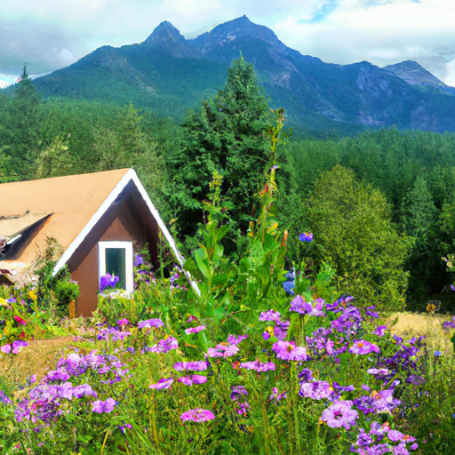
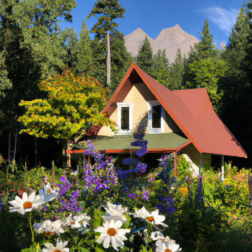
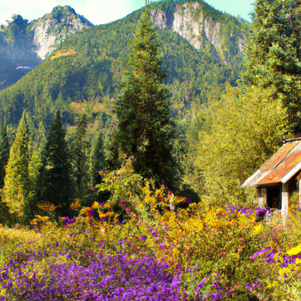

## [I never dreamed of this after leaving the city - receiving my book in the mail](https://www.youtube.com/watch?v=Q6OXIKIPVT8)

<table align="center">
	<tr>
		<td align="center">
			
		</td>
		<td align="center">
			
		</td>
		<td align="center">
			
		</td>
	</tr>
</table>

Something so exciting happened today. So I went into the mountains to share the news that the last of the Alpine flowers, realizing that the year seems to have just rushed by and summer will soon be coming to a close. My physical book finally arrived in the mail. It's been a year of work without seeing the result, and it was wonderful to open the box and see the product of that labor.

I hope that whatever project you're working on or goal you are pursuing, big or small, that you allow yourself time for things to come together and don't allow fear to stop you from moving forward. Believe in yourself, to quote the illustrious A. Milne, the author of Winnie the Pooh: "You are braver than you believe, stronger than you seem, and smarter than you think."

With that being said, I thought I would read you the introductory page of my book, just to share a little bit. It was so exciting, and I hope you enjoy it.

I came to the valley in June. It was a quiet place, nestled in the foothills of the Cascade Mountains. The balsam root had recently gone to seed, and the hillsides were fading from a rich green to the soft browns and yellows of a full summer. I'd come to know the seasons quite well over the next several years. Much of it would be a thorough study conducted through the bedroom window of my cottage, where I would sit at my desk and work nearly every day.

From that window, I would see my first moose cow leading her trembling newborn to the lakeside, a half-mile trek down the road. Six months later, the frigid clear skies of a winter's night dappled with the brightest clusters of stars I had ever seen. Yet, the most rewarding moment by far would be spying a diminutive bluebell growing by my garden fence. It peeped through the chilled ground, a harbinger of spring when my world seemed so still and unrelentingly cold.

My cottage and I share an intimacy akin to that of two old friends, though we haven't known each other for long. When I first passed the threshold and promptly tripped on a jutting wood plank, I was a nascent adult overwhelmed by a life spent working and studying towards a goal I'd held onto so tightly I couldn't see what it was anymore. I had long discovered my life was waning a little smaller and less vibrant each day. I didn't know what to do, so I had applied for a position teaching at a preschool in a small rural town. I hoped the increase in salary and vicinity to my family would give me the strength to make progress in a life that seemed so incredibly mundane that it had permeated something deep within, leaving me absolutely uninterested in the world.

The cottage needed repairs and a fresh coat of paint. It took months to recover it to a livable state. Looking back, the process was far more beneficial to me than the cottage itself. To take so much delicate care in fixing something, decorating it, and starting a little garden, to give time and love even when you didn't know you had any left to give.

The greatest thing that my cottage experience offered me was that I'd never actually needed it. If one day I move again, if my life takes me back to my old city apartment, little will change. I truly believe that a beautiful life can only be cultivated through time and effort. It isn't so much dependent on where you live, but how. The hardest lesson I've ever learned is that happiness is not in a location.

I hope this book, a collection of prose, poetry, recipes, and crafts, will inspire you to look at your life more closely and notice the magic that has always been there. Those unassuming moments overlooked by many, patiently waiting to be rediscovered.

I hope you're having a wonderful week. As you already know, I had a wonderful surprise in the mail. And I wasn't sure what would be the best time, but I was just so excited and elated about it that I did want to share it with you briefly. And that is that my book came in the mail. It is so exciting. It was just about the most wonderful thing to get a package like this in the mail. I'm very grateful to the publishing company I'm working with. They have really gone above and beyond to try to help with making sure that the book is as perfect as possible. And yeah, and being very helpful when my editor and I decide to make some formatting changes.

It's been a very long project. It's been, um, I think over a year at this point. So it's just really wonderful to see it coming together and knowing that the book is going to be released this year. As you may know from last week, the book release date was pushed back due to making some changes to just ensure the best quality of the book. And I'm very grateful for all your lovely messages of understanding. Sometimes those things just come up, and it was regretful that it wasn't going to be released this month.

Thank you, everyone, again, and I will see you very, very soon. I'm sending you all my love. Goodbye.