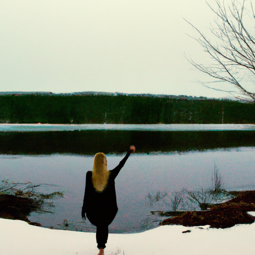
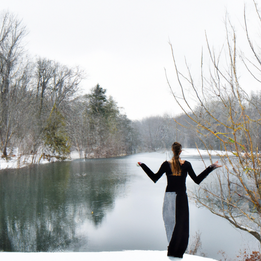
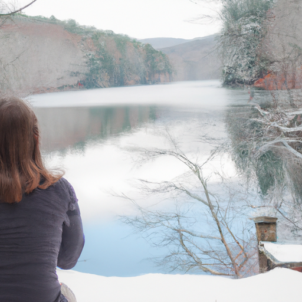

## [I ve been tired my entire life - the art of actually resting](https://www.youtube.com/watch?v=FOMS_yqdN1o)

<table align="center">
	<tr>
		<td align="center">
			
		</td>
		<td align="center">
			
		</td>
		<td align="center">
			
		</td>
	</tr>
</table>

It’s a cold November with only a thin scattering of snow, and the grey skies have reflected my own existence lately. The beginning of my pregnancy has left me absolutely exhausted. After being a bit frustrated about the sudden turtle pace of my life, I decided that that attitude was not serving me. Instead, I decided to accept how I feel and find joy in this new slowness, and see what it can teach me.

I’ve always considered myself a bit of a slow going person. When things get rushed and chaotic I get all frazzled, a bit like a little field mouse in a rainstorm. The way I have made peace with this natural disposition has been to accept a rhythm of living that is as far from the fast lane as possible.

I remember years ago describing myself as ‘always and forever tired’. I realize now that I wasn’t really ‘tired’, I just wasn’t living the way that suited me best. It’s hard to have energy when you get yours from a different source than someone else might. A bird might feed on seeds to grow, while a plant takes in the sun, and yet they both thrive when their needs are met.

I needed to cultivate within the pace I was yearning for. And for the last two weeks, I’ve been trying to stay true to that, and focus on being only as productive as my body allows. I baked a thanksgiving treat for my in-laws, decorated the house for the festive season, and started to de-clutter a bit in preparation for the baby in the new year. Just doing these few things while still working in town has sucked up all my energy, and I’ve spent so much time in bed. It’s been a humbling experience, to be sure.

I’ve spent the last several years learning how to slow down my thoughts, my movements, adjusting my entire lifestyle to remind me just because you can’t match the pace of someone else doesn’t mean you’re too slow, it means you are listening to the beat of a different song, one that - in my case - has been whispering to my soul from the very day I was born. Slow down. Look. Listen. Rest. And that couldn’t be more true as it is now.

The art of resting, actually resting, in my experience, isn’t about doing something mindless to make the day pass by, it’s about leaning into the awareness of time, stretching it out to make it serve you better. And to honor your energy, your body, and listen. Digging into the parts of myself that house pain and insecurities, bringing those things to the surface with gentle words and giving them the care they have longed for, also helped me feel so much more at peace with my pace of life.

Every time you let go a little more of anything that’s holding you back, you feel lighter, more rested, more whole. That is quality rest. It’s not always easy, but it teaches you how to surrender. You are not always the one in control, that there is freedom in that acceptance.