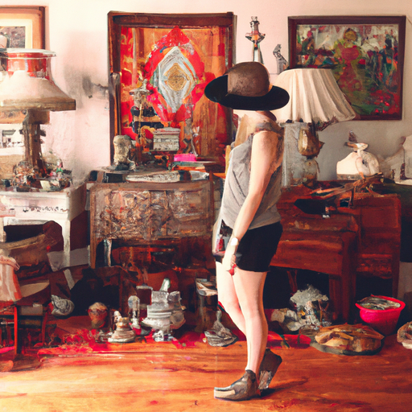

## [I was in recovery for 7 years - overcoming my disorder and starting to feel again](https://www.youtube.com/watch?v=c1jcIM1okK8)

<table align="center">
	<tr>
		<td align="center">
<<<<<<< HEAD
			
		</td>
		<td align="center">
			
		</td>
		<td align="center">
			
=======
			
		</td>
		<td align="center">
			
		</td>
		<td align="center">
			
>>>>>>> ffe52613361410ad9d371a0f80e81de4dd24175f
		</td>
	</tr>
</table>

I was looking through some old photo albums recently and seeing images of my past self made me realize that it is only fairly recently that I felt at peace in regards to having a healthy relationship with my body and nourishment in general. As you may know, I've made videos in the past about recovering from an eating disorder, but a long story short, my problem was merely a symptom of a deeper issue. For me, it was a fear of the responsibilities of adulthood, a failure in general, and seeking a sense of control. Living with a heart that was too ready to take on burdens.

It took me seven years to feel fully and completely recovered from my disorder. That is a very long time, and I wanted to say that number because I think that time taught me something I didn't expect. When it comes to improving our lives, reaching our goals and dreams, putting an immediate deadline for achieving them can risk sabotaging the entire journey. There are many cases when we simply must accept that we're complex and deserve to discover equally complex answers. Trying to skip to the end result makes it meaningless, and the truths we need to uncover are found over the course of years and the wisdom gained simply through being alive.

I was not unhappy and miserable for those seven years, to be clear. I was not simply putting my life on hold. Because when I started the road to recovery and facing the other mental issues I had to address, I was choosing to actually start living, to see things out. And when you choose to do that, it doesn't mean you're ready to be perfect or live the ideal version of your life or not make mistakes. It doesn't mean choosing to be happy while sweeping those other uncomfortable emotions under the rug. If anything, I started that road to recovery when I started to let myself feel deeply, feel the pain I was holding, the fears I had, and consequently discover that deep desire to be alive, even though that wish was hidden away under many layers of lies I had told myself. The lie that things don't change, the lie that I don't deserve help.

We all have limitations, but there is always at least something we can do to make tomorrow a bit better, even if it's a very small change. At least, I needed to believe that to start moving forward. This is what worked for me, and you must discover what works for you. Isn't that rather exciting? Seven years of ups and downs, joy and sadness, and building the foundation for a strength in my core that I could have never imagined. If I met my past self, I know she would be so proud and amazed that I waited out the storm and became something so beautiful in the process. That I would never dare believe that the world would be better without me anymore.

Speaking from my heart to all of you because if you cannot relate to this story, there's likely someone in your life who can, and they need your love and understanding. It's what humans do best, in my opinion, to love, and we can always use more of it in this world.

I remember I was once at a house party when I was quite young, and I was having a really hard time. You know, that year I remember I was in university and very affected by the environment. I was just learning how to be an adult, and like for so many adults at that age, I was just having a hard time. I was feeling quite overwhelmed and nervous. My introvert self was just screaming for help. So, I remember I went out to the porch just to get a breath of fresh air. There was a young man there, just doing, I think, pretty much the same thing. I remember we chatted just a little bit, and he asked me if I was okay because I think he could tell in my face that I was having a hard time and I didn't really want to be there. And I was in a moment of vulnerability, and I told him, "No, you know, I haven't been doing okay for a while." To my surprise, he just nodded and offered to give me a hug and said, "I totally get it. The weight of human consciousness is just a lot sometimes, and that's okay. And I'm sure it'll get better." Firstly, I'm still amazed to hear such beautiful words of wisdom from someone so young in university at a house party, probably quite inebriated. Somehow, those words have stayed with me, and I have repeated them to other people when they're having a hard time. And I think something about acknowledging that it's just sometimes hard to be human, you know, hard to have so much knowledge of the things going on in this world, caring deeply about suffering, wanting the world to be a better place, not knowing how to make it better, not knowing how to be the best version of yourself, all these thoughts and questions rolling about your head can just be hard sometimes. And that's okay.

Recently, I've been hearing a lot of that saying of "You survived all your worst days, be proud of yourself." And I think that that's so sweet and simple but true. Think of all the low points that you have gotten to in your life, and you have gotten through them. If you're watching this video, so I think that's something really important to acknowledge and be proud of.

My husband, for example, is a very gentle, kind person that always makes me feel very safe. And I know that I would appreciate that of him no matter what my life experiences are. But looking back at the abusive relationships I experienced, I do value him in such an incredible way.

When I chose to start that road of recovery, I wasn't just choosing from day one to figure things out and immediately change everything about my lifestyle and all my decisions. And the reason that it took me so long to fully recover from the disorder I was facing was because I was not ready to truly and completely face every single fear, anxiety, and issue that I had. That process took years of gaining courage to unpack those layers. But every day, I chose to live and to try to enjoy life a little more, to be a little better version of myself, to let go of one more little part of that self-medicating behavior that was unhelpful to me.

But I think for that very same reason is why the end result has been so lasting and so welcome. It is amazing to look back and see what you thought was just impossible has become possible. And you also learn to embrace a life of discomfort, a life of ups and downs, a life of the full spectrum of human emotions, of tears, of laughter, of vulnerability. And that means signing up for a life of potential hurt and truly and deeply feeling all those feelings, not all of which are very comfortable. But at the end of the day, you do know that you have been allowing yourself to feel and deeply feel. And that's such a beautiful, such a human, and such a, I think, recipe for lasting fulfillment. Face those fears little by little and just take those baby steps of progress. It's amazing over the course of years how far you can get.

On a far more light-hearted note, I did want to share that I recently went to a really fun type of affair. It's called a bartering fair. It's a little bit like a flea market, but instead of bringing money, you can bring items and trade. Whenever you can walk into a space and twenty dollars will get you so many random, antique, interesting items, then I am very happy. I hope that this inspires you to go antique shopping or thrift store shopping and looking at what all these beautiful second-hand shops have to offer. It is such a sustainable and just wonderful, I think, way to bring items into your home that have a story.

That being said, I am, of course, sending my love. I hope you have an absolutely wonderful week, and I will see you very soon. Do take care of yourself. Goodbye.