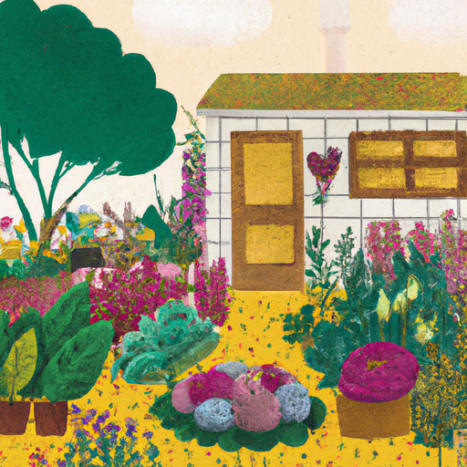
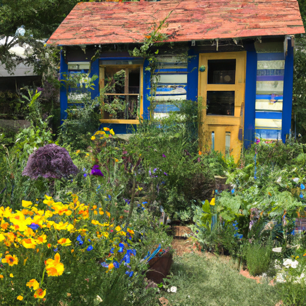
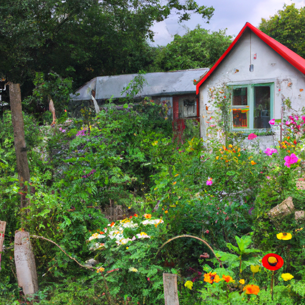

## [I went back to my old cottage](https://www.youtube.com/watch?v=1zsnFUvrFDc)

<table align="center">
	<tr>
		<td align="center">
			
		</td>
		<td align="center">
			
		</td>
		<td align="center">
			
		</td>
	</tr>
</table>

Today, I went back to my old one-room cottage. The reason for that is the little garden next to it has been replanted with potatoes, and there were quite a few of my plants that I wanted to rescue from being tilled. So, I came to pick them up and got an opportunity to look around and see inside and how it is being changed and renovated. It is no doubt going to look lovely, and it was interesting walking through and having such bittersweet emotions.

So much has changed since I left this little house only five months ago. I'm proud of myself for having loved that cottage and also being able to know when it was time to move on. Later that day, I had to drive into my little town for my weekend job at the bookstore. It is buzzing with tourism right now, and the shop has been so busy. I've been able to meet some of you there, so please always feel free to stop by and say hello. I will be available for a book signing once my book is released in August, so I will leave the dates down below if you'd like to stop by.

If you have any books you've loved this year, please let me know. I've been trying to read even more than usual. Writing my own book has been such a wonderful process, and I'm hoping in the future I will have the chance to write more. I would love to make a children's book and illustrate it. I would also love to write novels in the future. Also, I've been trying to expand my reading genres thanks to a co-worker of mine. Besides my recent more fairy tale reads, such as these, I've been attempting to read books on spookier topics. Some have been a bit too scary, but I have enjoyed detective stories recently.

Back home, I've been trying to get my garden finally in order. The area is quite wild, but there's still a surprising amount of lovely flowers growing all over the place. So, I thought I would give you a very quick garden tour so you can see what I've been up to. Apologies for the shaky camera. Here we have growing a huge amount of different flowers, primarily larkspur, calendula, iris, cornflower, honeysuckle, chamomile, also various edible wildflowers and herbs for teas and recipes. As you can see, this area is quite wild and free. There are a lot of weeds and other flowers mixed into what I intentionally planted. I'm kind of going to keep it that way for now. I love the wild look, and I also want to encourage the growth and abundance of native plants on the property.

Luke is gonna build me a lovely little fenced area where I can let my cat safely enjoy the outdoors, and I'm so excited to see how things evolve and develop over time. My mother-in-law has planted a lot of flowers here over the years, so a lot of the work hasn't been done by me, for sure. I'm so grateful for her and her eye for beauty. As for vegetables, I'm growing lettuce, carrots, radish, peppers, beets, peas, and tomatoes. I don't have much space yet, so it will be a small harvest, but I'm grateful to have this space. So yes, I think in another year or two, things will look quite different, but all these things take time, especially when it comes to plants. So, I will update you as things go on.

A final note, revisiting my thoughts on my old cottage, I hope that whenever you're faced with fear of the unknown or change or growth in general, know that most anything worth having is always at risk of being lost. And growing and developing over time means making mistakes and learning to let go where needed and finding courage to face scary yet exciting opportunities. For me, it was always a question of balance, enjoying a quiet comfortable life while still pushing myself in small ways to continue to grow and develop as a person. In this case, it meant leaving my cottage for a new chapter, and so far, it has been so worth it.

Hello everyone, I hope you're all doing well. I just got back home and got changed and refreshed after going to my old cottage, and it was a really interesting experience to spend some time walking around. I'd not actually been inside since I left, and so it was really lovely and thought-provoking to spend a little bit of time there and think about how in so little time, so much has changed. It's a really funny feeling, especially when it really only has been, I think, about five months at this point. It still felt kind of odd and different to go back and see my garden transformed and so much of the house being transformed and renovated. So, I think moments like that are always a little bit bittersweet because you have so many lovely memories associated with your home where you lived, and you have not yet had adequate time to build up all your new memories and experiences of years in your new house. At the same time, I am so happy and strangely proud of myself to have the courage to move forward and make choices that I wanted to make, even though they scared me. And so, that is something that I've been thinking about quite a bit right now.

But yes, walking through the old house got me thinking a lot about how for so many years, I really let fear dictate my decisions. You know, I was very fearful of stepping outside of my comfort zone in any way. I noticed especially at my old job in the city, I felt very overwhelmed with life in general, and I was having a lot of anxiety. The reason for my anxiety wasn't my location; it was just me, still not being able to quite learn how to adult and manage and process my feelings. And at one point, I was so anxious about life in general that I pretty much got on the bus, went to work, worked for 10 hours, got on the bus again, and came home, and would just stay in my room. And I would do that day in and day out, and day in and day out. And even though I'm quite an introverted person and I love to spend days alone in my room, and I certainly really need my alone time, you know, I was noticing that in my personal case, my world was getting smaller and smaller and smaller. I was so comfortable with my very limited routine that I wasn't even giving the opportunity for new people to come into my life, especially positive people. And the more I stayed at home, the more kind of comfortable I got with my routine to the point that I was fearful of any changes. For the first time, I would suddenly start feeling social anxiety and anxiety associated with new people or relationships. And all of those new things became unwelcome because they meant facing a lot of my fears associated with being rejected, not measuring up to someone else's standards.

If I kept avoiding all these fears of failure and of not succeeding in the things that I want to do, I might as well just accept that in my life, I'm not going to try to do anything at all. The decision to finally make a change and to start facing fears and treating that emotion of fear and anxiety as something that had to be understood and worked with instead of avoiding it altogether, that was really important for me. But anyway, I hope you have a wonderful week. Sending you all my love, and I will see you soon. Goodbye.